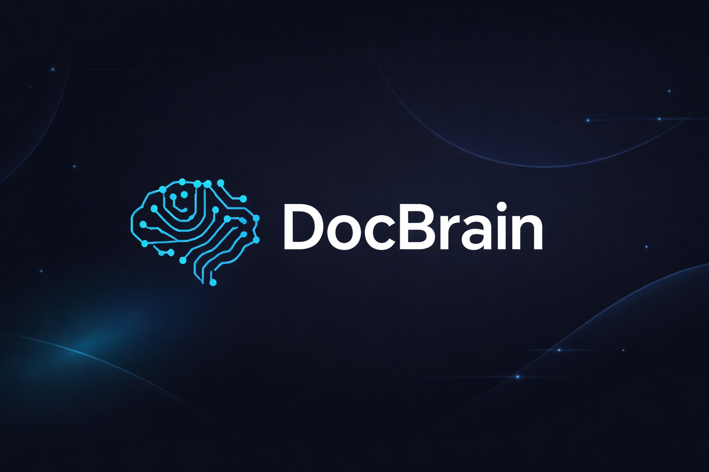
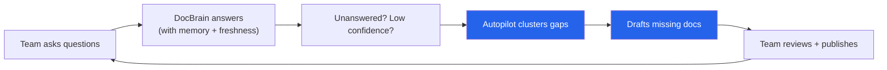
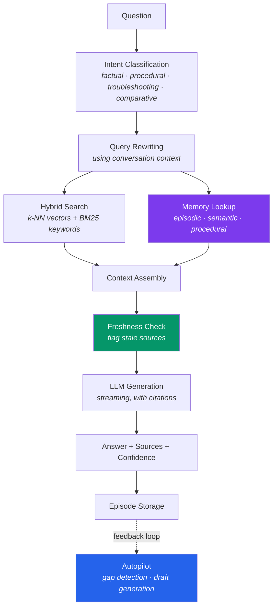
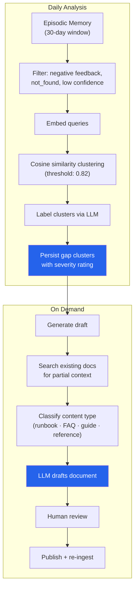
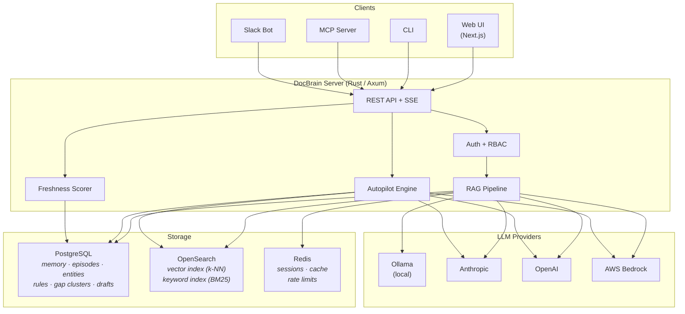

<p align="center">
  
</p>

<p align="center">
  <strong>Open-source documentation intelligence engine.</strong><br/>
  Answers questions. Learns from usage. Identifies gaps. Drafts what's missing.
</p>

<p align="center">
  <a href="https://github.com/docbrain-ai/docbrain/stargazers"></a>
  <a href="LICENSE"></a>
  <a href="https://github.com/docbrain-ai/docbrain/releases/latest"></a>
  <a href="https://github.com/docbrain-ai/docbrain/releases/latest"></a>
</p>

<p align="center">
  <a href="#quickstart">Quickstart</a> &bull;
  <a href="#how-it-works">How It Works</a> &bull;
  <a href="#documentation-autopilot">Autopilot</a> &bull;
  <a href="docs/architecture.md">Architecture</a> &bull;
  <a href="docs/api-reference.md">API Reference</a> &bull;
  <a href="docs/kubernetes.md">Deploy</a>
</p>

---

## Why DocBrain Exists

Documentation has the same fundamental problem everywhere: it degrades the moment it's published. Docs go stale, knowledge gaps grow invisibly, and the only signal that something is missing is a frustrated engineer asking in Slack.

Existing tools try to fix this with better search. DocBrain takes a different approach: it treats documentation as a **living system** — one that should monitor its own health, surface its own gaps, and propose its own improvements.



The more your team uses DocBrain, the better your documentation gets. That feedback loop is the core idea.

---

## Quickstart

### Run Locally with Ollama (no API keys, no data leaves your machine)

```bash
ollama pull llama3.1 && ollama pull nomic-embed-text
git clone https://github.com/docbrain-ai/docbrain.git && cd docbrain
cp .env.example .env
docker compose up -d
```

```bash
# Get your admin API key (copy the output)
docker compose exec server cat /app/admin-bootstrap-key.txt

# Ingest the included sample docs
docker compose exec server docbrain-ingest

# Ask a question (replace <key> with the key from above)
docker compose exec -e DOCBRAIN_API_KEY=<key> server docbrain-cli ask "How do I deploy to production?"
```

Open the Web UI at **http://localhost:3001**.

<details>
<summary><strong>Use Anthropic, OpenAI, or AWS Bedrock instead</strong></summary>

Edit `.env` and set your provider:

```env
LLM_PROVIDER=anthropic          # or openai, bedrock
LLM_MODEL_ID=claude-sonnet-4-5-20250929
ANTHROPIC_API_KEY=sk-ant-...

EMBED_PROVIDER=openai
EMBED_MODEL_ID=text-embedding-3-small
OPENAI_API_KEY=sk-...
```

```bash
docker compose up -d
```

See [Provider Setup](docs/providers.md) for full details including AWS Bedrock configuration.

</details>

<details>
<summary><strong>Interactive setup wizard</strong></summary>

```bash
git clone https://github.com/docbrain-ai/docbrain.git && cd docbrain
./scripts/setup.sh
```

Walks you through provider selection, API key configuration, and document source setup.

</details>

---

## How It Works

DocBrain is a RAG pipeline with three layers that most implementations skip: **memory**, **freshness awareness**, and **autonomous gap detection**.



### Memory System

Most Q&A tools are stateless — every question starts from zero. DocBrain maintains four tiers of memory:

| Tier | Purpose | Example |
|------|---------|---------|
| **Working** | Conversation context within a session | "by 'the service' I mean auth-service" |
| **Episodic** | Past Q&A across all users, with feedback | "this was asked before — validated answer exists" |
| **Semantic** | Entity graph — services, teams, dependencies | "auth-service depends on Redis, owned by Platform" |
| **Procedural** | Rules learned from feedback patterns | "for deploy questions, always include the canary step" |

Working memory is session-scoped (Redis). The other three are permanent (PostgreSQL + OpenSearch) and compound over time.

### Freshness Scoring

Every indexed document receives a freshness score from 0 to 100, recalculated on a configurable schedule. Stale sources are flagged in answers so users know when to treat information with caution.

| Signal | Weight | What It Measures |
|--------|--------|-----------------|
| Time Decay | 30% | Time since last edit |
| Engagement | 20% | Query frequency, view count, feedback ratio |
| Content Currency | 20% | LLM analysis of temporal references ("as of Q1 2024") |
| Link Health | 15% | Broken or redirected links within the document |
| Contradiction | 15% | Cross-document consistency (does this conflict with other docs?) |

Documents scoring below 40 are flagged as outdated. When combined with Autopilot data, this surfaces docs that are both stale *and* frequently asked about — the highest-impact content to fix.

### Intent-Adaptive Responses

DocBrain classifies each query and adapts the response format:

| Intent | Response Format |
|--------|----------------|
| Factual | Direct answer with source citation |
| Procedural | Numbered step-by-step instructions |
| Troubleshooting | Diagnostic tree with ranked causes |
| Comparative | Structured comparison table |
| Incident | Runbooks and playbooks surfaced first |

---

## Documentation Autopilot

Autopilot is what turns DocBrain from a consumption tool into a documentation improvement system.

It runs on a daily schedule, analyzing every query from the past 30 days that received negative feedback, a `not_found` resolution, or a confidence score below 0.4. It clusters these queries by semantic similarity, identifies patterns, and creates actionable gap reports.



**What this produces:**

- **Gap clusters** ranked by severity (critical / high / medium / low) based on query volume. A cluster like "Production Deployment Process" with 47 unanswered queries is flagged as critical.
- **Auto-generated drafts** — runbooks, FAQs, troubleshooting guides, or reference docs. DocBrain uses your existing documentation as context, so drafts match your team's domain language.
- **Weekly digests** — a Slack summary of total questions asked, unanswered rate, top gaps, and drafts ready for review.

Enable it with one environment variable:

```env
AUTOPILOT_ENABLED=true
```

Autopilot endpoints: [`GET /api/v1/autopilot/gaps`](docs/api-reference.md), [`POST /api/v1/autopilot/generate/{id}`](docs/api-reference.md), [`GET /api/v1/autopilot/digest`](docs/api-reference.md) — [full API reference](docs/api-reference.md).

---

## Connect Your Documents

DocBrain ingests from three source types. Documents are chunked with heading-aware splitting, embedded, and indexed in OpenSearch. Ingestion runs on a configurable cron schedule for continuous sync.

<details>
<summary><strong>Confluence</strong></summary>

```env
SOURCE_TYPE=confluence
CONFLUENCE_BASE_URL=https://yourcompany.atlassian.net/wiki
CONFLUENCE_USER_EMAIL=you@yourcompany.com
CONFLUENCE_API_TOKEN=your-token
CONFLUENCE_SPACE_KEYS=ENG,DOCS,OPS
```

</details>

<details>
<summary><strong>GitHub Repository</strong></summary>

```env
SOURCE_TYPE=github
GITHUB_REPO_URL=https://github.com/your-org/your-docs
GITHUB_TOKEN=ghp_...    # only needed for private repos
GITHUB_BRANCH=main
```

</details>

<details>
<summary><strong>Local Markdown Files</strong></summary>

```env
SOURCE_TYPE=local
LOCAL_DOCS_PATH=/data/docs
```

</details>

Full ingestion guide with troubleshooting: [docs/ingestion.md](docs/ingestion.md)

---

## Integrations

### MCP (Model Context Protocol)

Query your documentation — and discover gaps — from Claude Code, Cursor, or any MCP-compatible editor.

**Claude Code:**

```bash
claude mcp add docbrain -- npx -y docbrain-mcp@latest
```

That's it. Set your API key and server URL as environment variables, or pass them inline:

```bash
claude mcp add docbrain \
  -e DOCBRAIN_API_KEY=db_sk_... \
  -e DOCBRAIN_SERVER_URL=http://localhost:3000 \
  -- npx -y docbrain-mcp@latest
```

**Cursor** (`.cursor/mcp.json`):

```json
{
  "mcpServers": {
    "docbrain": {
      "command": "npx",
      "args": ["-y", "docbrain-mcp@latest"],
      "env": {
        "DOCBRAIN_API_KEY": "db_sk_...",
        "DOCBRAIN_SERVER_URL": "http://localhost:3000"
      }
    }
  }
}
```

<details>
<summary><strong>Alternative: use the binary directly (no npx)</strong></summary>

If you installed via Homebrew or downloaded the binary:

```json
{
  "mcpServers": {
    "docbrain": {
      "command": "docbrain-mcp",
      "env": {
        "DOCBRAIN_API_KEY": "db_sk_...",
        "DOCBRAIN_SERVER_URL": "http://localhost:3000"
      }
    }
  }
}
```

</details>

<details>
<summary><strong>Alternative: Docker</strong></summary>

If you don't have Node.js and prefer Docker:

```json
{
  "mcpServers": {
    "docbrain": {
      "command": "docker",
      "args": [
        "run", "--rm", "-i", "--network", "host",
        "-e", "DOCBRAIN_SERVER_URL=http://localhost:3000",
        "-e", "DOCBRAIN_API_KEY=db_sk_...",
        "ghcr.io/docbrain-ai/docbrain:latest",
        "docbrain-mcp"
      ]
    }
  }
}
```

</details>

**Available MCP tools:** `docbrain_ask`, `docbrain_incident`, `docbrain_freshness`, `docbrain_autopilot_gaps`, `docbrain_autopilot_generate`, `docbrain_autopilot_summary`

### Slack

DocBrain can serve as a Slack bot for team-wide Q&A and receive weekly Autopilot digests. Set `SLACK_BOT_TOKEN` and `SLACK_SIGNING_SECRET` — see [Configuration](docs/configuration.md).

### CLI

```bash
brew install docbrain-ai/tap/docbrain
# or: npm install -g docbrain
# or: curl -sSL https://raw.githubusercontent.com/docbrain-ai/docbrain/main/scripts/install.sh | sh
```

```bash
export DOCBRAIN_API_KEY="db_sk_..."
export DOCBRAIN_SERVER_URL="http://localhost:3000"

docbrain ask "How do I configure mTLS between services?"
docbrain freshness --space PLATFORM
docbrain incident "Redis connection timeouts in auth-service"
```

---

## Deploy

### Docker Compose (default)

```bash
docker compose up -d
```

Starts the API server, web UI, PostgreSQL, OpenSearch, and Redis. Schema migrations run automatically on boot.

### Kubernetes (Helm)

```bash
helm install docbrain ./helm/docbrain \
  --set llm.provider=anthropic \
  --set llm.anthropicApiKey=$ANTHROPIC_API_KEY \
  --set autopilot.enabled=true
```

Supports external PostgreSQL, OpenSearch, and Redis. Includes HPA, ingress, and TLS configuration. See [Kubernetes docs](docs/kubernetes.md).

---

## Architecture



| Component | Technology | Role |
|-----------|-----------|------|
| API Server | Rust, Axum, Tower | HTTP/SSE, auth, rate limiting, routing |
| RAG Pipeline | Custom | Intent classification, hybrid search, memory enrichment, generation |
| Autopilot | Custom | Gap analysis, semantic clustering, draft generation, digests |
| Freshness | Custom | 5-signal scoring, contradiction detection, staleness alerts |
| Storage | PostgreSQL 17, OpenSearch 2.19, Redis 7 | Metadata, vectors, cache |
| Ingestion | Custom | Confluence, GitHub, local file connectors with heading-aware chunking |

Full architecture documentation: [docs/architecture.md](docs/architecture.md)

---

## Documentation

| | |
|---|---|
| [Quickstart](docs/quickstart.md) | Running locally or in the cloud in 5 minutes |
| [Ingestion Guide](docs/ingestion.md) | Connecting Confluence, GitHub, or local files |
| [Configuration](docs/configuration.md) | All environment variables and options |
| [Provider Setup](docs/providers.md) | LLM and embedding provider configuration |
| [Architecture](docs/architecture.md) | System design, data flow, memory, freshness, and Autopilot |
| [API Reference](docs/api-reference.md) | REST API with Autopilot endpoints |
| [Kubernetes](docs/kubernetes.md) | Helm chart deployment and scaling |

---

## Contributing

We welcome bug reports, feature requests, and documentation improvements via [GitHub Issues](https://github.com/docbrain-ai/docbrain/issues).

Source code releases at **5,000 GitHub stars** or **January 1, 2028**, whichever comes first.

## License

[Business Source License 1.1](LICENSE) — free to use, deploy, and modify. Cannot be offered as a competing hosted service. Converts to Apache 2.0 on the date above.
