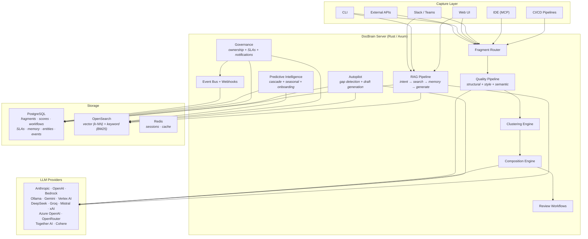

<p align="center">
  
</p>

<p align="center">
  <strong>The institutional memory layer for your organization.</strong><br/>
  DocBrain captures the decisions, fixes, and expertise that live in conversations, tickets, incidents, and people's heads — connects them across the tools you already use, keeps them accurate, and preserves them when people leave. Self-hosted. Read-only. Every answer cited to its source.
</p>

<p align="center">
  <a href="https://docbrainapi.com"></a>
  <a href="https://github.com/docbrain-ai/docbrain/stargazers"></a>
  <a href="LICENSE"></a>
  
  <a href="https://github.com/docbrain-ai/docbrain/actions/workflows/clients.yml"></a>
  <a href="https://glama.ai/mcp/servers/docbrain-ai/docbrain"></a>
</p>

<p align="center">
  <a href="https://docbrainapi.com"><strong>Website</strong></a> &bull;
  <a href="https://docbrainapi.com/docs"><strong>Docs</strong></a> &bull;
  <a href="#quickstart">Quickstart</a> &bull;
  <a href="#the-problem">The Problem</a> &bull;
  <a href="#how-docbrain-works">How It Works</a> &bull;
  <a href="#features">Features</a> &bull;
  <a href="#architecture">Architecture</a> &bull;
  <a href="#security-architecture">Security</a>
</p>

---

> **Project Status: client source open, server closed.** The source for everything DocBrain runs on *your* side of the network boundary — the `docbrain` CLI and the IDE MCP server — is in this repo under [`crates/`](crates/), MIT-licensed, built and tested in public CI. Audit exactly what runs in your environment and what leaves it. The server ships as free production Docker images (BSL 1.1 permits production use) with full Helm charts, complete configuration, the [threat model](THREAT_MODEL.md), and all the docs to self-host in production. The server source stays closed for now — we originally targeted the first half of 2026 to publish it, we missed that date, and we won't post a new date until we're certain we can hit it. If a closed server is a dealbreaker for you, that's a rational position and we respect it: [how DocBrain earns trust](https://docbrainapi.com/docs/trust/). Contributions: code PRs for the client crates, plus documentation, configuration, and bug reports. When the server source publishes, it will be under the BSL 1.1 terms below.

---

## The Problem

Every organization runs on knowledge that never gets written down.

The decision made in a meeting. The fix someone found at 2am. The workaround only one person knows. The reason it was built *this* way and not the obvious way. It lives in PRs, chat threads, tickets, and people's heads — and it was never going to end up in a wiki.

Then it leaves. Someone changes teams or quits, and years of context walk out with them. A new hire spends months re-asking questions that were answered long ago. Two teams solve the same problem a quarter apart because neither could find the other's work. During an incident, the one runbook that matters is six months stale and the person who wrote it is gone.

**The root cause isn't laziness, and it isn't missing docs.** Knowledge written down *after* the work is done is written from memory, without context, under competing priorities — a tax nobody wants to pay, and the result decays the moment it's written.

Every tool in the market solves the wrong half of the problem. They index the knowledge you *already* wrote down and put a chatbot on top. Now you retrieve your stale, incomplete, scattered wiki slightly faster.

**The knowledge that actually runs your organization was never captured in the first place.** And it's getting worse: people change roles faster, teams are distributed, and AI now produces work faster than any human can absorb the reasoning behind it. The gap between what your organization does and what it remembers widens every quarter.

This isn't only an engineering problem. The same amnesia hits operations, support, and any team whose expertise lives in its people. DocBrain starts where knowledge decays fastest, and its language-agnostic [Connector SDK](docs/connectors.md) extends the same memory layer to any source you have.

---

## How DocBrain Works

DocBrain is a **memory layer**. It doesn't wait for someone to write a doc — it captures knowledge at the point of creation, connects it into one searchable memory, preserves the reasoning behind it, and keeps it accurate over time. Capture happens *at the source*, the same principle that made shift-left testing work: move the capture upstream, to where the knowledge actually exists.

```
                    WHERE KNOWLEDGE IS CREATED
                    ─────────────────────────

  Someone merges a change      ──→  DocBrain extracts the decisions, caveats, procedures
  A team works through chat    ──→  DocBrain distills the answer from the conversation
  A deploy goes out            ──→  DocBrain captures what changed and why
  On-call resolves an incident ──→  DocBrain captures the fix and the root cause
  Any other system you run     ──→  DocBrain ingests it via the Connector SDK

                              │
                              ▼

                   HOW KNOWLEDGE BECOMES MEMORY
                   ────────────────────────────

      ┌─────────┐    ┌──────────┐    ┌───────────┐    ┌──────────┐
      │ Capture │───→│ Connect  │───→│ Preserve  │───→│  Keep    │
      │         │    │          │    │           │    │ current  │
      └─────────┘    └──────────┘    └───────────┘    └──────────┘

  At the source,      Linked into        Decisions and       Freshness
  the moment it's     one graph by       the "why" kept      tracked; stale
  created — no        topic, people,     with provenance     and conflicting
  wiki to maintain    and dependencies                       knowledge flagged
```

**This is what makes DocBrain different.** Other tools organize the knowledge you already wrote down and answer questions about it. DocBrain captures the knowledge you *didn't* — the PR decisions, the chat explanations, the deployment gotchas, the incident resolutions — and turns it into memory your whole organization can draw on.

The result: knowledge **born from real work**, not written from memory. **Connected** into one memory, not scattered across ten tools. **Preserved with its context**, so the *why* survives the people who knew it. And **kept current**, so you can trust what it tells you.

---

## Quickstart

```bash
git clone https://github.com/docbrain-ai/docbrain.git && cd docbrain
./scripts/setup.sh    # interactive wizard: picks provider, sets keys, starts services
```

Or manually:

```bash
cp .env.example .env   # set LLM_PROVIDER and API keys
docker compose up -d
```

```bash
# Get the auto-generated admin API key
docker compose exec server cat /app/admin-bootstrap-key.txt

# Open the web dashboard
open http://localhost:3001

# Or ask a question via API (same origin as the UI — /api/* is proxied to the server)
curl -H "Authorization: Bearer <key>" \
     -H "Content-Type: application/json" \
     -d '{"question":"How do I deploy to production?"}' \
     http://localhost:3001/api/v1/ask
```

The **Web UI** at `http://localhost:3001` gives you the full experience: dashboard, knowledge capture, governance, quality scores, review workflows, predictive analytics, and more. Full setup guide: [docs/quickstart.md](docs/quickstart.md)

---

## Why DocBrain

### For Engineers
- **Zero extra work.** Knowledge is captured from PRs, commits, Slack threads, and CI pipelines you're already using. No context-switching to a wiki.
- **Capture from your IDE.** `docbrain_annotate`, `docbrain_suggest_capture`, and `docbrain_commit_capture` via MCP. Works in Claude Code, Cursor, and any MCP-compatible editor.
- **Quality gates in CI.** Lint docs with custom style rules, enforce structure, catch stale content before it ships. `POST /api/v1/quality/lint` plugs into any CI pipeline.
- **Ask, don't search.** Query your entire knowledge base with confidence-scored answers that cite sources. No more digging through Confluence.

### For Team Leads & Managers
- **Know what's documented and what isn't.** Governance dashboards show coverage per space, per team. See exactly where the gaps are.
- **SLA enforcement.** Per-space policies ensure gaps are acknowledged within 24h and resolved within 7 days. Automated breach detection with notifications.
- **ROI tracking.** Documentation velocity, time saved per query, resolution rates, and knowledge half-life, per team, in dollars.
- **Review workflows.** Multi-stage approval pipelines (SME Review → Writer Review → Publish) with threaded comments, so nothing goes live without oversight.

### For Platform & Operations
- **Self-hosted, single binary.** Rust backend, no JVM, no Python dependency hell. Docker, Kubernetes, or bare metal. Sub-100ms API responses.
- **14 LLM providers.** Anthropic, OpenAI, AWS Bedrock, Ollama (fully local), Gemini, and 9 more. Swap providers without changing a line of code.
- **13+ knowledge sources.** Confluence, Slack, Teams, GitHub, GitLab, Jira, PagerDuty, and more. Connector SDK for anything else.
- **Full OpenAPI spec.** Swagger UI at `/api/docs`. Auto-generated OpenAPI 3.1 spec. 150+ API endpoints.
- **RBAC, SSO, space isolation.** GitHub/GitLab/OIDC SSO, 4-tier role system (viewer/editor/analyst/admin), per-space access restrictions.
- **Event-driven.** Real-time event bus with SSE streaming. Outbound webhooks with HMAC-SHA256 signing, exponential backoff, and circuit breakers.

### "My IDE already has MCP. Why DocBrain?"

Fair question. Cursor and Claude Code can hit your tools over MCP too. The difference is what happens after the answer: they forget it, DocBrain keeps it.

| | IDE + MCP | DocBrain |
|---|---|---|
| Reads live tools at answer time | Yes | Yes |
| Remembers the answer after you close the tab | No | Yes |
| Learns from everyone, not just you | No | Yes |
| Maps who owns what, what depends on what | No | Yes |
| Turns answers into durable, quality-scored docs | No | Yes |
| Scope | One developer's session | One shared brain for the org, with RBAC |

An IDE asks your tools a question. DocBrain turns every question your organization has ever asked into a system that gets smarter. The 100th person asking about a topic gets a better answer because of the first 99.

---

## Features

### Knowledge Capture at the Source

The core of DocBrain. Every integration point captures knowledge where it's created, before anyone has to remember to document it.

| Capture Point | How It Works |
|---|---|
| **Merged PRs** | `POST /api/v1/ci/analyze`: LLM extracts decisions, facts, caveats, and procedures from diffs and commit messages. Hook it into GitHub Actions or GitLab CI. |
| **Deployments** | `POST /api/v1/ci/deploy-capture`: Captures deployment context, environment changes, and rollback procedures. |
| **Slack & Teams** | Capture threads via message shortcut, `@DocBrain capture` mention, or `/docbrain capture`: distills conversations into knowledge fragments with confidence scoring. |
| **IDE (MCP)** | `docbrain_annotate` links knowledge to exact code locations. `docbrain_commit_capture` captures intent at commit time. 10 MCP tools total. |
| **Conversations** | Auto-distillation extracts fragments from Q&A sessions. When someone asks a question and gets a good answer, that answer becomes a fragment automatically. |
| **Manual** | `POST /api/v1/fragments`: Teams can submit fragments directly. CLI: `docbrain capture`. |

**What happens after capture:** Every fragment is confidence-scored and routed automatically:
- **High confidence (>0.7):** Auto-indexed into search, immediately available for Q&A
- **Medium confidence (0.4–0.7):** Queued for human review
- **Low confidence (<0.4):** Discarded as noise

### Knowledge Quality Pipeline

Every fragment and document is scored across three independent layers. No unscored content enters the system:

| Layer | Method | What It Measures |
|---|---|---|
| **Structural** | Deterministic (no LLM cost) | Heading structure, section completeness, code examples, link density, readability |
| **Style** | Rule engine | Banned terms, heading depth, sentence length, required sections, custom regex |
| **Semantic** | LLM-assessed (budget-controlled) | Accuracy, clarity, completeness, actionability |

Composite score: `structural × 0.4 + style × 0.3 + semantic × 0.3`

Quality scores drive automation: low-scoring docs trigger maintenance suggestions, stale docs trigger freshness alerts, and contradictions between docs are flagged automatically.

### Custom Style Rules: Your Style Guide, Enforced Automatically

Every team has a style guide. Nobody follows it. DocBrain enforces it on every document and draft:

```yaml
# Export your rules as YAML, version-control them, import across spaces
- rule_type: terminology
  name: no-simple
  description: "Don't assume expertise. Avoid 'simple' and 'easy'"
  config:
    wrong: "simple"
    right: "straightforward"
    match_whole_word: true
  severity: warning

- rule_type: formatting
  name: short-sentences
  description: "Keep sentences under 40 words for readability"
  config:
    max_words: 40
  severity: info

- rule_type: structure
  name: require-intro
  description: "Every doc needs an introduction before the first heading"
  config:
    min_words_before_first_heading: 10
  severity: warning

- rule_type: custom_pattern
  name: no-internal-urls
  description: "Don't leak internal URLs in public docs"
  config:
    pattern: "https?://internal\\."
    message: "Remove internal URL before publishing"
  severity: error
```

**Four rule types:** `terminology` (banned/preferred terms), `formatting` (heading depth, sentence length), `structure` (required sections, intro paragraphs), and `custom_pattern` (regex for anything else).

**Per-space scoping:** Different rules for API docs vs. runbooks vs. onboarding guides.

**YAML import/export:** Version-control your rules. `GET /api/v1/style-rules/export` → commit to git → `POST /api/v1/style-rules/import` on deploy.

**Lint any text on demand:** `POST /api/v1/quality/lint` with raw text → get violations with line numbers, severity, and fix suggestions. Wire it into CI to block PRs that break your style guide.

**GitOps for style policy:** Check `.docbrain/style.md` into your team's repo; DocBrain pulls it on a schedule and applies the rules to every draft for that space. Policy changes go through normal PR review. See [`docs/style-policy.md`](docs/style-policy.md) and the working [`examples/style/`](examples/style/) example.

### Governance & Accountability

Documentation without ownership decays. DocBrain makes ownership and accountability explicit:

- **Space ownership**: Owners, maintainers, and topic stewards per knowledge space. Clear responsibility chains.
- **SLA policies**: Per-space deadlines for gap acknowledgment (24h), resolution (7d), draft review (48h), and document freshness. Configurable per space.
- **Breach detection**: Automated scanning surfaces SLA violations. Breaches trigger events, notifications, and webhook deliveries.
- **Governance dashboard**: Coverage percentages, SLA compliance trends, quality distribution, capture velocity, and top contributors, all in one view.
- **Notifications**: In-app notification center with unread tracking. SLA breaches, review assignments, and gap alerts delivered to the right people.

See [Governance Guide](docs/governance.md) for setup and configuration.

### Review Workflows

Configurable multi-stage review pipelines for documentation drafts:

- **Define stages per space**: e.g., SME Review → Technical Writing → Publish Approval. Each stage has assigned reviewers and required approvals.
- **Submit for review**: Autopilot drafts, manually written docs, or composed fragments can all enter the review pipeline.
- **Approve / Request Changes / Reject**: Reviewers act on drafts with threaded comments for inline feedback.
- **Personal review queue**: Every reviewer sees their pending items in one place.
- **Auto-publish on approval**: When all stages pass, the document publishes to your configured target (Confluence, etc.).

See [Review Workflows Guide](docs/reviews.md) for configuration and API details.

### Source-System Access Control (ACL)

DocBrain enforces source-system permissions at query time. Restrict a Confluence page to your Finance team and DocBrain respects it; lock down a private Slack channel and DocBrain won't surface its content to users outside that channel.

- **Per-source extraction**: Confluence page restrictions, GitHub repo visibility + collaborators, Slack channel membership, Jira issue security levels. Each source's real permission model is mirrored, not flattened.
- **Three enforcement modes**: `off` (default, fully backwards-compatible), `warn` (logs would-have-denied chunks for coverage validation), `enforce` (drops denied chunks before they reach the LLM).
- **Side-channel mitigations**: when the filter wipes out results, the answer text, confidence score, and source list are all sanitized so the response doesn't leak the existence of denied content via context-derived synthesis.
- **Three denial UX modes**: `silent` (MNPI-safe, generic message), `disclosed_no_count` (default, tells the user the filter is on, no specifics leak), `disclosed` (full transparency for open-collaboration orgs).
- **Per-source / per-role overrides** with strictest-wins resolution. Mixing public and restricted content in one query never weakens the response.
- **Audit log** for HIPAA / FedRAMP / SOC2 compliance. Every full or partial denial persisted with policy provenance.
- **Structured `access` metadata** in every API response so any client (web UI, Slack bot, CLI, custom integration) can render denials appropriately.

```yaml
acl:
  mode: enforce
  sources:
    confluence: { mode: mirror }
    github:     { mode: mirror }
    slack:      { mode: mirror }
    jira:       { mode: mirror }
  denial:
    mode: disclosed_no_count       # silent | disclosed_no_count | disclosed
    referral: "your administrator"
    audit: false                   # flip true for compliance contexts
```

Default off. Opt in source by source. See [Access Control (ACL)](docs/access-control.md) for the full guide.

### Intelligent Q&A (RAG)

- **Confidence-scored answers**: High confidence returns sourced answers with citations. Low confidence asks clarifying questions instead of guessing.
- **Intent classification**: Adapts response format to query type: find, how-to, troubleshoot, who-owns, explain. Each gets a different answer structure.
- **Hybrid search**: OpenSearch with both vector (k-NN) and keyword (BM25) retrieval, combined for precision.
- **4-tier memory**: Working, episodic, semantic, and procedural memory that compounds over time. The system gets smarter with use.
- **Document freshness**: 5-signal scoring (time decay, engagement, content currency, link health, contradiction detection) with staleness alerts. Auto-detects archived / historical / reference docs from Confluence labels and excludes them from scoring. Old isn't the same as wrong. See [exclusion rules](docs/configuration.md#excluding-documents-from-freshness-reports).

### Documentation Autopilot

The autonomous documentation engine that finds and fills gaps without human intervention:

- **Gap detection**: Clusters unanswered questions and low-confidence answers by semantic similarity. Severity scoring based on user count, negative signal ratio, and recency.
- **Draft generation**: AI composes missing documentation grounded in existing docs, fragments, and conversation context. No hallucination. Every claim must be sourced.
- **Review routing**: Generated drafts automatically enter the review workflow for human approval. Nothing publishes without oversight.
- **Weekly digest**: Summary of gaps detected, drafts generated, and coverage changes delivered to space owners.
- **Forecast**: Predictive gap analysis shows where documentation gaps are likely to appear next.

See [Autopilot Guide](docs/autopilot.md) for configuration and tuning.

### Grounded Doc Generation (`docbrain generate`)

Produce a documentation draft grounded in your org's own reality — your runbooks, incidents, tickets, PRs, and Slack threads — with per-claim provenance, and honest about what it doesn't know. A frontier model with no access to your systems writes fluent, generic prose; `generate` writes what is true *for you*, or says it can't. Where Autopilot is automatic and gap-driven, `generate` is on-demand: *you* name the doc, hand it the source material, and get the markdown back.

- **Provenance, not vibes.** Every section is attributed to the corpus, episode, or live connector it was built from.
- **Same gates as every other DocBrain doc.** Secret/PII redaction, hostname scrub, prompt-injection quarantine, and structural + style scoring all apply — a template can shape sections and tone but can *never* carry or disable a safety rule.
- **Honest when it doesn't know.** Instead of fabricating, it emits `needs_input` — the open questions the available knowledge couldn't answer.
- **Returns, never publishes.** Stateless. stdout is pipe-clean (markdown only); diagnostics go to stderr; non-zero exit on error-severity violations unless `--allow-violations` (CI-native).

```bash
# Runbook from local notes, redirected to a file (pipe-clean stdout)
docbrain generate "runbook for cert rotation" --source notes.md > out.md

# Postmortem grounded in a real Slack incident thread
docbrain generate "postmortem from this incident" \
  --source-url https://acme.slack.com/archives/C123/p1700000000123 > postmortem.md

# API reference grounded in a GitHub PR's changes
docbrain generate "API reference for the changed endpoints" \
  --source-url https://github.com/acme/repo/pull/42 --type reference
```

- **`--source-url`** (repeatable) names a link as primary material — DocBrain fetches it via the connected MCP connector (Confluence page, Jira issue, Slack thread, GitHub PR or file). It is **all-or-nothing**: if *any* named URL can't be fetched the whole run aborts and names the failed source — never a doc silently built from a subset. Fetched content is size-bounded (per-source + aggregate byte caps) just like inline sources.
- **`--target`** augments an existing doc instead of rewriting it; **`--template`** points at **a markdown file your team already has** (an existing runbook, a doc skeleton) — no special format to learn: `generate` follows its `##` section structure, each section's block shape (table columns, checklists, code blocks, header fields) and tone, filling from your sources and marking gaps `NEEDS INPUT` (it never copies the file's example rows, commands, or placeholder text). **`--no-enrich`** turns off live-MCP enrichment for a corpus/seed-only run.
- **CI-native.** Generate or update a doc straight from a PR URL or a `git diff` and fail the build on bad quality. See **[Using `generate` in CI](docs/generate.md#using-generate-in-ci)**.
- **API:** `POST /api/v1/generate` (editor role, same auth as `/ask`) returns a `GeneratedArtifact` — `markdown`, `doc_type`, `provenance`, `needs_input`, `skipped_sources`, `quality`. Errors: `400` bad request/unknown source kind/unsupported URL · `403` not editor · `413` source over size budget · `502` a named `--source-url` couldn't be fetched · `503` not configured.

See the full **[Generate guide](docs/generate.md)** for every flag, the template format, and CI playbooks.

### Fragment Lifecycle

The full journey from captured knowledge to published documentation:

```
Capture → Confidence routing → Auto-index / Review queue / Discard
                                       │
                    Semantic clustering (DBSCAN on embeddings)
                                       │
                    Auto-composition when cluster is ready
                    (3+ fragments, 2+ sources, shared topic)
                                       │
                    Quality scoring (structural + style + semantic)
                                       │
                    Review workflow (configurable stages)
                                       │
                    Published documentation
```

### Predictive Intelligence

DocBrain doesn't just document what exists. It predicts what's about to break:

- **Cascade staleness**: When one document changes, which other docs become stale? Dependency graph analysis surfaces cascade effects before they cause incidents.
- **Seasonal patterns**: Recurring documentation needs (quarterly reviews, annual compliance, onboarding seasons) predicted from historical patterns.
- **Onboarding gap detection**: Documents that new hires struggle with, ranked by friction score.
- **Code change analyzer**: Submit a PR diff, get back a list of documentation that needs updating. Wire it into CI to block merges when docs are impacted.

### Knowledge Graph & Analytics

- **Entity graph**: Relationships between documents, people, teams, and topics. BFS/DFS traversal, blast radius analysis, and shortest-path queries.
- **Expert finder**: "Who knows about Kubernetes networking?" → ranked list of contributors by topic, based on authorship and review activity.
- **Documentation velocity**: Gap resolution rate, knowledge half-life, ROI in USD, capture velocity per team. Grade-based scoring (A–F) per space.
- **Freshness scoring**: 5-signal composite score with contradiction detection. Two docs that say different things about the same topic? Flagged automatically.
- **Autonomous maintenance**: Contradiction fixes, link repairs, version updates, surfaced as suggestions with one-click apply.

See [Knowledge Intelligence Guide](docs/knowledge-intelligence.md) for details.

### Connector SDK: Plug In Any Source

Build a connector for any knowledge source in any language. DocBrain handles scheduling, retries, circuit breaking, and ingestion. Your connector just serves three HTTP endpoints:

```
GET  /health           → { "status": "ok", "connector_name": "notion" }
POST /documents/list   → Return document IDs (paginated, incremental via "since")
POST /documents/fetch  → Return full document content for given source IDs
```

Register it in DocBrain, set a cron schedule, and every document flows through the same quality pipeline as built-in sources. Includes SSRF protection, circuit breaker (auto-disable after 5 failures), and incremental sync. [Connector Protocol Docs →](docs/connectors.md)

### MCP IDE Capture

10 tools for Claude Code, Cursor, and any MCP-compatible editor:

- `docbrain_annotate`: Link knowledge to exact code locations
- `docbrain_suggest_capture`: AI suggests what to capture from your current context
- `docbrain_commit_capture`: Capture intent and decisions at commit time
- `docbrain_ask`: Query your knowledge base without leaving the IDE

### Event Bus & Webhooks

- Real-time internal pub/sub with persistent event logging and SSE streaming
- Outbound webhook subscriptions with HMAC-SHA256 signed payloads
- Subscribe to any event type: `fragment.captured`, `gap.detected`, `draft.created`, `sla.breached`, `quality.scored`
- Exponential backoff, circuit breakers, delivery history with replay

### Web Dashboard

DocBrain ships with a full web application. Not a thin wrapper, but a complete management interface:

- **Home**: Dashboard with gap forecast, capture trends, analytics KPIs, and knowledge health at a glance
- **Ask**: Chat interface with streaming responses, source citations, feedback, and conversation history
- **Autopilot**: Gap analysis, draft generation, and AI-assisted documentation workflows
- **Captures**: CI captures, conversation distillation, fragment review queue, and cluster visualization
- **Governance**: Ownership coverage, SLA compliance, quality trends, space health, and review workflows
- **Quality**: Document scores, style rule management, and on-demand linting
- **Events**: Real-time event stream, webhook management with delivery tracking
- **Notifications**: In-app notification center with unread tracking and mark-as-read
- **Graph**: Interactive knowledge graph with entity lookup, dependency visualization, and blast radius
- **Velocity**: Team ROI dashboard with time-saved calculations and efficiency grades
- **Predictive**: Cascade staleness, seasonal patterns, onboarding gaps, and code change analysis
- **Settings**: User profile, API key management, connectors, freshness tuning, and system maintenance

### Integrations

| Integration | Type |
|---|---|
| **Slack** | `/docbrain ask`, `/docbrain incident`, thread capture (shortcut or `@DocBrain capture`) |
| **MCP (IDE)** | 10 tools for Claude Code, Cursor, and any MCP-compatible editor |
| **CLI** | `docbrain ask`, `docbrain login`, `docbrain capture`, `docbrain freshness` |
| **GitHub** | PR capture via Actions or webhooks, discussion capture |
| **GitLab** | MR discussion capture, webhook-driven indexing |
| **Jira** | Issue and comment capture for decision tracking |
| **Confluence** | Bidirectional: ingest from Confluence, publish drafts back to Confluence |
| **PagerDuty / OpsGenie** | Incident resolution capture |
| **HTTP Connector** | Stateless protocol for custom source ingestion |
| **OpenAPI** | Swagger UI at `/api/docs`, auto-generated spec at `/api/docs/openapi.json` |

---

## Architecture


```mermaid
graph TB
    subgraph "Capture Layer"
        CI["CI/CD Pipelines"]
        IDE["IDE (MCP)"]
        SLACK["Slack / Teams"]
        WEB["Web UI"]
        CLI["CLI"]
        API_EXT["External APIs"]
    end

    subgraph "DocBrain Server (Rust / Axum)"
        FRAG["Fragment Router"]
        QUAL["Quality Pipeline<br/><i>structural + style + semantic</i>"]
        CLUST["Clustering Engine"]
        COMP["Composition Engine"]
        REV["Review Workflows"]
        RAG["RAG Pipeline<br/><i>intent → search → memory → generate</i>"]
        AUTO["Autopilot<br/><i>gap detection + draft generation</i>"]
        GOV["Governance<br/><i>ownership + SLAs + notifications</i>"]
        PRED["Predictive Intelligence<br/><i>cascade + seasonal + onboarding</i>"]
        EVT["Event Bus + Webhooks"]
    end

    subgraph "Storage"
        PG["PostgreSQL<br/><i>fragments · scores · workflows<br/>SLAs · memory · entities · events</i>"]
        OS["OpenSearch<br/><i>vector (k-NN) + keyword (BM25)</i>"]
        RD["Redis<br/><i>sessions · cache</i>"]
    end

    subgraph "LLM Providers"
        PROVIDERS["Anthropic · OpenAI · Bedrock<br/>Ollama · Gemini · Vertex AI<br/>DeepSeek · Groq · Mistral · xAI<br/>Azure OpenAI · OpenRouter<br/>Together AI · Cohere"]
    end

    CI & IDE & SLACK & WEB & CLI & API_EXT --> FRAG
    FRAG --> QUAL --> CLUST --> COMP --> REV
    WEB & CLI & SLACK --> RAG
    RAG & AUTO & GOV & PRED --> PG & OS
    RAG & AUTO & COMP & QUAL --> PROVIDERS
    EVT --> PG
    GOV --> EVT
```

| Component | Technology | Role |
|---|---|---|
| API Server | Rust, Axum, Tower | HTTP/SSE, auth, RBAC, rate limiting |
| Quality Pipeline | Structural + Rule Engine + LLM | 3-layer document and fragment scoring |
| Fragment Engine | DBSCAN clustering, LLM composition | Capture, route, cluster, compose |
| Review System | Multi-stage state machine | Configurable approval workflows |
| Governance | SLA checker, breach detection | Ownership, accountability, notifications |
| RAG Pipeline | Hybrid search, 4-tier memory | Intent classification, generation |
| Autopilot | Gap analysis, severity scoring | Autonomous gap detection and draft generation |
| Predictive | Graph analysis, pattern detection | Cascade staleness, seasonal, onboarding |
| Storage | PostgreSQL 17, OpenSearch 2.19, Redis 7 | Metadata, vectors, sessions |

---

## Security Architecture

DocBrain runs entirely in your infrastructure. No data leaves your network unless you configure an external LLM provider.

```
                    YOUR NETWORK BOUNDARY
 ┌──────────────────────────────────────────────────────────────────┐
 │                                                                  │
 │  ┌─────────────┐     TLS + Bearer Token     ┌────────────────-┐  │
 │  │ Users       │ ──────────────────────────▶ │ DocBrain       │  │
 │  │ (Browser,   │                             │ Server         │  │
 │  │  CLI, Slack,│ ◀────── JSON / SSE ──────── │ (Rust/Axum)    │  │
 │  │  MCP IDE)   │                             │                │  │
 │  └─────────────┘                             │ • RBAC (4 roles│  │
 │                                              │ • Argon2 keys  │  │
 │                                              │ • Rate limiting│  │
 │                                              │ • Audit logging│  │
 │                                              └──┬──┬──┬──┬────┘  │
 │                                                 │  │  │  │       │
 │              ┌──────────────────────────────────┘  │  │  │       │
 │              ▼                 ▼                   ▼  │  │       │
 │  ┌───────────────┐ ┌──────────────────┐ ┌────────────┐│  │       │
 │  │ PostgreSQL    │ │ OpenSearch       │ │ Redis      ││  │       │
 │  │               │ │                  │ │            ││  │       │
 │  │ • Users/keys  │ │ • Document       │ │ • Sessions ││  │       │
 │  │ • Episodes    │ │   chunks +       │ │ • Rate     ││  │       │
 │  │ • Fragments   │ │   embeddings     │ │   counters ││  │       │
 │  │ • Gap clusters│ │ • BM25 + k-NN    │ │ • Working  ││  │       │
 │  │ • Audit log   │ │   hybrid search  │ │   memory   ││  │       │
 │  └───────────────┘ └──────────────────┘ └────────────┘│  │       │
 │                                                       │  │       │
 │  All storage is self-hosted. No credentials leave.    │  │       │
 │                                                       │  │       │
 │  ┌ ─ ─ ─ ─ ─ ─ ─ ─ ─ ─ ─ ─ ─ ─ ─ ─ ─ ─ ─ ─ ─ ─ ─ ─ - -│  │       │
 │    OPTION A: LLM stays inside your network            │  │       │
 │  │                                        ┌───────────┘  │       │
 │                                           ▼              │       │
 │  │                               ┌──────────────────┐    │       │
 │                                  │ Ollama           │    │       │
 │  │                               │ (local model)    │    │       │
 │                                  │ Nothing leaves.  │    │       │
 │  │                               └──────────────────┘    │       │
 │  └ ─ ─ ─ ─ ─ ─ ─ ─ ─ ─ ─ ─ ─ ─ ─ ─ ─ ─ ─ ─ ─ ─ ─ ─ ─ │─  ┘ 
 └───────────────────────────────────────────────────────────│──────┘
                                                             │
          OPTION B: LLM in your cloud account ───────────────│──────
                                                             │
              ┌──────────────────────────────────────────────┘
              ▼
 ┌────────────────────────┐    Only query text + relevant chunk
 │ AWS Bedrock            │    context is sent. Your cloud account,
 │ Azure OpenAI           │    your data policies, your encryption
 │ Google Vertex AI       │    keys. No data shared with third
 └────────────────────────┘    parties.

          OPTION C: Third-party LLM API ─────────────────────────────
              │
              ▼
 ┌────────────────────────┐    Query text + relevant chunk context
 │ Anthropic API          │    sent via TLS. Subject to provider's
 │ OpenAI API             │    data policies. No bulk export,
 │ Groq / Mistral / etc.  │    only per-request context.
 └────────────────────────┘
```

**The LLM is required**. It powers RAG, intent classification, quality scoring, and draft generation. You choose where it runs:

| Option | Data leaves your network? | Best for |
|---|---|---|
| **Ollama** (local) | No. Zero egress. | Air-gapped, regulated, maximum control |
| **Bedrock / Azure / Vertex** | Stays in your cloud account | Enterprise: your KMS, your VPC, your audit trail |
| **Anthropic / OpenAI / etc.** | Query + chunk context sent via TLS | Fastest setup, best model quality |

**What data goes where:**

| Data | Stays in your infra | Sent to LLM |
|---|---|---|
| Documents, embeddings, indexes | Yes (PostgreSQL + OpenSearch) | No |
| User queries | Yes (episodes table) | Yes, needed for answer generation |
| API keys, passwords | Yes (Argon2 hashed) | No |
| Chunk context for answers | Yes (OpenSearch) | Yes, relevant chunks only, not full corpus |
| Analytics, gap clusters, feedback | Yes (PostgreSQL) | No |

**Security controls:**

| Control | Implementation |
|---|---|
| Authentication | API keys with Argon2 hashing, OIDC/SSO (GitHub, GitLab, generic OIDC) |
| Authorization | 4-tier RBAC (Viewer → Editor → Analyst → Admin) enforced on every endpoint |
| Space isolation | Per-key `allowed_spaces` hard-filters search results, so users only see their team's docs |
| Rate limiting | Per-key RPM limits with sliding window |
| Secrets | Keys shown once at creation, stored as hashes. Bootstrap key written to file with 0600 permissions |
| Audit | All admin actions logged with user, action, timestamp, and target |
| SQL injection | Compile-time verified parameterized queries (sqlx), no string interpolation |
| Prompt injection | XML delimiter sanitization on all untrusted content entering LLM context |
| Webhook verification | HMAC-SHA256 signed payloads for inbound webhooks (Confluence, GitHub, GitLab) |

For the full threat model with 11 analyzed attack vectors and an operator security checklist, see [THREAT_MODEL.md](THREAT_MODEL.md).

---

## LLM Providers

| Provider | Config |
|---|---|
| **Anthropic** | `LLM_PROVIDER=anthropic` |
| **OpenAI** | `LLM_PROVIDER=openai` |
| **AWS Bedrock** | `LLM_PROVIDER=bedrock` |
| **Ollama** | `LLM_PROVIDER=ollama`: 100% local, no data leaves your machine |
| **Google Gemini** | `LLM_PROVIDER=gemini` |
| **Vertex AI** | `LLM_PROVIDER=vertex_ai` |
| **DeepSeek** | `LLM_PROVIDER=deepseek` |
| **Groq** | `LLM_PROVIDER=groq` |
| **Mistral** | `LLM_PROVIDER=mistral` |
| **xAI (Grok)** | `LLM_PROVIDER=xai` |
| **Azure OpenAI** | `LLM_PROVIDER=azure_openai` |
| **OpenRouter** | `LLM_PROVIDER=openrouter` |
| **Together AI** | `LLM_PROVIDER=together` |
| **Cohere** | `LLM_PROVIDER=cohere` |

See [Provider Setup](docs/providers.md) for detailed configuration including model selection guidance.

---

## Deployment

### Docker Compose

```bash
docker compose up -d
```

Starts everything behind a single-origin reverse proxy at `localhost:3001` — the web UI at `/` and the API at `/api/*` (this same-origin setup is required by the web app's strict CSP). The API server, web UI, PostgreSQL, OpenSearch, and Redis run on the internal compose network. Migrations run automatically on first boot.

### Kubernetes

```bash
helm install docbrain ./helm/docbrain \
  --set llm.provider=anthropic \
  --set llm.anthropicApiKey=sk-ant-...
```

See [Kubernetes Guide](docs/kubernetes.md) for production configuration, scaling, and monitoring.

---

## Configuration

DocBrain uses a config-first architecture:

| File | Purpose |
|---|---|
| `config/default.yaml` | Non-secret defaults: all features, thresholds, intervals |
| `config/local.yaml` | Credentials and local overrides (gitignored) |
| `.env` | Infrastructure secrets: `DATABASE_URL`, LLM API keys |

Environment variables always override config files. See [Configuration Guide](docs/configuration.md).

---

## Documentation

| | |
|---|---|
| [Quickstart](docs/quickstart.md) | Running locally in 5 minutes |
| [Configuration](docs/configuration.md) | All environment variables and options |
| [Provider Setup](docs/providers.md) | LLM and embedding provider configuration |
| [Architecture](docs/architecture.md) | System design, data flow, memory, freshness |
| [Ingestion Guide](docs/ingestion.md) | Connecting 13+ knowledge sources |
| [External Connectors](docs/connectors.md) | Build custom connectors for any knowledge source |
| [Governance](docs/governance.md) | Ownership, SLAs, breach detection, dashboards |
| [Review Workflows](docs/reviews.md) | Multi-stage approval pipelines |
| [Knowledge Intelligence](docs/knowledge-intelligence.md) | Graph, analytics, predictive intelligence |
| [Autopilot](docs/autopilot.md) | Gap detection, draft generation, feedback loop |
| [Learning Pipeline](docs/learning.md) | Embedding fine-tuning (opt-in) |
| [API Reference](docs/api-reference.md) | Full REST API documentation |
| [RBAC](docs/rbac.md) | Role-based access control and SSO |
| [Slack Integration](docs/slack.md) | Slash commands, message shortcuts, and thread capture |
| [GitLab Capture](docs/gitlab-capture.md) | MR discussion indexing |
| [Kubernetes](docs/kubernetes.md) | Helm chart deployment |

---

## See It In Action

| | |
|---|---|
| [What is DocBrain?](https://youtu.be/S4aSTmevvOQ), 5-min overview | [Deep Dive Podcast](https://youtu.be/GN4SC6L8YmI), 20-min deep dive |
| [MCP Preview](https://youtu.be/9mZLoQnGLl8), 30-sec IDE demo | [Full Proof Demo](https://youtu.be/yqj5BCVOLHw), Downvote → Gap → Draft |

---

## Community

- **GitHub Issues:** [Bug reports and feature requests](https://github.com/docbrain-ai/docbrain/issues)
- **GitHub Discussions:** [Questions and community conversation](https://github.com/docbrain-ai/docbrain/discussions)
- **Email:** [hello@docbrainapi.com](mailto:hello@docbrainapi.com)

---

## Contributing

We welcome contributions. Since source code is not yet published, current contributions focus on documentation, configuration, and feedback. See [Contributing Guide](CONTRIBUTING.md).

---

## Security

To report a security vulnerability, see [SECURITY.md](SECURITY.md). Do **not** file a public issue.

---

## License

[Business Source License 1.1](LICENSE) (BSL 1.1). Production use is permitted, except offering DocBrain as a hosted service. Converts to [Apache 2.0](https://www.apache.org/licenses/LICENSE-2.0) on the earlier of January 1, 2028, or 5,000 GitHub stars. For alternative licensing: [licensing@docbrainapi.com](mailto:licensing@docbrainapi.com).

---

## Code of Conduct

[Contributor Covenant Code of Conduct](CODE_OF_CONDUCT.md). 
Report concerns to [hello@docbrainapi.com](mailto:hello@docbrainapi.com).
