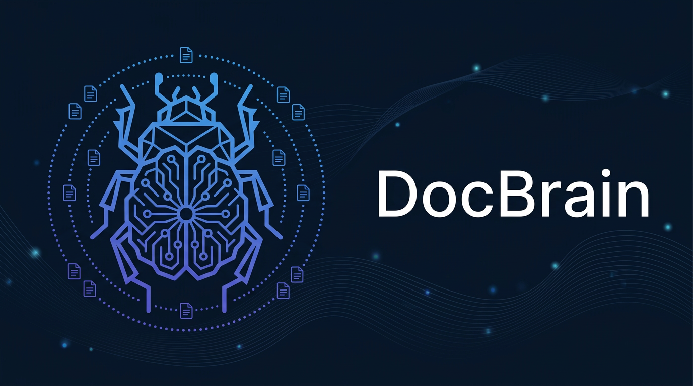
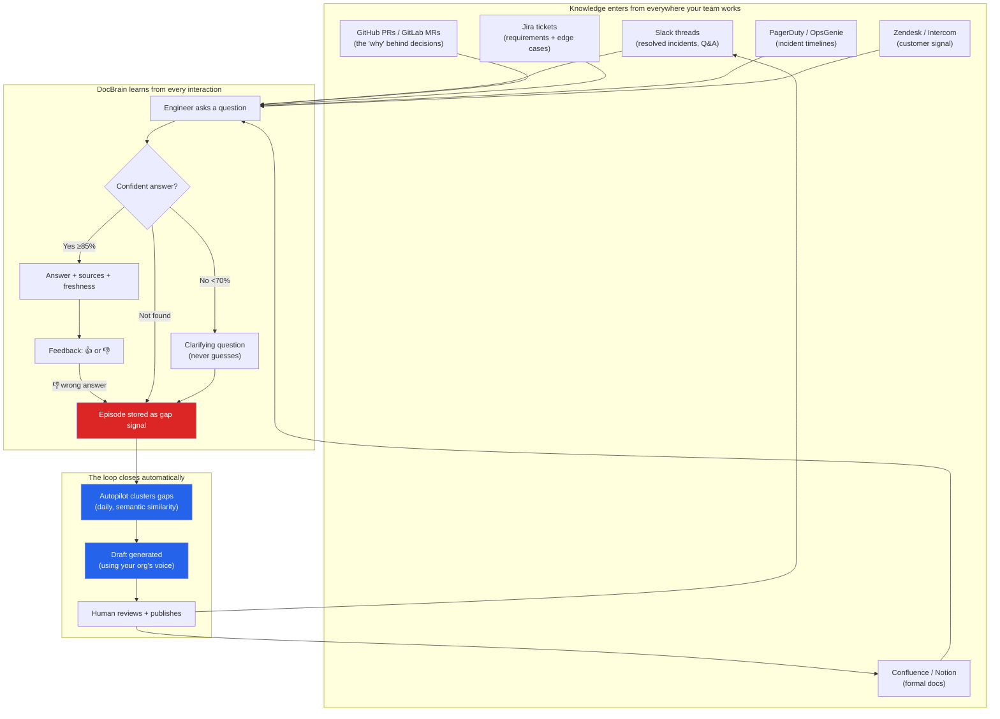
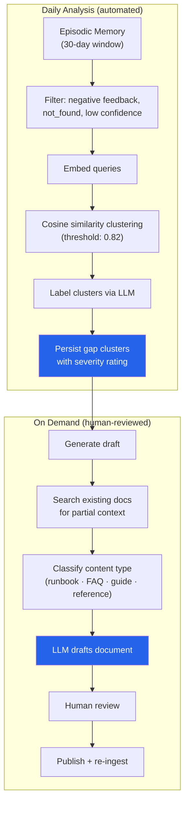
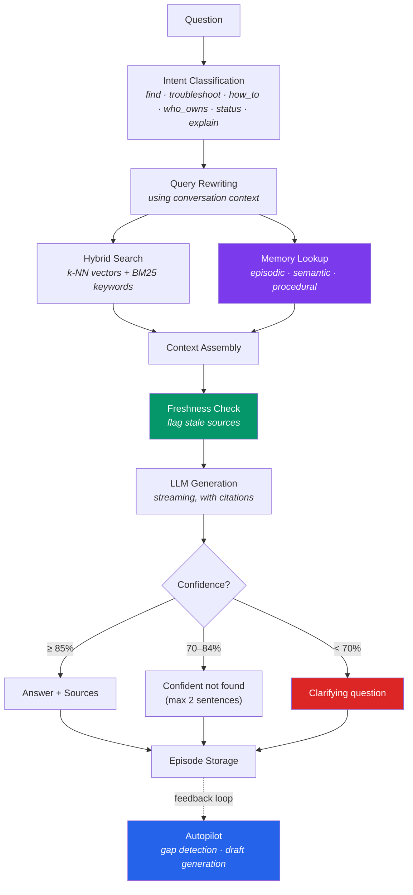
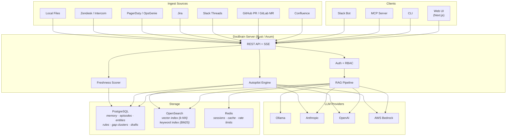

<p align="center">
  
</p>

<p align="center">
  <strong>Most teams have a knowledge problem they don't know how to name.<br/>
  The answer was in a Slack thread. A PR comment. An incident timeline.<br/>
  Somewhere no one thought to look — and now it's gone.</strong>
</p>

<p align="center">
  DocBrain closes the loop: it learns from every place your team already works,<br/>
  answers questions like your most knowledgeable teammate,<br/>
  and turns every unanswered question into a documented solution.
</p>

<p align="center">
  <a href="https://github.com/docbrain-ai/docbrain/stargazers"></a>
  <a href="LICENSE"></a>
  <a href="https://github.com/docbrain-ai/docbrain/releases/latest"></a>
  <a href="https://github.com/docbrain-ai/docbrain/releases/latest"></a>
</p>

<p align="center">
  <a href="#quickstart">Quickstart</a> &bull;
  <a href="#who-is-this-for">Who Is This For</a> &bull;
  <a href="#why-docbrain-is-different">Why Different</a> &bull;
  <a href="#real-world-use-cases">Use Cases</a> &bull;
  <a href="#documentation-autopilot">Autopilot</a> &bull;
  <a href="#connect-your-knowledge-sources">Sources</a> &bull;
  <a href="#how-it-works">How It Works</a> &bull;
  <a href="docs/architecture.md">Architecture</a> &bull;
  <a href="docs/api-reference.md">API</a> &bull;
  <a href="docs/slack.md">Slack</a> &bull;
  <a href="docs/kubernetes.md">Deploy</a>
</p>

---

## The Feedback Loop Your Team Is Missing

Your team's knowledge doesn't live in Confluence. It lives in the places where real work happens.

It's in the GitHub PR where someone explained *why* you're not using gRPC — buried in a review comment that took 20 minutes to write and has never been read since. It's in the Jira ticket that documented the edge case discovered in production. It's in the Slack thread where the 2am incident finally got resolved after 47 minutes. It's in the PagerDuty timeline of the same Redis OOM error you've seen 14 times. It's in the Zendesk ticket where 23 customers independently asked how to configure SSO — which means your docs don't cover it.

**None of that is searchable. None of it learns. None of it knows when it's wrong.**

Every AI documentation tool on the market solves the same half of this problem: embed your Confluence, run vector search, wrap it in an LLM. You get faster answers to questions about things you've already documented.

What you don't get is a system that closes the loop. One that learns what's undocumented from the questions people ask. One that turns a resolved Slack thread into a runbook. One that notices the same incident happened 14 times and surfaces the resolution pattern automatically. One that sees 23 support tickets about SSO configuration and creates a documentation gap signal.

**DocBrain closes that loop. That's the product.**


```mermaid
graph TB
    subgraph "Knowledge enters from everywhere your team works"
        SL["Slack threads<br/>(resolved incidents, Q&A)"]
        PR["GitHub PRs / GitLab MRs<br/>(the 'why' behind decisions)"]
        JR["Jira tickets<br/>(requirements + edge cases)"]
        PD["PagerDuty / OpsGenie<br/>(incident timelines)"]
        ZD["Zendesk / Intercom<br/>(customer signal)"]
        CF["Confluence / Notion<br/>(formal docs)"]
    end

    subgraph "DocBrain learns from every interaction"
        Q["Engineer asks a question"]
        Q --> ANS{"Confident answer?"}
        ANS -->|"Yes ≥85%"| A["Answer + sources + freshness"]
        ANS -->|"No <70%"| CQ["Clarifying question<br/>(never guesses)"]
        A --> FB["Feedback: 👍 or 👎"]
        FB -->|"👎 wrong answer"| EP["Episode stored as gap signal"]
        ANS -->|"Not found"| EP
        CQ --> EP
    end

    subgraph "The loop closes automatically"
        EP --> CL["Autopilot clusters gaps<br/>(daily, semantic similarity)"]
        CL --> DR["Draft generated<br/>(using your org's voice)"]
        DR --> REV["Human reviews + publishes"]
        REV --> SL
        REV --> CF
    end

    SL & PR & JR & PD & ZD & CF --> Q

    style EP fill:#dc2626,color:#fff
    style CL fill:#2563eb,color:#fff
    style DR fill:#2563eb,color:#fff
```

The moat is not the features. Any team can build a RAG pipeline in a weekend. The moat is **the accumulated loop** — 6 months of your org's questions, answers, feedback, incident patterns, and gap signals. That history cannot be replicated. Every question asked makes the next answer better. Every unanswered question becomes a documented solution. The system compounds.

---

## Who Is This For

Any organization where knowledge lives in people's heads instead of somewhere searchable — and where that gap causes downtime, mistakes, slow onboarding, or repeated questions that no one has time to answer.

That's not a software problem. That's an organizational problem. DocBrain solves it regardless of industry.

| Who | The knowledge problem | How DocBrain closes the loop |
|---|---|---|
| **Software Engineering Team** | Runbooks, architecture decisions, deployment procedures — scattered across Confluence, Slack, PR comments, and tribal knowledge | Ingests all of it. Answers in seconds. Learns from every unanswered question. |
| **SRE / On-Call Engineer** | The same incident has happened 14 times. The resolution lived in a Slack thread that's now buried. | Incident pattern memory: "We've seen this 14 times. Here's what worked 11/14." |
| **Manufacturing / Operations** | Line operators need fault procedures on the floor. The expert who wrote them retired. New operators make expensive mistakes. | Tablet-accessible Q&A against your maintenance manuals, SOP library, and fault logs. Unanswered questions surface gaps before the next shift. |
| **Logistics / Field Operations** | Dispatch procedures, compliance checklists, equipment manuals — siloed by site, team, or vehicle type. Onboarding takes weeks. | One interface across all sites. New hires get the right procedure, not a 200-page PDF. |
| **Healthcare / Clinical Operations** | Protocols update. Staff miss the update. Someone follows the old procedure. | Every protocol has a health score. Staff get answers from the current version. Outdated procedures are flagged automatically. |
| **Legal / Compliance** | Policy changes are emailed. Three months later, someone acts on the old version. Nobody knows it's happened. | Policies ingested, versioned, health-scored. Questions answered from the latest version. Conflicts between documents surfaced automatically. |
| **Customer Support** | Agents give inconsistent answers because internal docs are out of sync with product reality. | Agents ask DocBrain, not each other. Every question that can't be answered confidently becomes a documentation gap. |
| **Technical Writers** | Nobody tells you what's missing until someone complains. | Autopilot shows you exactly what's missing, how often it's being asked, and who's asking — before anyone files a ticket. |
| **Engineering Leaders** | You can measure system health. You can't measure knowledge health. | A health score for every document, a gap dashboard for every team, and a feedback loop that improves both automatically. |

The common thread: **a team with institutional knowledge that isn't captured, isn't searchable, and isn't improving on its own.**

If that's your organization — regardless of whether your "runbook" is a Kubernetes deployment guide or a machine fault recovery procedure — DocBrain was built for you.

---

## Why DocBrain Is Different

This needs to be said plainly, because the category is noisy.

**DocBrain is not semantic search over your Confluence.**
Most AI documentation tools are retrieval layers: embed your docs, vector lookup, pass to an LLM. That's useful. It's also the same tool you could build in a weekend. The problem — fragmented knowledge across 10 sources, a broken feedback loop, docs that decay silently — remains entirely unsolved.

**DocBrain is not a chatbot on top of your docs.**
A chatbot answers questions. DocBrain answers questions *and* ingests the Slack thread where the answer was discovered, watches which questions go unanswered, clusters them by theme, and proposes drafts to fill the gaps — without anyone asking it to.

**DocBrain behaves like your most knowledgeable teammate — not a search engine.**

When it has a confident answer, it leads with it. When it doesn't, it asks a focused clarifying question instead of guessing. When a document is stale, it tells you. When a question has been asked and positively answered before, it remembers. When the same question goes unanswered by 12 engineers over a month, it files a bug against your documentation.

| Generic AI Doc Tool | DocBrain |
|---|---|
| One knowledge source | 10+ sources: every place your team actually works |
| Answers questions | Answers questions + stores every interaction as a learning signal |
| Static retrieval | Freshness-aware, with per-document health scores |
| Stateless | 4-tier memory that compounds: working · episodic · semantic · procedural |
| You discover gaps when people complain | Autopilot detects gaps before anyone complains |
| Docs decay silently | Every document has a live health score + owner-aware staleness alerts |
| Guesses when unsure | Zero-guess: asks clarifying questions when confidence is low |
| Knowledge locked in individual tools | Cross-source synthesis: PR + Slack + incident → one answer with attribution |

The competitor can copy the code. They cannot copy your org's 12 months of accumulated questions, answers, incident patterns, and feedback — the loop you've already closed.

---

## 🎬 Demo

### What is DocBrain?

[](https://youtu.be/IU3haCc6WKI)
**[What is DocBrain?](https://youtu.be/IU3haCc6WKI)**

[](https://youtu.be/GN4SC6L8YmI)
**[20-Minute Podcast about DocBrain](https://youtu.be/GN4SC6L8YmI)**

---

### ⚡ MCP Preview (30-Second Overview)

[](https://youtu.be/9mZLoQnGLl8)

DocBrain MCP plugin in action — org knowledge inline in your IDE.

### ⚡ Quick Preview (30-Second Overview)

[](https://youtu.be/IXGaJioq6Og)

A fast visual walkthrough of DocBrain in action.

### 🔎 Full Proof Demo (Downvote → Gap → Draft)

[](https://youtu.be/yqj5BCVOLHw)

Complete proof flow: ask questions → downvote weak responses → Autopilot detects the gap → generates a structured draft automatically.

---

## Real-World Use Cases

### 1. Incident Response — Find the Runbook, Not the Channel

It's 2am. The payments service is returning 502s after a deploy.

```bash
/docbrain incident payments service 502 after deploy
```

```
🚨 Incident Search: payments service 502 after deploy

Runbook: Payments Service Rollback Procedure
Source: "Payments On-Call Guide" (Confluence: OPS) · ✓ Updated 3 days ago

1. Check the deploy diff: git log --oneline production..main
2. If the issue is in the payment-processor service, roll back with:
   kubectl rollout undo deployment/payment-processor -n payments
3. Verify recovery: curl -sf https://api.example.com/health/payments

Confidence: 91% — documentation fully covers this scenario.

[👍 Helpful]  [👎 Not helpful]
```

No channel-surfing. No asking who wrote the runbook. The answer is sourced, timestamped, and confidence-scored. When DocBrain can't answer confidently — below 70% — it asks a targeted clarifying question instead of guessing. You always know whether to trust it or call someone.

---

### 2. Cross-Source Intelligence — The "Why" Behind Every Decision

Three years of architectural decisions live in GitHub PR review threads. The Jira tickets that shaped your service boundaries. The Slack thread where someone explained why you're not using gRPC.

None of that was searchable. Until now.

```
Q: Why is the auth service synchronous?

DocBrain: The auth service uses a synchronous request model for two reasons:

1. PCI compliance requirements prevent async token validation for payment flows
   [Jira: PLAT-2341 — "PCI audit findings Q2 2023"]

2. The async migration was scoped in Q4 2022 but deprioritized due to latency
   concerns raised in code review
   [GitHub PR #892 — "RFC: Auth service async migration"]

The original decision is in the Slack thread from Feb 2023:
[#platform-eng — "Auth service architecture discussion"]

Confidence: 88%
```

Every fact attributed to its source. The architectural reasoning your senior engineers carry in their heads — now searchable.

---

### 3. Support Ticket Intelligence — What Customers Can't Figure Out

After ingesting 6 months of Zendesk and Intercom tickets, DocBrain knows more about your documentation gaps than any internal audit ever would.

```
Autopilot Gap Report — Customer Signal Analysis

Cluster: "SSO configuration with Okta"
  · 23 support tickets (last 90 days)
  · 14 internal engineers asked the same question
  · Existing docs cover login flow but not SCIM provisioning
  · Suggested: "SSO Configuration Guide — SCIM Provisioning"

Cluster: "API rate limits in production"
  · 18 support tickets
  · 31 internal queries, confidence avg 0.61
  · No existing documentation found
  · Suggested: "API Rate Limits and Backoff Strategies"
```

Your support team's most-asked questions become a prioritized backlog for your technical writers — ranked by combined internal + external signal volume.

---

### 4. Incident Pattern Memory — "We've Seen This Before"

After 100 resolved incidents, DocBrain has a pattern database of your failure modes. When a familiar error appears:

```
/docbrain incident redis connection pool exhausted auth-service
```

```
🚨 Incident: Redis connection pool exhausted — auth-service

📊 We've seen this 14 times. Avg resolution: 23 min.
   Most effective: "Redis Memory Management Runbook" resolved it 11/14 times.

Most likely resolution:
1. Check connection pool saturation:
   redis-cli -h redis-prod info clients | grep connected_clients
2. If connected_clients > maxclients:
   kubectl rollout restart deployment/auth-service -n platform
3. Verify pool recovery: watch -n2 'redis-cli info clients | grep connected'

Source: "Redis On-Call Runbook" · ✓ Updated 5 days ago · Confidence: 92%
```

Not just a document search. A structured memory of what has worked — ranked by historical success rate.

---

### 5. IaC in the IDE — Org Standards Inline via MCP

Your engineer is writing a Terraform module for a new RDS instance. With DocBrain as an MCP server in Claude Code or Cursor, generated code reflects your org's actual standards — not generic AWS docs.

```
User: "Add RDS to this module"

Claude (via DocBrain MCP): [fetches "RDS Provisioning Standards" from Confluence]
  → Multi-AZ required in production (Source: Infra Standards v2.3)
  → Use db.r7g.xlarge minimum for production workloads
  → ⚠ Doc flagged as STALE — last updated 14 months ago.
    Verify instance types with #platform-eng
```

When the engineer marks the answer as unhelpful, DocBrain records it. After similar signals from other engineers, Autopilot surfaces it: *"5 engineers asked about RDS instance types this month and marked the answers as outdated."* The author gets notified automatically.

---

### 6. Onboarding — Day 1, Not Week 3

New hire joins the platform team:

```bash
/docbrain onboard PLATFORM
```

Gets an AI-curated reading list tailored to their first week — not a sorted list of most-viewed pages, but a semantically assembled set of docs chosen for a week-1 persona. The LLM explicitly excludes meeting notes, sprint pages, deep technical specs, and infrastructure runbooks — everything that belongs in month 2, not week 1.

And when they ask something nobody documented — *"How do I trigger the integration test suite without a PR?"* — DocBrain can't answer confidently. It asks a clarifying question. If it still doesn't know, that signal joins a cluster with the 7 other engineers who asked the same thing. Autopilot drafts a doc. The team lead reviews and publishes it. The next new hire gets the answer on day 1.

---

### 7. Proactive Stale-Doc Nudges — No Command Needed

DocBrain's background scheduler runs daily and DMs doc owners automatically:

> ⚠️ **Your documentation needs attention**
>
> • [Deploy Guide](https://...) — freshness 23/100 · cited 47 times this week · last updated 8 months ago
> • [API Rate Limits](https://...) — freshness 31/100 · cited 12 times this week · last updated 3 months ago
>
> 🚨 High Impact — your team is actively relying on outdated information.

No ticket filed. No command run. The system watches, knows who owns what, and nudges the right person at the right time.

---

## Quickstart

```bash
git clone https://github.com/docbrain-ai/docbrain.git && cd docbrain
cp .env.example .env
# Edit .env — set LLM_PROVIDER, API keys, and document source
docker compose up -d
```

```bash
# Get your admin API key (generated on first boot)
docker compose exec server cat /app/admin-bootstrap-key.txt

# Ingest the included sample docs
docker compose exec server docbrain-ingest

# Ask a question
docker compose exec -e DOCBRAIN_API_KEY=<key> server \
  docbrain-cli ask "How do I deploy to production?"
```

Open the Web UI at **http://localhost:3001**.

### Configuration

DocBrain uses a **config-first architecture** with three layers:

| File | Purpose |
|---|---|
| `config/default.yaml` | All non-secret defaults — committed, safe to inspect |
| `config/local.yaml` | Your credentials and local overrides — **gitignored, never committed** |
| `.env` | Infrastructure secrets only: `DATABASE_URL`, `ANTHROPIC_API_KEY`, `REDIS_URL`, `OPENSEARCH_URL` |

Environment variables always override config files.

```yaml
# config/local.yaml — create this file, it's gitignored
ingest:
  ingest_sources: confluence,github_pr,slack_thread,jira

confluence:
  base_url: https://yourco.atlassian.net/wiki
  user_email: you@yourco.com
  api_token: your-token
  space_keys: ENG,DOCS,OPS

github_pr:
  token: ghp_...
  repo: yourco/platform
  lookback_days: 180

slack_ingest:
  token: xoxb-...
  channels: C01234567,C09876543
  min_replies: 3
```

```env
# .env — infrastructure secrets and API keys only
LLM_PROVIDER=anthropic
ANTHROPIC_API_KEY=sk-ant-...
LLM_MODEL_ID=claude-sonnet-4-5-20250929

AUTOPILOT_ENABLED=true

# Slack slash commands + /docbrain capture
SLACK_BOT_TOKEN=xoxb-...
SLACK_SIGNING_SECRET=...

# GitHub real-time capture (optional)
# GITHUB_WEBHOOK_SECRET=your-webhook-secret
# GITHUB_BOT_TOKEN=ghp_...
```

### Choose Your LLM Provider

<details open>
<summary><strong>AWS Bedrock (recommended for teams already on AWS)</strong></summary>

Uses your existing AWS credentials. No separate API keys needed.

```env
LLM_PROVIDER=bedrock
LLM_MODEL_ID=us.anthropic.claude-sonnet-4-5-20250929-v1:0
EMBED_PROVIDER=bedrock
EMBED_MODEL_ID=cohere.embed-v4:0
AWS_REGION=us-east-1
```

</details>

<details>
<summary><strong>Anthropic + OpenAI (best quality)</strong></summary>

```env
LLM_PROVIDER=anthropic
ANTHROPIC_API_KEY=sk-ant-...
LLM_MODEL_ID=claude-sonnet-4-5-20250929
EMBED_PROVIDER=openai
OPENAI_API_KEY=sk-...
EMBED_MODEL_ID=text-embedding-3-small
```

</details>

<details>
<summary><strong>OpenAI only</strong></summary>

```env
LLM_PROVIDER=openai
OPENAI_API_KEY=sk-...
LLM_MODEL_ID=gpt-4o
EMBED_PROVIDER=openai
EMBED_MODEL_ID=text-embedding-3-small
```

</details>

<details>
<summary><strong>Ollama (100% local, no data leaves your machine)</strong></summary>

```bash
ollama pull llama3.1 && ollama pull nomic-embed-text
```

```env
LLM_PROVIDER=ollama
OLLAMA_BASE_URL=http://host.docker.internal:11434
LLM_MODEL_ID=llama3.1
EMBED_PROVIDER=ollama
EMBED_MODEL_ID=nomic-embed-text
```

</details>

See [Provider Setup](docs/providers.md) for full configuration details.

---

## Documentation Autopilot

This is the feature that makes DocBrain different from everything else in this space.

Most AI tools help you consume documentation faster. Autopilot helps your documentation improve itself.

**Autopilot is not AI writing assistance. It is documentation maintenance intelligence.**

Here is what it watches, every day, without being asked:

- Which questions your team asked that received no confident answer
- Which questions received negative feedback from users
- Which knowledge gaps are appearing repeatedly across different people and teams
- Which gaps are growing in severity as query volume climbs
- Which customer support tickets are asking questions your internal docs can't answer

It then clusters these patterns semantically, classifies them by documentation type (runbook, FAQ, troubleshooting guide, reference doc), uses your existing documentation as context to match your team's language, and drafts the missing content.

Not because someone filed a ticket. Not because a tech writer noticed. Because the system was watching.


```mermaid
graph TB
    subgraph "Daily Analysis (automated)"
        E["Episodic Memory<br/>(30-day window)"] --> F["Filter: negative feedback,<br/>not_found, low confidence"]
        F --> EM["Embed queries"]
        EM --> CL["Cosine similarity clustering<br/>(threshold: 0.82)"]
        CL --> LB["Label clusters via LLM"]
        LB --> DB["Persist gap clusters<br/>with severity rating"]
    end

    subgraph "On Demand (human-reviewed)"
        DB --> GEN["Generate draft"]
        GEN --> CTX["Search existing docs<br/>for partial context"]
        CTX --> CLS["Classify content type<br/>(runbook · FAQ · guide · reference)"]
        CLS --> DFT["LLM drafts document"]
        DFT --> REV["Human review"]
        REV --> PUB["Publish + re-ingest"]
    end

    style DB fill:#2563eb,color:#fff
    style DFT fill:#2563eb,color:#fff
```

The draft is a starting point for a human reviewer who has the domain expertise but previously had no signal that anything was missing. Autopilot provides that signal and removes the blank-page problem.

```env
AUTOPILOT_ENABLED=true
```

---

## How Knowledge Gets Into DocBrain

There are four modes: **scheduled batch ingestion** you configure and run on a cron, **real-time Slack capture** for instantly indexing any thread into the knowledge store, **real-time GitHub capture** for PR and issue discussions, and **real-time GitLab capture** for merge request discussions. All capture modes feed Autopilot's gap analysis — they don't bypass it.

### Mode 1 — Scheduled Ingestion (opt-in, disabled by default)

The `docbrain-ingest` binary is a standalone CLI — it does **not** run in the background automatically. Configure your sources, then wire it to a cron job or run it manually.

```yaml
# config/local.yaml — set which sources to ingest
ingest:
  ingest_sources: confluence,github_pr,slack_thread,jira,pagerduty
```

```bash
# Run all configured sources now
docker compose exec server docbrain-ingest

# Run a single source for testing
INGEST_SOURCES=github_pr docker compose exec server docbrain-ingest
INGEST_SOURCES=slack_thread docker compose exec server docbrain-ingest
```

To run on a schedule, add a cron job:

```bash
# Run every 6 hours (example)
0 */6 * * * docker compose exec -T server docbrain-ingest >> /var/log/docbrain-ingest.log 2>&1
```

**What each source pulls and when:**

| Source | What gets ingested | Trigger |
|---|---|---|
| `confluence` | All pages in configured spaces | Schedule + webhook (instant on publish) |
| `github_pr` | Merged PRs: description + all review comments | Schedule (nightly) |
| `gitlab_mr` | Merged MRs: description + discussion notes | Schedule |
| `slack_thread` | Threads with `min_replies` or target emoji reactions | Schedule |
| `jira` | Resolved issues: description + all comments | Schedule |
| `pagerduty` | Resolved incidents: timeline + resolution notes | Schedule |
| `opsgenie` | Resolved alerts with timeline | Schedule |
| `zendesk` | Solved tickets: public replies only (internal notes excluded) | Schedule |
| `intercom` | Resolved conversations above `min_messages` threshold | Schedule |
| `local` | Markdown files from `LOCAL_DOCS_PATH` | Schedule |

**Confluence gets an extra shortcut** — a webhook re-ingests a page the moment it's published, so it appears in search within seconds:

```bash
# Register Confluence webhook (one-time setup)
curl -X POST https://yourco.atlassian.net/wiki/rest/api/webhook \
  -u "you@yourco.com:$CONFLUENCE_API_TOKEN" \
  -H "Content-Type: application/json" \
  -d '{
    "name": "DocBrain live sync",
    "url": "https://your-docbrain-host/api/v1/webhooks/confluence",
    "events": ["page_created", "page_updated"]
  }'
```

---

### Mode 2 — Real-Time Capture from Slack

Run `/docbrain capture` **inside any Slack thread** to immediately index it into DocBrain's knowledge store — no waiting for the next scheduled ingest cycle.

**Requirements:** `SLACK_BOT_TOKEN` with `channels:history` + `chat:write` scopes, `SLACK_SIGNING_SECRET`.

```
# Run this inside any thread (not a top-level message)
/docbrain capture
```

```
✅ Thread from #platform-incidents captured into DocBrain (7 chunks indexed).
   It's now searchable and will be used by Autopilot's next gap analysis.
```

**What happens under the hood:**
1. DocBrain fetches all messages in the thread via `conversations.replies`
2. Formats them as a timestamped conversation
3. Chunks, embeds, and indexes the content into OpenSearch + Postgres — immediately
4. The thread is now findable via `/docbrain ask`, `/docbrain incident`, and MCP
5. On the next Autopilot analysis run, this content feeds the gap detection — gaps that the captured thread resolves may be auto-closed; clusters that touch this topic have richer context for draft generation

**What it does NOT do:** It does not generate a draft directly. Autopilot generates drafts from gap clusters — patterns of unanswered questions across many users. A single thread feeds that system; it doesn't bypass it.

Use it when:
- An incident just resolved and you want the fix searchable before anyone forgets
- A thread has a clear architectural decision that should be in the knowledge base
- You want content indexed *now*, not at the next scheduled ingest

**The loop closing in real time:**

```
3:47am — incident resolves in #platform-incidents

Engineer: "Fixed — Redis maxmemory-policy needed to be allkeys-lru.
           Runbook updated. Took 47 min."

/docbrain capture   ← engineer runs this in the thread

✅ Thread captured into DocBrain (7 chunks indexed).

─────────────────────────────────────────────────────────
3 hours later — different engineer hits the same error

/docbrain incident redis memory eviction

DocBrain: Set maxmemory-policy to allkeys-lru on the Redis instance.

          Source: Slack thread (#platform-incidents, captured 3h ago) · Confidence: 91%
```

The knowledge didn't exist in any formal doc. It existed in a Slack thread captured three hours ago.

---

### Mode 3 — Real-Time Capture from GitHub

Comment `@docbrain capture` on any GitHub PR or issue to immediately index the full discussion into DocBrain's knowledge store.

**Requirements:** `GITHUB_WEBHOOK_SECRET` + `GITHUB_BOT_TOKEN` configured, webhook registered in GitHub.

**One-time setup (per repo):**

```bash
# GitHub repo → Settings → Webhooks → Add webhook
#   Payload URL:  https://your-docbrain-host/github/events
#   Content type: application/json
#   Secret:       <your GITHUB_WEBHOOK_SECRET value>
#   Events:       Issue comments, Pull request review comments
```

Or set up via GitHub CLI:

```bash
gh api repos/your-org/your-repo/hooks \
  --method POST \
  --field name=web \
  --field "config[url]=https://your-docbrain-host/github/events" \
  --field "config[content_type]=json" \
  --field "config[secret]=$GITHUB_WEBHOOK_SECRET" \
  --field "events[]=issue_comment" \
  --field "events[]=pull_request_review_comment"
```

**Usage:**

```
# On any PR or issue — add a comment containing:
@docbrain capture
```

```
✅ Captured by DocBrain — 12 chunks indexed and immediately searchable.
   This thread will feed Autopilot's next gap analysis run.
```

**What happens:** The PR or issue title + body + all comments are fetched, chunked, embedded, and indexed into OpenSearch. The content is immediately searchable and feeds Autopilot's gap analysis on the next scheduled run. Like Slack capture, it does not generate a draft directly — it enriches the knowledge base that Autopilot draws from.

**Works for:**
- PR review threads (architecture decisions, technical trade-offs, the "why" behind choices)
- Issue discussions (bug root-cause analysis, feature requirements, edge cases)
- Incident post-mortem issues

---

### Mode 4 — Real-Time Capture from GitLab

Comment `@docbrain capture` on any GitLab merge request to immediately index the full MR discussion into DocBrain's knowledge store.

**Requirements:** `GITLAB_CAPTURE_WEBHOOK_SECRET` + `GITLAB_CAPTURE_TOKEN` configured, webhook registered in GitLab.

**One-time setup (per project):**

1. Set environment variables:
   ```env
   GITLAB_CAPTURE_WEBHOOK_SECRET=<generate with: openssl rand -hex 32>
   GITLAB_CAPTURE_TOKEN=glpat-...   # Personal access token with api scope
   ```

2. In GitLab: **Project → Settings → Webhooks → Add webhook**
   - URL: `https://your-docbrain-host/api/v1/gitlab/events`
   - Secret token: same as `GITLAB_CAPTURE_WEBHOOK_SECRET`
   - Trigger: enable **Comments**

**Usage:**

```
# On any merge request — add a comment containing:
@docbrain capture
```

```
✅ Captured — 12 chunks indexed
```

**What happens:** The MR title, description, and all human discussion notes are fetched, chunked, embedded, and indexed into OpenSearch. System notes (merge events, label changes, approval events) are excluded automatically. The content is immediately searchable and feeds Autopilot's gap analysis on the next scheduled run.

**Optional allowlists** (recommended to restrict who can trigger capture):

```env
GITLAB_CAPTURE_ALLOWED_USERS=alice,bob          # Only these GitLab usernames
GITLAB_CAPTURE_ALLOWED_PROJECTS=myorg/myrepo    # Only these project paths
```

A 500KB size guard prevents runaway captures on very large threads.

---

### How Slack, GitHub, and GitLab Know Where DocBrain Lives

Webhooks and slash commands require the calling service to reach your DocBrain instance over the network. The table below covers each deployment topology:

| Deployment | Slack (SaaS) | GitHub.com (SaaS) | GitHub Enterprise / Self-Hosted GitLab |
|---|---|---|---|
| **Public URL** (cloud VM, Kubernetes with Ingress, Fly.io, Railway, etc.) | ✅ Direct — configure your public URL | ✅ Direct | ✅ Direct (must be able to reach DocBrain's host) |
| **Local / internal network** (laptop, private VPC) | Requires a tunnel: [ngrok](https://ngrok.com), [Cloudflare Tunnel](https://www.cloudflare.com/products/tunnel/), or VPN | Same | Same |
| **Private Slack (self-hosted via Slack Enterprise Grid with SCIM)** | Still SaaS webhooks — same as above | — | — |

**For SaaS Slack and GitHub.com:** DocBrain needs a URL reachable from the public internet. Your `CORS_ALLOWED_ORIGINS` and ingress rules don't affect inbound webhooks — only the URL needs to be reachable.

**For development / localhost:**

```bash
# Option 1: ngrok (simplest)
ngrok http 3000
# Use the ngrok URL as your webhook URL:
# https://abc123.ngrok-free.app/slack/commands
# https://abc123.ngrok-free.app/github/events
# https://abc123.ngrok-free.app/api/v1/gitlab/events

# Option 2: Cloudflare Tunnel (persistent subdomain, free tier)
cloudflared tunnel --url http://localhost:3000
```

**For GitHub Enterprise / self-hosted GitLab:** Both must have network access to DocBrain. Both can be on the same internal network — no public internet required. Set the webhook URL to DocBrain's internal hostname:

```bash
# e.g. if DocBrain runs at https://docbrain.internal:3000
https://docbrain.internal:3000/github/events
https://docbrain.internal:3000/api/v1/gitlab/events
```

**Verifying connectivity:** DocBrain's webhook endpoints respond `200 OK` to valid signature-verified requests and silently ignore unknown event types — safe to test by sending a ping event from GitHub's or GitLab's webhook settings page.

---

## Connect Your Knowledge Sources

DocBrain ingests from every place your team actually thinks. Documents are chunked with heading-aware splitting, embedded, and indexed in OpenSearch.

<details>
<summary><strong>Confluence (Cloud + Data Center)</strong></summary>

```yaml
ingest:
  ingest_sources: confluence

confluence:
  base_url: https://yourcompany.atlassian.net/wiki
  user_email: you@yourcompany.com
  api_token: your-token
  space_keys: ENG,DOCS,OPS
```

For Data Center / self-hosted, use `api_version: v1` with a Personal Access Token.

</details>

<details>
<summary><strong>GitHub — Repositories + Pull Requests</strong></summary>

```yaml
ingest:
  ingest_sources: github,github_pr

github:
  repo_url: https://github.com/your-org/your-docs
  token: ghp_...

github_pr:
  token: ghp_...
  repo: your-org/platform
  lookback_days: 365
  min_comments: 1   # skip trivial PRs
```

GitHub PR ingestion captures merged PR descriptions, all review comments, and inline code discussions. This is your "why" corpus — years of architectural decisions that were never written down anywhere else.

</details>

<details>
<summary><strong>GitLab Merge Requests</strong></summary>

```yaml
ingest:
  ingest_sources: gitlab_mr

gitlab_mr:
  token: glpat-...
  project_ids: your-org/platform
  lookback_days: 365
```

Supports self-hosted GitLab with `tls_verify: false` for internal certs.

</details>

<details>
<summary><strong>Slack Threads</strong></summary>

```yaml
ingest:
  ingest_sources: slack_thread

slack_ingest:
  token: xoxb-...
  channels: C01234567,C09876543
  min_replies: 3
  reactions: white_check_mark,bookmark
  lookback_days: 90
```

Ingests threads with resolved knowledge — minimum reply count, specific emoji reactions, or both. Bot messages are preserved (bots often post the incident resolution summary).

</details>

<details>
<summary><strong>Jira</strong></summary>

```yaml
ingest:
  ingest_sources: jira

jira_ingest:
  base_url: https://yourcompany.atlassian.net
  user_email: you@yourcompany.com
  api_token: your-token
  projects: ENG,OPS,PLATFORM
  issue_types: Bug,Story,Task,Epic
  lookback_days: 365
```

Ingests resolved issues: description (Atlassian Document Format → Markdown) + all comments. Closed Jira issues carry the requirements, edge cases, and production-discovered nuances that live nowhere else.

</details>

<details>
<summary><strong>PagerDuty / OpsGenie</strong></summary>

```yaml
ingest:
  ingest_sources: pagerduty  # or opsgenie

pagerduty_ingest:
  api_token: your-token
  lookback_days: 180
  min_duration_minutes: 5   # skip blips, keep real incidents
```

Each resolved incident becomes a mini postmortem: what alerted, what was tried, who escalated, what resolved it. After 100 incidents, DocBrain has a pattern database of your failure modes.

</details>

<details>
<summary><strong>Zendesk / Intercom</strong></summary>

```yaml
ingest:
  ingest_sources: zendesk  # or intercom

zendesk_ingest:
  subdomain: yourcompany
  user_email: you@yourcompany.com
  api_token: your-token
  lookback_days: 180

intercom_ingest:
  access_token: your-token
  lookback_days: 90
  min_messages: 3
  tag_filter: billing,enterprise   # optional
```

Solved support tickets reveal what customers can't figure out from your docs — the clearest signal of documentation gaps you can get. Internal notes are excluded; only public agent responses are ingested.

</details>

<details>
<summary><strong>Local Markdown Files</strong></summary>

```env
LOCAL_DOCS_PATH=/data/docs
```

```yaml
ingest:
  ingest_sources: local
```

</details>

Full ingestion guide: [docs/ingestion.md](docs/ingestion.md)

---

## How It Works

DocBrain is a RAG pipeline with three layers that most implementations skip: **memory**, **freshness awareness**, and **autonomous gap detection**.


```mermaid
graph TB
    Q["Question"] --> IC["Intent Classification<br/><i>find · troubleshoot · how_to · who_owns · status · explain</i>"]
    IC --> QR["Query Rewriting<br/><i>using conversation context</i>"]
    QR --> HS["Hybrid Search<br/><i>k-NN vectors + BM25 keywords</i>"]
    QR --> ML["Memory Lookup<br/><i>episodic · semantic · procedural</i>"]
    HS --> CA["Context Assembly"]
    ML --> CA
    CA --> FS["Freshness Check<br/><i>flag stale sources</i>"]
    FS --> LLM["LLM Generation<br/><i>streaming, with citations</i>"]
    LLM --> CF{"Confidence?"}
    CF -->|"≥ 85%"| R["Answer + Sources"]
    CF -->|"70–84%"| NF["Confident not found<br/>(max 2 sentences)"]
    CF -->|"< 70%"| CQ["Clarifying question"]
    R & NF & CQ --> EP["Episode Storage"]
    EP -. "feedback loop" .-> AP["Autopilot<br/><i>gap detection · draft generation</i>"]

    style AP fill:#2563eb,color:#fff
    style FS fill:#059669,color:#fff
    style ML fill:#7c3aed,color:#fff
    style CQ fill:#dc2626,color:#fff
```

### The Zero-Guess Policy

DocBrain never speculates. Confidence below 70% → targeted clarifying question, not a wall of hallucinated text. Confidence 70–84% (confidently not found) → two-sentence answer, no sources shown. Confidence 85%+ → full answer with sources and freshness indicators.

Every low-confidence interaction is recorded as a gap signal and feeds Autopilot's clustering engine.

### Memory System

Most Q&A tools are stateless — every question starts from zero. DocBrain maintains four tiers of memory:

| Tier | Purpose | Example |
|------|---------|---------|
| **Working** | Conversation context within a session | "by 'the service' I mean auth-service" |
| **Episodic** | Past Q&A across all users, with feedback | "this was asked before — validated answer exists" |
| **Semantic** | Entity graph — services, teams, dependencies | "auth-service depends on Redis, owned by Platform" |
| **Procedural** | Rules learned from feedback patterns | "for deploy questions, always include the canary step" |

Working memory is session-scoped (Redis, 50-turn sliding window). The other three are permanent (PostgreSQL + OpenSearch) and compound over time.

### Document Health Scores

Every document has a health score — a single number from 0 to 100 recalculated on a configurable schedule using five signals:

| Signal | Weight | What It Measures |
|--------|--------|-----------------|
| Time Decay | 30% | Time since last edit |
| Engagement | 20% | Query frequency, view count, feedback ratio |
| Content Currency | 20% | Temporal references ("as of Q1 2024") |
| Link Health | 15% | Broken or redirected links |
| Contradiction | 15% | Cross-document consistency conflicts |

Documents scoring below 40 are flagged as stale. Combined with Autopilot data, this surfaces docs that are both stale *and* frequently asked about — the highest-impact content to fix, ranked automatically.

### Intent-Adaptive Responses

DocBrain classifies each query and adapts both the search strategy and response format:

| Intent | Response Format |
|--------|----------------|
| `find` | Direct answer with source citation |
| `how_to` | Numbered step-by-step instructions with ownership context |
| `troubleshoot` | Runbook-first, incident brevity — link + max 5 sentences |
| `who_owns` | Team ownership with service boundary context |
| `status` | Current state with timestamp and freshness indicator |
| `explain` | Depth-appropriate explanation with cross-source synthesis |

### Multi-Team / Space-Aware Search

Three levels of space control for multi-team deployments:

**Soft boost** — prefer results from a space, but don't exclude others:
```json
{ "question": "How do I deploy?", "space": "PLATFORM" }
```

**Per-request hard filter** — restrict a single query to specific spaces:
```json
{ "question": "How do I deploy?", "spaces": ["PLATFORM", "SRE"] }
```

**API Key hard restriction** — enforce space isolation at the key level:
```bash
curl -X POST /api/v1/admin/keys \
  -d '{"name": "Platform Key", "allowed_spaces": ["PLATFORM", "SRE"]}'
```

If both an API key restriction and per-request filter are set, DocBrain computes the intersection — most restrictive wins.

### Knowledge Base Health Dashboard

```bash
curl http://localhost:3000/api/v1/health/report -H "Authorization: Bearer $API_KEY"
```

```json
{
  "total_documents": 342,
  "overall_health_score": 67.3,
  "freshness_distribution": { "fresh": 120, "review": 89, "stale": 72, "outdated": 41 },
  "top_stale_cited_docs": [
    { "title": "Deploy Guide", "freshness_score": 23, "citations_last_7d": 47 }
  ],
  "coverage_gaps": 15
}
```

`top_stale_cited_docs` is the most actionable output — docs simultaneously stale and frequently served to your team. Fix these first.

---

## Image Intelligence

Most documentation tools throw away images during ingestion. DocBrain reads them.

Architecture diagrams, config screenshots, flowcharts, decision tables — during ingestion, DocBrain sends each image to a vision-capable LLM for description, and injects the description into the document content. The descriptions get chunked, embedded, and indexed like normal text — zero changes to the search pipeline.

```
Q: "What are the three steps to onboard a service to EKS?"
A: Based on the onboarding infographic:
   1. Update/Create your Terraform module...
   2. Create your base Helm chart...
   3. Configure ArgoCD application...
   Source: [Helm Chart Deployment Guide] — extracted from diagram
```

| Provider | Vision Support |
|----------|---------------|
| **AWS Bedrock** | Yes — Claude native vision |
| **Anthropic** | Yes — Claude native vision |
| **OpenAI** | Yes — GPT-4o vision |
| **Ollama** | Yes, with vision models (`llava`, `llama3.2-vision`). Text-only models auto-skip gracefully. |

---

## Integrations

### MCP (Model Context Protocol)

Query your documentation — and discover gaps — from Claude Code, Cursor, or any MCP-compatible editor.

**Claude Code:**
```bash
claude mcp add docbrain \
  -e DOCBRAIN_API_KEY=db_sk_... \
  -e DOCBRAIN_SERVER_URL=http://localhost:3000 \
  -- npx -y docbrain-mcp@latest
```

**Cursor** (`.cursor/mcp.json`):
```json
{
  "mcpServers": {
    "docbrain": {
      "command": "npx",
      "args": ["-y", "docbrain-mcp@latest"],
      "env": {
        "DOCBRAIN_API_KEY": "db_sk_...",
        "DOCBRAIN_SERVER_URL": "http://localhost:3000"
      }
    }
  }
}
```

**Available MCP tools:** `docbrain_ask`, `docbrain_incident`, `docbrain_freshness`, `docbrain_autopilot_gaps`, `docbrain_autopilot_generate`, `docbrain_autopilot_summary`

### Slack

Use `/docbrain` as a slash command — your team queries docs, triages incidents, and gets proactive stale-doc notifications without leaving their workspace.

```
/docbrain ask how do we deploy to production?
/docbrain incident payments service 502 after deploy
/docbrain freshness PLATFORM
/docbrain onboard ENG
/docbrain capture          ← run inside a thread to generate an Autopilot draft
```

Answers include source links, freshness indicators, and feedback buttons that feed into DocBrain's learning loop. A background scheduler DMs doc owners when their content goes stale.

**Required OAuth scopes:** `channels:history`, `channels:read`, `chat:write`, `commands`, `users:read`

Setup takes 10 minutes. Full guide: **[docs/slack.md](docs/slack.md)**

### CLI

```bash
brew install docbrain-ai/tap/docbrain
# or: npm install -g docbrain
```

**Login — email/password or SSO:**

```bash
# Email/password
docbrain login --server https://docbrain.mycompany.com

# OAuth / OIDC (opens browser, captures callback automatically)
docbrain login --github --server https://docbrain.mycompany.com
docbrain login --gitlab --server https://docbrain.mycompany.com
docbrain login --oidc   --server https://docbrain.mycompany.com
```

Session key is saved to `~/.docbrain/config.json`. All subsequent commands use it automatically.

**Querying:**

```bash
docbrain ask "How do I configure mTLS between services?"
docbrain freshness --space PLATFORM
docbrain incident "Redis connection timeouts in auth-service"
```

**Managing tokens (any authenticated user):**

```bash
docbrain token create --name "MCP Server Key" --role viewer
docbrain token list
docbrain token revoke <id>
```

---

## Deploy

### Docker Compose (default)

```bash
docker compose up -d
```

Starts the API server, web UI, PostgreSQL, OpenSearch, and Redis. Schema migrations run automatically on boot.

### Kubernetes (Helm)

```bash
helm install docbrain ./helm/docbrain \
  --set llm.provider=anthropic \
  --set llm.anthropicApiKey=$ANTHROPIC_API_KEY \
  --set autopilot.enabled=true
```

Supports external PostgreSQL, OpenSearch, and Redis. Includes HPA, ingress, and TLS configuration. See [Kubernetes docs](docs/kubernetes.md).

---

## Architecture


```mermaid
graph TB
    subgraph "Clients"
        WEB["Web UI<br/>(Next.js)"]
        CLI["CLI"]
        MCP["MCP Server"]
        SLACK["Slack Bot"]
    end

    subgraph "DocBrain Server (Rust / Axum)"
        API["REST API + SSE"]
        AUTH["Auth + RBAC"]
        RAG["RAG Pipeline"]
        AUTO["Autopilot Engine"]
        FRESH["Freshness Scorer"]
    end

    subgraph "Ingest Sources"
        CF["Confluence"]
        GH["GitHub PR / GitLab MR"]
        SL["Slack Threads"]
        JR["Jira"]
        PD["PagerDuty / OpsGenie"]
        ZD["Zendesk / Intercom"]
        LO["Local Files"]
    end

    subgraph "Storage"
        PG["PostgreSQL<br/><i>memory · episodes · entities<br/>rules · gap clusters · drafts</i>"]
        OS["OpenSearch<br/><i>vector index (k-NN)<br/>keyword index (BM25)</i>"]
        RD["Redis<br/><i>sessions · cache · rate limits</i>"]
    end

    subgraph "LLM Providers"
        OL["Ollama"]
        AN["Anthropic"]
        OA["OpenAI"]
        BR["AWS Bedrock"]
    end

    WEB & CLI & MCP & SLACK --> API
    CF & GH & SL & JR & PD & ZD & LO --> API
    API --> AUTH --> RAG
    API --> AUTO
    API --> FRESH
    RAG --> PG & OS & RD
    RAG --> OL & AN & OA & BR
    AUTO --> PG & OS
    AUTO --> AN & OA & BR
    FRESH --> PG
```

| Component | Technology | Role |
|-----------|-----------|------|
| API Server | Rust, Axum, Tower | HTTP/SSE, auth, rate limiting, routing |
| RAG Pipeline | Custom | Intent classification, hybrid search, memory enrichment, generation |
| Autopilot | Custom | Gap analysis, semantic clustering, draft generation |
| Freshness | Custom | 5-signal scoring, contradiction detection, staleness alerts |
| Storage | PostgreSQL 17, OpenSearch 2.19, Redis 7 | Metadata, vectors, sessions |
| Ingest | Custom | 10+ source connectors, heading-aware chunking, image extraction |

Full architecture documentation: [docs/architecture.md](docs/architecture.md)

---

## Documentation

| | |
|---|---|
| [Quickstart](docs/quickstart.md) | Running locally or in the cloud in 5 minutes |
| [Ingestion Guide](docs/ingestion.md) | Connecting all knowledge sources |
| [Configuration](docs/configuration.md) | All environment variables and options |
| [Provider Setup](docs/providers.md) | LLM and embedding provider configuration |
| [Architecture](docs/architecture.md) | System design, data flow, memory, freshness, and Autopilot |
| [API Reference](docs/api-reference.md) | REST API with Autopilot endpoints |
| [Slack Integration](docs/slack.md) | Slash commands, feedback buttons, and proactive notifications |
| [Kubernetes](docs/kubernetes.md) | Helm chart deployment and scaling |
| [Threat Model](THREAT_MODEL.md) | Security analysis: assets, trust boundaries, mitigations, operator checklist |

---

## A Note on Why This Exists

Every team we have talked to has the same documentation story. It started with good intentions. It fell apart under the weight of moving fast. And the failure was invisible until it wasn't.

We built DocBrain because we believe there's a better model — one where documentation is treated as a living system with health signals, feedback loops, and the ability to identify its own weaknesses. Not a static artifact that engineers are guilted into maintaining. Infrastructure that participates in its own upkeep.

And one that behaves like the most knowledgeable engineer on the team — not a search engine that ranks results, but a system that understands what you're asking, knows what it doesn't know, and gets smarter with every question.

If DocBrain helps your team, please consider starring the project — it genuinely helps us reach the engineers who need it. If it fails you, open an issue and tell us exactly why. That feedback is the most valuable thing you can give us.

---

## Contributing

We welcome bug reports, feature requests, and documentation improvements via [GitHub Issues](https://github.com/docbrain-ai/docbrain/issues).

Source code releases at **5,000 GitHub stars** or **January 1, 2028**, whichever comes first.

⭐ Help us open-source this faster — every star moves the date forward.
