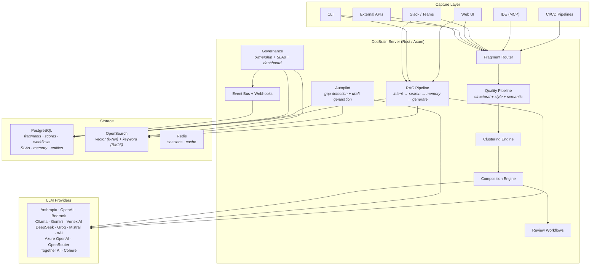

<p align="center">
  
</p>

<p align="center">
  <strong>Knowledge captured at the source. Quality enforced before it ships.</strong><br/>
  DocBrain captures knowledge the moment it's created — from PRs, conversations, CI pipelines, and IDE annotations — then scores, reviews, and publishes it automatically. No more "we should document that."
</p>

<p align="center">
  <a href="https://docbrainapi.com"></a>
  <a href="https://github.com/docbrain-ai/docbrain/stargazers"></a>
  <a href="LICENSE"></a>
  
  <a href="https://glama.ai/mcp/servers/docbrain-ai/docbrain"></a>
</p>

<p align="center">
  <a href="https://docbrainapi.com"><strong>Website</strong></a> &bull;
  <a href="https://docbrainapi.com/docs"><strong>Docs</strong></a> &bull;
  <a href="#quickstart">Quickstart</a> &bull;
  <a href="#why-docbrain">Why DocBrain</a> &bull;
  <a href="#features">Features</a> &bull;
  <a href="#architecture">Architecture</a>
</p>

---

> **Project Status:** DocBrain is currently distributed as pre-built Docker images and deployment artifacts (Helm charts, configuration, documentation). Source code is not yet published. Contributions are welcome for documentation, configuration, and bug reports.

---

## The Problem

Every engineering team has the same problem: **knowledge lives in people's heads, Slack threads, PR descriptions, and incident war rooms** — everywhere except the documentation.

The traditional fix? "Let's have a documentation sprint." It never works. People write docs once, they go stale in weeks, and the cycle repeats.

## The Fix: Shift-Left Documentation

DocBrain flips the model. Instead of asking engineers to write documentation *after* the work is done, it **captures knowledge at the point of creation** and turns it into documentation automatically:

```
Developer merges a PR           → DocBrain extracts decisions, caveats, procedures
Team discusses in Slack          → DocBrain distills fragments from the conversation
CI pipeline deploys              → DocBrain captures deployment context and changes
Engineer annotates in their IDE  → DocBrain links knowledge to the exact code location

     Fragments accumulate → Quality scored → Clusters detected → Docs composed
                                                                      ↓
                              Review workflow → Style checks → Published
```

**This is what makes DocBrain different.** Other tools index existing docs and answer questions. DocBrain captures the knowledge that was never written down in the first place — and turns it into documentation that meets your team's quality standards.

---

## Quickstart

```bash
git clone https://github.com/docbrain-ai/docbrain.git && cd docbrain
./scripts/setup.sh    # interactive wizard — picks provider, sets keys, starts services
```

Or manually:

```bash
cp .env.example .env   # set LLM_PROVIDER and API keys
docker compose up -d
```

```bash
# Get the auto-generated admin API key
docker compose exec server cat /app/admin-bootstrap-key.txt

# Ask a question
curl -H "Authorization: Bearer <key>" \
     -H "Content-Type: application/json" \
     -d '{"question":"How do I deploy to production?"}' \
     http://localhost:3000/api/v1/ask
```

Open the Web UI at **http://localhost:3001**. Full setup guide: [docs/quickstart.md](docs/quickstart.md)

---

## Why DocBrain

### For Engineers
- **Zero extra work.** Knowledge is captured from PRs, commits, and conversations you're already having.
- **Capture from your IDE.** `docbrain_annotate`, `docbrain_suggest_capture`, and `docbrain_commit_capture` via MCP.
- **Quality gates in CI.** Lint docs with custom style rules, enforce structure, catch stale content before it ships.

### For Engineering Managers
- **Know what's documented and what isn't.** Coverage dashboards show gaps per team and per space.
- **SLA enforcement.** Policies that ensure gaps are acknowledged within 24h and resolved within 7 days.
- **ROI tracking.** See time saved per query, resolution rates, and knowledge half-life per team.

### For Platform Teams
- **Self-hosted, single binary.** Rust backend, no JVM, no Python dependency hell. Docker, Kubernetes, or bare metal.
- **14 LLM providers.** Anthropic, OpenAI, AWS Bedrock, Ollama (fully local), Gemini, and 9 more.
- **13+ knowledge sources.** Confluence, Slack, Teams, GitHub, GitLab, Jira, PagerDuty, and more.
- **Connector SDK.** Build connectors for any source — Notion, Google Docs, internal wikis — in any language. Stateless HTTP protocol, DocBrain handles scheduling and retries.
- **Full OpenAPI spec.** Swagger UI at `/api/docs`. Auto-generated OpenAPI 3.1 spec. Build your own integrations.
- **RBAC, SSO, space isolation.** GitHub/GitLab/OIDC SSO, role-based access, per-space restrictions.

---

## Features

### Shift-Left Knowledge Capture

| Capture Point | How It Works |
|---|---|
| **Merged PRs** | `POST /api/v1/ci/analyze` — LLM extracts decisions, facts, caveats, and procedures from diffs and commit messages |
| **Deployments** | `POST /api/v1/ci/deploy-capture` — Captures deployment context, environment changes, and rollback procedures |
| **Slack & Teams** | `/docbrain capture` in a thread — distills conversation into knowledge fragments |
| **IDE (MCP)** | `docbrain_annotate` links knowledge to code locations. `docbrain_commit_capture` captures intent at commit time |
| **Conversations** | Auto-distillation extracts fragments from Q&A sessions with confidence scoring |
| **Manual** | `POST /api/v1/fragments` — Teams can submit fragments directly via API |

### Knowledge Quality Pipeline

Every fragment and document is scored across three layers:

| Layer | Method | What It Measures |
|---|---|---|
| **Structural** | Deterministic (no LLM) | Heading structure, section completeness, code examples, link density, readability |
| **Style** | Rule engine | Banned terms, heading depth, sentence length, required sections, custom regex |
| **Semantic** | LLM-assessed (budget-controlled) | Accuracy, clarity, completeness, actionability |

Composite score: `structural x 0.4 + style x 0.3 + semantic x 0.3`

### Fragment Lifecycle

```
Capture → Confidence routing → Auto-index / Review queue / Discard
                                       ↓
                    Semantic clustering (DBSCAN on embeddings)
                                       ↓
                    Auto-composition when cluster is ready
                    (5+ fragments, 2+ sources, 500+ words)
                                       ↓
                    Review workflow (configurable stages)
                                       ↓
                    Published documentation
```

### Governance & Accountability

- **Space ownership** — Owners, maintainers, and topic stewards per knowledge space
- **SLA policies** — Per-space deadlines for gap acknowledgment, resolution, draft review, and freshness
- **Breach detection** — Automated scanning with event bus notifications when SLAs are violated
- **Governance dashboard** — Coverage, SLA compliance, quality trends, capture velocity, top contributors

### Review Workflows

Configurable multi-stage review pipelines for documentation drafts:
- Define stages per space (e.g., SME Review → Writer Review → Publish Approval)
- Role-based reviewer assignment with approve/request-changes/reject actions
- Threaded comments and personal review queue

### Intelligent Q&A (RAG)

- **Confidence-scored answers** — High confidence returns sourced answers, low confidence asks clarifying questions
- **Intent classification** — Adapts response format to query type (find, how-to, troubleshoot, who-owns, explain)
- **4-tier memory** — Working, episodic, semantic, and procedural memory that compounds over time
- **Document freshness** — 5-signal scoring with contradiction detection and staleness alerts

### Documentation Autopilot

- Clusters unanswered questions by semantic similarity
- Detects documentation gaps with severity classification
- Drafts missing content grounded in existing docs
- Routes drafts through review workflows before publishing

### Connector SDK — Plug In Any Source

Build a connector for any knowledge source in any language. DocBrain handles scheduling, retries, and ingestion — your connector just serves HTTP:

```
GET  /health          → { "status": "ok", "connector_name": "notion" }
POST /fetch           → Return documents as JSON (with cursor-based pagination)
POST /fetch-by-ids    → Return specific documents by ID
```

Register it in DocBrain, set a sync schedule, and every document flows through the same quality pipeline as built-in sources. [Connector Protocol Docs →](docs/ingestion.md)

### MCP IDE Capture

10 tools for Claude Code, Cursor, and any MCP-compatible editor:

- `docbrain_annotate` — Link knowledge to exact code locations
- `docbrain_suggest_capture` — AI suggests what to capture from your current context
- `docbrain_commit_capture` — Capture intent and decisions at commit time
- `docbrain_ask` — Query your knowledge base without leaving the IDE

### Event Bus & Webhooks

- Real-time internal pub/sub with persistent logging and SSE streaming
- Outbound webhook subscriptions with retry logic and circuit breakers
- Subscribe to any event type: gap detected, draft created, SLA breached, fragment captured
- HMAC-SHA256 signed payloads, exponential backoff, circuit breakers

### OpenAPI & Developer Experience

- **Swagger UI** at `/api/docs` — interactive API explorer
- **OpenAPI 3.1 spec** at `/api/docs/openapi.json` — auto-generate clients in any language
- **CLI** — `docbrain ask`, `docbrain capture`, `docbrain login`
- 60+ API endpoints, fully documented with request/response schemas

### Knowledge Graph & Analytics

- Entity relationships with BFS/DFS traversal and blast radius analysis
- Documentation velocity: gap resolution rate, knowledge half-life, ROI in USD
- Predictive intelligence: cascade staleness, seasonal patterns, onboarding friction

### Integrations

| Integration | Type |
|---|---|
| **Slack** | `/docbrain ask`, `/docbrain capture`, `/docbrain incident` |
| **MCP (IDE)** | 10 tools for Claude Code, Cursor, and any MCP-compatible editor |
| **CLI** | `docbrain ask`, `docbrain login`, `docbrain capture` |
| **GitHub** | PR capture via Actions, `@docbrain capture` on discussions |
| **GitLab** | MR discussion capture, webhook-driven |
| **HTTP Connector** | Protocol for custom source ingestion |
| **OpenAPI** | Swagger UI at `/api/docs`, auto-generated spec at `/api/docs/openapi.json` |

---

## Architecture


```mermaid
graph TB
    subgraph "Capture Layer"
        CI["CI/CD Pipelines"]
        IDE["IDE (MCP)"]
        SLACK["Slack / Teams"]
        WEB["Web UI"]
        CLI["CLI"]
        API_EXT["External APIs"]
    end

    subgraph "DocBrain Server (Rust / Axum)"
        FRAG["Fragment Router"]
        QUAL["Quality Pipeline<br/><i>structural + style + semantic</i>"]
        CLUST["Clustering Engine"]
        COMP["Composition Engine"]
        REV["Review Workflows"]
        RAG["RAG Pipeline<br/><i>intent → search → memory → generate</i>"]
        AUTO["Autopilot<br/><i>gap detection + draft generation</i>"]
        GOV["Governance<br/><i>ownership + SLAs + dashboard</i>"]
        EVT["Event Bus + Webhooks"]
    end

    subgraph "Storage"
        PG["PostgreSQL<br/><i>fragments · scores · workflows<br/>SLAs · memory · entities</i>"]
        OS["OpenSearch<br/><i>vector (k-NN) + keyword (BM25)</i>"]
        RD["Redis<br/><i>sessions · cache</i>"]
    end

    subgraph "LLM Providers"
        PROVIDERS["Anthropic · OpenAI · Bedrock<br/>Ollama · Gemini · Vertex AI<br/>DeepSeek · Groq · Mistral · xAI<br/>Azure OpenAI · OpenRouter<br/>Together AI · Cohere"]
    end

    CI & IDE & SLACK & WEB & CLI & API_EXT --> FRAG
    FRAG --> QUAL --> CLUST --> COMP --> REV
    WEB & CLI & SLACK --> RAG
    RAG & AUTO & GOV --> PG & OS
    RAG & AUTO & COMP --> PROVIDERS
    EVT --> PG
    GOV --> EVT
```

| Component | Technology | Role |
|---|---|---|
| API Server | Rust, Axum, Tower | HTTP/SSE, auth, RBAC, rate limiting |
| Quality Pipeline | Custom | Structural + style + semantic scoring |
| Fragment Engine | Custom | Capture, route, cluster, compose |
| Review System | Custom | Multi-stage approval workflows |
| Governance | Custom | Ownership, SLAs, breach detection |
| RAG Pipeline | Custom | Intent classification, hybrid search, memory, generation |
| Autopilot | Custom | Gap analysis, clustering, draft generation |
| Storage | PostgreSQL 17, OpenSearch 2.19, Redis 7 | Metadata, vectors, sessions |

---

## LLM Providers

| Provider | Config |
|---|---|
| **Anthropic** | `LLM_PROVIDER=anthropic` |
| **OpenAI** | `LLM_PROVIDER=openai` |
| **AWS Bedrock** | `LLM_PROVIDER=bedrock` |
| **Ollama** | `LLM_PROVIDER=ollama` — 100% local, no data leaves your machine |
| **Google Gemini** | `LLM_PROVIDER=gemini` |
| **Vertex AI** | `LLM_PROVIDER=vertex_ai` |
| **DeepSeek** | `LLM_PROVIDER=deepseek` |
| **Groq** | `LLM_PROVIDER=groq` |
| **Mistral** | `LLM_PROVIDER=mistral` |
| **xAI (Grok)** | `LLM_PROVIDER=xai` |
| **Azure OpenAI** | `LLM_PROVIDER=azure_openai` |
| **OpenRouter** | `LLM_PROVIDER=openrouter` |
| **Together AI** | `LLM_PROVIDER=together` |
| **Cohere** | `LLM_PROVIDER=cohere` |

See [Provider Setup](docs/providers.md) for detailed configuration.

---

## Deployment

### Docker Compose

```bash
docker compose up -d
```

Starts the API server, web UI, PostgreSQL, OpenSearch, and Redis. Migrations run automatically.

### Kubernetes

```bash
helm install docbrain ./helm/docbrain \
  --set llm.provider=anthropic \
  --set llm.anthropicApiKey=sk-ant-...
```

See [Kubernetes Guide](docs/kubernetes.md) for production configuration.

---

## Configuration

DocBrain uses a config-first architecture:

| File | Purpose |
|---|---|
| `config/default.yaml` | Non-secret defaults |
| `config/local.yaml` | Credentials and local overrides (gitignored) |
| `.env` | Infrastructure secrets: `DATABASE_URL`, API keys |

Environment variables always override config files. See [Configuration Guide](docs/configuration.md).

---

## Documentation

| | |
|---|---|
| [Quickstart](docs/quickstart.md) | Running locally in 5 minutes |
| [Configuration](docs/configuration.md) | All environment variables and options |
| [Provider Setup](docs/providers.md) | LLM and embedding provider configuration |
| [Architecture](docs/architecture.md) | System design, data flow, memory, freshness |
| [Ingestion Guide](docs/ingestion.md) | Connecting 13+ knowledge sources |
| [Knowledge Intelligence](docs/knowledge-intelligence.md) | Graph, analytics, predictive intelligence, maintenance |
| [Autopilot](docs/autopilot.md) | Gap detection, draft generation, feedback loop |
| [Learning Pipeline](docs/learning.md) | Embedding fine-tuning (opt-in) |
| [API Reference](docs/api-reference.md) | Full REST API documentation |
| [RBAC](docs/rbac.md) | Role-based access control |
| [Slack Integration](docs/slack.md) | Slash commands and real-time capture |
| [GitLab Capture](docs/gitlab-capture.md) | MR discussion indexing |
| [Kubernetes](docs/kubernetes.md) | Helm chart deployment |

---

## See It In Action

| | |
|---|---|
| [What is DocBrain?](https://youtu.be/S4aSTmevvOQ) — 5-min overview | [Deep Dive Podcast](https://youtu.be/GN4SC6L8YmI) — 20-min deep dive |
| [MCP Preview](https://youtu.be/9mZLoQnGLl8) — 30-sec IDE demo | [Full Proof Demo](https://youtu.be/yqj5BCVOLHw) — Downvote → Gap → Draft |

---

## Community

- **GitHub Issues:** [Bug reports and feature requests](https://github.com/docbrain-ai/docbrain/issues)
- **GitHub Discussions:** [Questions and community conversation](https://github.com/docbrain-ai/docbrain/discussions)
- **Email:** [hello@docbrain.ai](mailto:hello@docbrain.ai)

---

## Contributing

We welcome contributions. Since source code is not yet published, current contributions focus on documentation, configuration, and feedback. See [Contributing Guide](CONTRIBUTING.md).

---

## Security

To report a security vulnerability, see [SECURITY.md](SECURITY.md). Do **not** file a public issue.

---

## License

[Business Source License 1.1](LICENSE) (BSL 1.1). Production use is permitted, except offering DocBrain as a hosted service. Converts to [Apache 2.0](https://www.apache.org/licenses/LICENSE-2.0) on the earlier of January 1, 2028, or 5,000 GitHub stars. For alternative licensing: [licensing@docbrainapi.com](mailto:licensing@docbrainapi.com).

---

## Code of Conduct

[Contributor Covenant Code of Conduct](CODE_OF_CONDUCT.md). Report concerns to [conduct@docbrain.ai](mailto:conduct@docbrain.ai).
