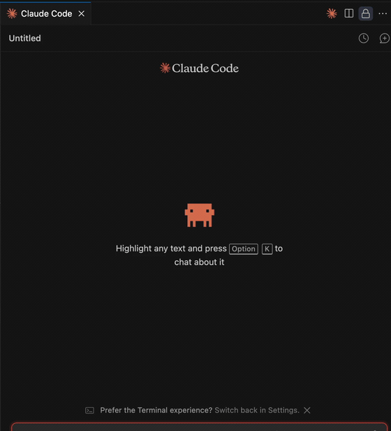
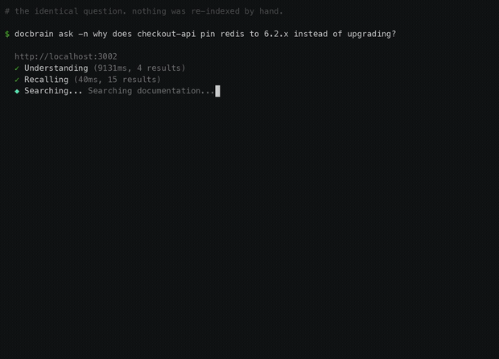
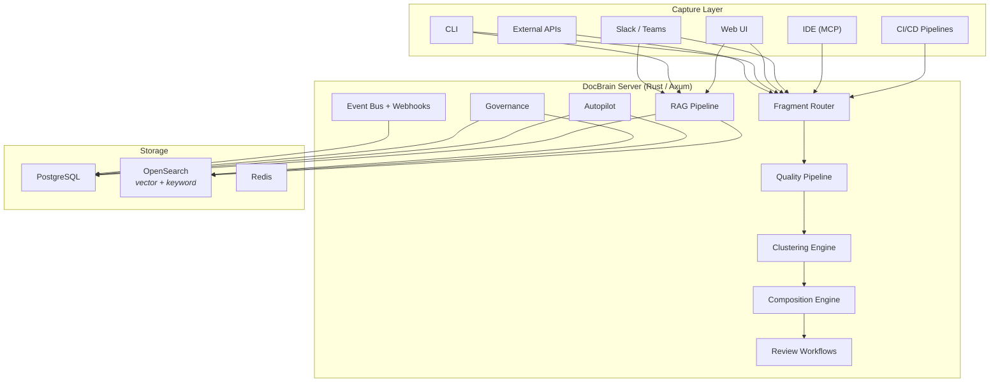

<p align="center">
  
</p>

<p align="center">
  <strong>What one engineer works out, the whole company keeps.</strong><br/>
  Someone solves it on a Tuesday. Two teams over, in November, a person who has never met them hits the same wall and has no way to know it was ever solved, and neither does their agent, which proposes the approach that was already ruled out. DocBrain captures those decisions where they actually happen, pull requests, threads, incidents, deploys, and hands them to whoever touches that code next, human or agent, <em>before</em> the change. Every claim cites its source, expires when reality moves, and exports as proof a third party verifies offline. Self-hosted. Read-only. Zero data egress.
</p>

<p align="center">
  <a href="https://docbrainapi.com"></a>
  <a href="https://github.com/docbrain-ai/docbrain/stargazers"></a>
  <a href="LICENSE"></a>
  
  <a href="https://github.com/docbrain-ai/docbrain/actions/workflows/clients.yml"></a>
  <a href="https://glama.ai/mcp/servers/docbrain-ai/docbrain"></a>
</p>

<p align="center">
  <a href="https://docbrainapi.com"><strong>Website</strong></a> &bull;
  <a href="https://docbrainapi.com/docs"><strong>Docs</strong></a> &bull;
  <a href="#quickstart">Quickstart</a> &bull;
  <a href="#the-problem">The Problem</a> &bull;
  <a href="#how-docbrain-works">How It Works</a> &bull;
  <a href="#architecture">Architecture</a> &bull;
  <a href="#security">Security</a>
</p>

---

<p align="center">
  <a href="https://youtu.be/DeiP74HuVDc">
    
  </a>
  <br/>
  <em>a one-line chart bump that takes checkout down, and the agent that refuses it — <a href="https://youtu.be/DeiP74HuVDc">54 seconds ▶</a></em>
</p>

---

> **Project Status: client source open, server closed.** The source for everything DocBrain runs on *your* side of the network boundary — the `docbrain` CLI, the IDE MCP server, and the offline [`.dbev` evidence verifier](crates/docbrain-evidence/) — is in this repo under [`crates/`](crates/), MIT-licensed, built and tested in public CI — as is everything else in this repository. Audit exactly what runs in your environment and what leaves it. The server ships as free production Docker images (BSL 1.1 permits production use) with full Helm charts, complete configuration, the [threat model](THREAT_MODEL.md), and all the docs to self-host in production. The server source stays closed for now — we originally targeted the first half of 2026 to publish it, we missed that date, and we won't post a new date until we're certain we can hit it. If a closed server is a dealbreaker for you, that's a rational position and we respect it: [how DocBrain earns trust](https://docbrainapi.com/docs/trust/). Contributions: code PRs for the client crates, plus documentation, configuration, and bug reports. When the server source publishes, it will be published under the Business Source License 1.1.

---

## The Problem

Every organization runs on knowledge that never gets written down: the decision from a meeting, the fix someone found at 2am, the workaround only one person knows. It lives in PRs, chat threads, tickets, and people's heads. When that person changes teams or quits, years of context walk out the door with them.

Tools that "index your docs and add a chatbot" solve the wrong half of the problem: they retrieve your stale, incomplete wiki slightly faster. The knowledge that actually runs your organization was never captured in the first place. And it's getting worse now that AI produces code, changes, and fluent documentation faster than any human can absorb — your agents read those docs too. More documentation is easy. Documentation your organization can trust is the scarce thing.

## Why This Is Not a Documentation Tool

Most tools in this space index your documents and put a chat box in front of them. That is one of the three things below, and it is the easy one.

The reason it matters more now: agents write a large share of the code, and they will re-derive, re-decide and re-break anything your organization settled but never recorded somewhere reachable. A rules file does not close that — it holds what one person remembered to write, in one repo, for their own agent. It does not cross teams, it does not expire when the system changes, and it carries no source anyone can check. Meanwhile agents generate plausible documentation faster than anyone can review it, so "more docs" makes the problem worse and "docs you can verify" is the scarce thing.

**1. It captures what was never written down.** A wiki holds the fraction of your knowledge that somebody found time to type up. The decision from the meeting, the fix found at 2am, the workaround one person knows — those live in PRs, threads, tickets and heads. DocBrain reads those systems in place and captures the knowledge as it is produced, so the record includes what nobody would have filed. Your coding agent is the best capture device you have ever had: it is present at the exact second knowledge is created, and it can file it before the session ends.

**2. Every claim carries provenance, and claims expire.** An answer is not one blob of prose with a source list stapled to it. Each individual claim is traced to the span it came from, and a claim can be registered as a *premise* — a statement about your systems that DocBrain then monitors. When the source stops supporting it, the answer that relied on it says so, with the date it changed. Documentation that is wrong is worse than documentation that is missing, and the difference is whether the system notices.

**3. An answer can be proved without us.** Export any answer, decision, approval or premise verdict as a sealed, hash-chained `.dbev` bundle. A third party verifies it offline — no DocBrain, no server, no network — using an open-source verifier. The trust comes from the maths they run themselves. This is the property a model provider structurally cannot offer: a sampled generation is not reproducible, and verifying a claim about a moment requires having been present for it.

Everything else in this README is in service of those three.

## How DocBrain Works

DocBrain captures knowledge **at the source**, the moment it's created:

```
  Someone merges a change      ──→  decisions, caveats, procedures extracted
  A team works through chat    ──→  the answer, distilled from the thread
  A deploy goes out            ──→  what changed and why
  On-call resolves an incident ──→  the fix and the root cause
  Any other system you run     ──→  ingested via the Connector SDK
```

**On day one it also reads backwards.** Point it at systems you have been using for years — archived Slack channels, closed tickets, merged pull requests, the wiki nobody has opened since 2022 — and it ingests them in place, read-only. Your first answer can come from a thread nobody remembers writing. Nothing is migrated and nobody has to refile anything.

Captured fragments are confidence-scored, connected into one memory, and composed into documentation with **per-claim provenance**. Drafts route through human review before anything publishes. Then DocBrain keeps the result honest: freshness tracking, contradiction detection, and staleness alerts as reality changes. Ask a question, get a cited answer — or an honest "I don't know" instead of a guess.

## Quickstart

```bash
git clone https://github.com/docbrain-ai/docbrain.git && cd docbrain
./scripts/setup.sh    # interactive wizard: picks provider, sets keys, starts services
```

Or manually:

```bash
cp .env.example .env   # set LLM_PROVIDER and API keys
docker compose up -d
```

```bash
# Get the auto-generated admin API key
docker compose exec server cat /app/admin-bootstrap-key.txt

# Open the web dashboard
open http://localhost:3001

# Or ask a question via API
curl -H "Authorization: Bearer <key>" \
     -H "Content-Type: application/json" \
     -d '{"question":"How do I deploy to production?"}' \
     http://localhost:3001/api/v1/ask
```

Full setup guide: [docs/quickstart.md](docs/quickstart.md)

## Living Claims

A captured note can declare a **premise** — a checkable statement about your systems, not prose. `cert-manager is pinned to chart version 1.21.1`. `the session store is Postgres-backed`.

DocBrain re-checks premises against their sources on a schedule and holds each in one of four states:

| state | meaning |
|---|---|
| `holds` | the source still supports it |
| `broken` | the source now says something else — carries the new value and the date it changed |
| `uncheckable` | the source could not be read this sweep |
| `dormant` | not currently monitored |

`uncheckable` is deliberately not `broken`. A source that could not be read proves nothing about the claim, and a system that reports a failed check as a failed claim teaches you to ignore it. Every answer that draws on a broken premise carries the warning above the prose, on every surface — API, CLI, MCP and web — so a stale fact cannot reach you looking current.

<p align="center">
  <a href="https://youtube.com/shorts/sq0zkHxWIaA">
    
  </a>
  <br/>
  <em>the identical question, six weeks apart &mdash; <a href="https://youtube.com/shorts/sq0zkHxWIaA">watch the reason expire &#9654;</a></em>
</p>

[Knowledge intelligence →](docs/knowledge-intelligence.md)

## Teach Your Agent

**Knowledge that compounds across people, not just sessions.**

Someone works out why the pooler is load-bearing. Six weeks later a person on another team, who has never met them, opens that file — and has no way to know it was ever worked out. Neither does their agent.

**That is not a session-memory problem, and a rules file does not fix it.** A `CLAUDE.md` holds what you remembered to write, in your repo, for your agent: it does not cross people, it does not expire when the system changes, and it carries no source you can check.

Your coding agent is the best instrument for both halves of the fix — it is present at the second the knowledge is created, and it is the thing asking for it at the moment of the next change.

The [`docbrain-mcp`](crates/docbrain-mcp) server (MIT, in `crates/`) gives your agent [eleven tools](crates/docbrain-mcp#tools). Point your editor at it — one file, at your **project root**:

```jsonc
// .mcp.json — Claude Code. Cursor: .cursor/mcp.json (same shape).
// VS Code uses "servers" and needs "type": "stdio" — see examples/mcp-configs/vscode.json
{
  "mcpServers": {
    "docbrain": {
      "command": "npx",
      "args": ["-y", "docbrain-mcp@latest"],
      "env": {
        "DOCBRAIN_API_KEY": "YOUR_API_KEY_HERE",
        "DOCBRAIN_SERVER_URL": "http://localhost:3000"
      }
    }
  }
}
```

Get the key with `docbrain token create --name "MCP" --role viewer`. Ready-made configs for all three editors, and the one setup mistake that fails silently, are in [`examples/mcp-configs/`](examples/mcp-configs/).

Two instructions in your `CLAUDE.md` close the loop:

```markdown
Before editing files you have not worked in before, call docbrain_context
with their repo-relative paths and read what comes back first.

When we resolve an error or discover non-obvious behavior, call
docbrain_suggest_capture for the files involved. If a gap exists, draft a
3–5 line capture and ask me to approve it before calling docbrain_annotate.
```

**Read — before it changes anything.** `docbrain_context` takes the files the agent is about to touch and returns what your organization already decided about them: the decision, the constraint, the thing someone learned the hard way. If any of that has since stopped being true, the warning comes *first*, dated. The agent arrives knowing what the last dozen sessions learned instead of re-deriving it.

**Write — at the only moment it is free.** Nobody writes up a fix on Friday afternoon. An agent will, in the same breath as the fix, while the reasoning is still in its context and costs nothing to recover. That is the moment this knowledge is cheapest to capture and the moment it is always lost.

**Nothing lands without you.** The agent proposes, you approve in the session, and the capture lands tied to a file and line range — and to the facts it depends on, so the codebase can contradict it later without anyone reviewing anything. A capture anchored to nothing checkable waits for a human instead of being served. Nothing publishes unattended, nothing uploads on its own, and the session never leaves your machine.

**Agents are never seats.** Every tool in this category has to decide whether a bot counts as a licence. We do not: agents make the memory better, and inference is billed by your own provider rather than resold by us. Point as many at it as you like.

The compounding is the point, and it compounds *outward*. One engineer's caveat becomes the team's, the team's becomes the company's, and none of it depended on anyone finding time to write a document. The new joiner in month three asks a question and gets an answer four people contributed to without ever being in a room together.

Full guide, including Cursor setup, the privacy model and all eleven tools: [docs/agents.md](docs/agents.md)

## What You Get

- **Capture from 13 built-in sources** — Confluence, Slack, Teams, GitHub, GitLab, Jira, PagerDuty, Linear, OpsGenie, Rootly, Zendesk, Intercom, and local files, plus a language-agnostic [Connector SDK](docs/connectors.md) for anything else. [Ingestion guide →](docs/ingestion.md)
- **Context before the change** — `docbrain_context` takes the repo-relative paths your agent is about to edit and returns what the organization already knows about those exact files: decisions, caveats and constraints, with a stale-knowledge warning first. Prevention, not just capture. [Coding agents →](docs/agents.md)
- **Ask, with citations** — hybrid vector + keyword search, confidence-scored answers; low confidence asks clarifying questions instead of guessing. [API →](docs/api-reference.md)
- **`docbrain generate`** — on-demand docs grounded in your own runbooks, incidents, threads, and PRs, with per-claim provenance and honest `needs_input` for what the knowledge can't answer. [Generate guide →](docs/generate.md)
- **Quality gates on every doc** — structural, style (your style guide, enforced automatically), and semantic scoring; nothing unscored enters the system. [Style policy →](docs/style-policy.md)
- **Review workflows and ownership** — multi-stage approvals, space owners, SLAs, and governance dashboards, so documentation has accountability. [Governance →](docs/governance.md) · [Reviews →](docs/reviews.md)
- **Offline evidence bundles** — export a sealed, signed, hash-chained `.dbev` record of answers, decisions, approvals and premise verdicts that **anyone verifies offline** — no DocBrain, no server, no network — with an open-source verifier (a Rust binary and a dependency-free Python script, proven byte-identical) returning `VALID` / `TAMPERED` / `CANNOT_VERIFY`. The trust comes from the math they run themselves, not from us. [Evidence bundles →](docs/evidence.md)
- **Autopilot** — clusters unanswered questions into gaps, drafts grounded fixes, and routes them to human review. Nothing publishes without oversight. [Autopilot →](docs/autopilot.md)
- **Live intelligence** — reads connected systems *at the moment you ask*, then reconciles that with indexed history in one cited answer. Write-capable tools are dropped at discovery, so it never holds the capability to change anything. [MCP tools →](docs/mcp-tools.md)
- **Freshness and contradiction detection** — stale docs flagged, conflicting docs surfaced, cascade staleness traced across dependent docs. [Knowledge intelligence →](docs/knowledge-intelligence.md)
- **Learning pipeline (optional, off by default)** — feedback on answers can fine-tune the embedding model on *your* corpus, so retrieval learns what "similar" means in your codebase. Versions are gated on quality before promotion and roll back automatically if they regress. Runs entirely on your infrastructure. [Learning →](docs/learning.md)
- **Predictive intelligence** — onboarding-gap detection from what new joiners ask in their first 30 days, seasonal query forecasting, and code-change-triggered doc review. [Knowledge intelligence →](docs/knowledge-intelligence.md)
- **Source-system ACL mirroring** — Confluence restrictions, Slack channel membership, and repo visibility enforced at query time. [Access control →](docs/access-control.md)
- **RBAC, SSO, audit logging** — 4-tier roles, GitHub/GitLab/OIDC SSO, per-space isolation. [RBAC →](docs/rbac.md)
- **Everywhere your team works** — web dashboard, Slack commands, CLI, CI hooks, and MCP tools for Claude Code, Cursor, and any MCP-compatible editor. [Slack →](docs/slack.md)

## Architecture


```mermaid
graph TB
    subgraph "Capture Layer"
        CI["CI/CD Pipelines"]
        IDE["IDE (MCP)"]
        SLACK["Slack / Teams"]
        WEB["Web UI"]
        CLI["CLI"]
        API_EXT["External APIs"]
    end

    subgraph "DocBrain Server (Rust / Axum)"
        FRAG["Fragment Router"]
        QUAL["Quality Pipeline"]
        CLUST["Clustering Engine"]
        COMP["Composition Engine"]
        REV["Review Workflows"]
        RAG["RAG Pipeline"]
        AUTO["Autopilot"]
        GOV["Governance"]
        EVT["Event Bus + Webhooks"]
    end

    subgraph "Storage"
        PG["PostgreSQL"]
        OS["OpenSearch<br/><i>vector + keyword</i>"]
        RD["Redis"]
    end

    CI & IDE & SLACK & WEB & CLI & API_EXT --> FRAG
    FRAG --> QUAL --> CLUST --> COMP --> REV
    WEB & CLI & SLACK --> RAG
    RAG & AUTO & GOV --> PG & OS
    EVT --> PG
```

Rust server, PostgreSQL, OpenSearch, Redis. Full design: [docs/architecture.md](docs/architecture.md)

## Security

DocBrain runs entirely in your infrastructure, **read-only** against your sources. You choose where the model runs: fully local via Ollama (zero egress), your own cloud account (Bedrock, Azure, Vertex — your KMS, your audit trail), or a provider API. Documents, embeddings, and indexes never leave your network; only the query and the relevant chunks reach the LLM you chose.

API keys are Argon2-hashed, every endpoint enforces RBAC, rate limits are per-key, and admin actions are audit-logged. The client code you install is open source in [`crates/`](crates/). The full threat model — 11 analyzed attack vectors and an operator checklist — is published: [THREAT_MODEL.md](THREAT_MODEL.md)

**LLM providers (14):** Anthropic, OpenAI, AWS Bedrock, Ollama, Google Gemini, Vertex AI, Azure OpenAI, DeepSeek, Groq, Mistral, xAI, OpenRouter, Together AI, Cohere. [Provider setup →](docs/providers.md)

## Deployment

```bash
# Docker Compose — everything behind a single origin at localhost:3001
docker compose up -d

# Kubernetes
helm install docbrain ./helm/docbrain \
  --set llm.provider=anthropic \
  --set llm.anthropicApiKey=sk-ant-...
```

[Kubernetes guide →](docs/kubernetes.md) · [Configuration →](docs/configuration.md)

## Documentation

| | |
|---|---|
| [Quickstart](docs/quickstart.md) | Running locally in 5 minutes |
| [Configuration](docs/configuration.md) | All environment variables and options |
| [Provider Setup](docs/providers.md) | LLM and embedding provider configuration |
| [Architecture](docs/architecture.md) | System design, data flow, memory, freshness |
| [Ingestion Guide](docs/ingestion.md) | Connecting the 13 built-in knowledge sources |
| [External Connectors](docs/connectors.md) | Build custom connectors for any knowledge source |
| [Governance](docs/governance.md) | Ownership, SLAs, breach detection, dashboards |
| [Review Workflows](docs/reviews.md) | Multi-stage approval pipelines |
| [Knowledge Intelligence](docs/knowledge-intelligence.md) | Graph, analytics, predictive intelligence |
| [Autopilot](docs/autopilot.md) | Gap detection, draft generation, feedback loop |
| [Generate](docs/generate.md) | Grounded on-demand doc generation |
| [Coding Agents](docs/agents.md) | Teaching Claude Code / Cursor to file docs via MCP |
| [Evidence Bundles](docs/evidence.md) | Offline-verifiable `.dbev` proof of your knowledge, and the open verifier |
| [API Reference](docs/api-reference.md) | Full REST API documentation |
| [RBAC](docs/rbac.md) | Role-based access control and SSO |
| [Slack Integration](docs/slack.md) | Slash commands, message shortcuts, thread capture |
| [Kubernetes](docs/kubernetes.md) | Helm chart deployment |

## See It In Action

**▶ [A commit the agent refused](https://youtu.be/DeiP74HuVDc)** — a Redis chart bumped 6.2.1 → 7.2.4, one line, and the captured decision that stops it. Waits removed, nothing sped up.

**▶ [The reason expired](https://youtube.com/shorts/sq0zkHxWIaA)** — the identical question asked six weeks apart, and the second answer opening with the fact that died.

| | |
|---|---|
| [What is DocBrain?](https://youtu.be/S4aSTmevvOQ), 5-min overview | [Deep Dive Podcast](https://youtu.be/GN4SC6L8YmI), 20-min deep dive |
| [MCP Preview](https://youtu.be/9mZLoQnGLl8), 30-sec IDE demo | [Full Proof Demo](https://youtu.be/yqj5BCVOLHw), Downvote → Gap → Draft |

## Independent Assessment

We opened Atlassian's own AI assistant, asked it to compare itself with DocBrain, and published the full response unedited — including where it wins.

> **"DocBrain's 'capture knowledge that was never written down' is solving a problem I fundamentally can't."**
> — Rovo, answering a direct comparison prompt

Where Rovo wins: native Atlassian integration, zero setup for existing Atlassian Cloud teams, broad work execution, and 3M+ users. [Full transcript →](https://docbrainapi.com/rovo-comparison.html)

## What We Haven't Proven Yet

A project built on refusing to overclaim shouldn't overclaim about itself.

- **The server is closed source.** The client that runs inside your network is MIT and auditable, in [`crates/`](crates/). The server isn't published. We targeted the first half of 2026, missed it, and won't name a new date until we're certain of it.
- **We publish no measured accuracy benchmark.** Grounding is measured internally and gates every model promotion, but no number goes in this README until it's measured across real customer corpora and we can publish the methodology with it.
- **Self-hosting isn't unique to us.** Open-source alternatives exist and several are genuinely good at retrieval — some more permissively licensed than we are. What they don't do is capture what was never written down. Judge us on that.
- **Our evidence base is strongest for software teams.** The mechanism generalises across support, operations and the rest of the business; the published statistics haven't been measured everywhere, and we won't imply otherwise.

## Community

- **GitHub Issues:** [Bug reports and feature requests](https://github.com/docbrain-ai/docbrain/issues)
- **GitHub Discussions:** [Questions and community conversation](https://github.com/docbrain-ai/docbrain/discussions)
- **Email:** [hello@docbrainapi.com](mailto:hello@docbrainapi.com)

## Contributing

We welcome contributions. The client tooling source ([`crates/`](crates/)) accepts code PRs; server-side contributions land best as documentation, configuration, and bug reports. See [Contributing Guide](CONTRIBUTING.md).

## Security Reports

To report a security vulnerability, see [SECURITY.md](SECURITY.md). Do **not** file a public issue.

## License

This repository is [MIT licensed](LICENSE) — the `docbrain` CLI, the MCP server, the Helm
charts, configuration, examples and documentation.

The **DocBrain server binaries and container images** are distributed under the
[Business Source License 1.1](LICENSE-SERVER). Production use is permitted, except offering
DocBrain as a hosted service. For alternative licensing:
[licensing@docbrainapi.com](mailto:licensing@docbrainapi.com).

## Code of Conduct

[Contributor Covenant Code of Conduct](CODE_OF_CONDUCT.md).
Report concerns to [hello@docbrainapi.com](mailto:hello@docbrainapi.com).
