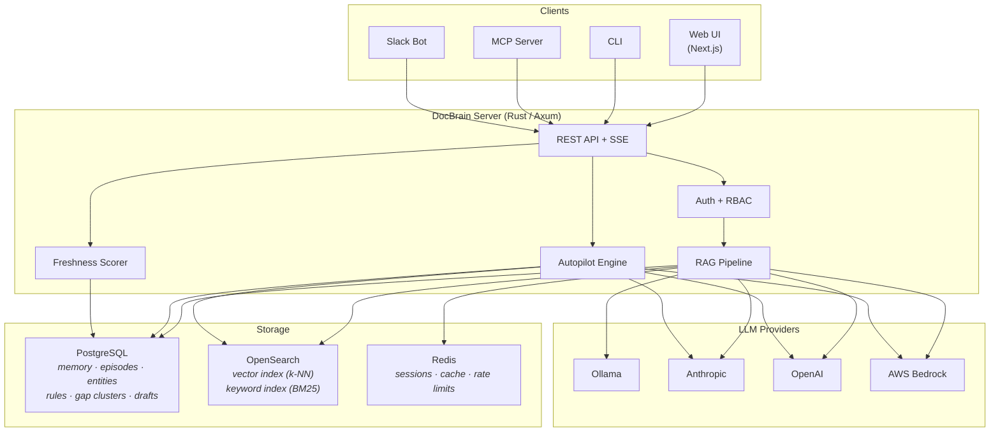
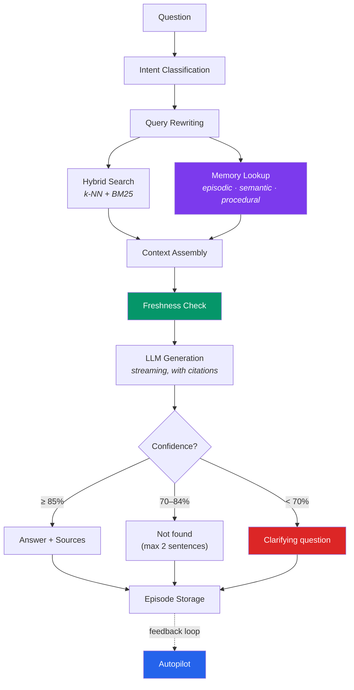

<p align="center">
  
</p>

<p align="center">
  <strong>Self-improving documentation intelligence for teams.</strong><br/>
  DocBrain ingests knowledge from every tool your team uses, answers questions with source attribution and confidence scoring, and autonomously identifies documentation gaps — turning every unanswered question into a documented solution.
</p>

<p align="center">
  <a href="https://github.com/docbrain-ai/docbrain/stargazers"></a>
  <a href="LICENSE"></a>
  <a href="https://github.com/docbrain-ai/docbrain/releases/latest"></a>
  <a href="https://github.com/docbrain-ai/docbrain/releases/latest"></a>
  <a href="https://glama.ai/mcp/servers/docbrain-ai/docbrain"></a>
</p>

<p align="center">
  <a href="#quickstart">Quickstart</a> &bull;
  <a href="#key-features">Features</a> &bull;
  <a href="#architecture">Architecture</a> &bull;
  <a href="#documentation">Docs</a> &bull;
  <a href="#community">Community</a> &bull;
  <a href="#contributing">Contributing</a>
</p>

---

## Overview

DocBrain is a RAG-based documentation intelligence platform built in Rust. It connects to 13+ knowledge sources (Confluence, Slack, GitHub, Jira, PagerDuty, Zendesk, Microsoft Teams, and more), provides confidence-scored answers with source attribution, and runs an autonomous **Autopilot** that detects documentation gaps and drafts missing content.

Unlike static search tools, DocBrain maintains a multi-tier memory system that compounds over time — every question, answer, and feedback signal makes the next response better.

### See It In Action

| | |
|---|---|
| [What is DocBrain?](https://youtu.be/IU3haCc6WKI) — 5-min overview | [Deep Dive Podcast](https://youtu.be/GN4SC6L8YmI) — 20-min deep dive |
| [MCP Preview](https://youtu.be/9mZLoQnGLl8) — 30-sec IDE demo | [Full Proof Demo](https://youtu.be/yqj5BCVOLHw) — Downvote → Gap → Draft |

---

## Key Features

- **13+ Knowledge Sources** — Confluence, Slack, Microsoft Teams, GitHub PRs, GitLab MRs, Jira, PagerDuty, OpsGenie, Zendesk, Intercom, local Markdown, and more
- **Confidence-Scored Answers** — Zero-guess policy: high confidence returns sourced answers, low confidence asks clarifying questions instead of hallucinating
- **Documentation Autopilot** — Autonomously clusters unanswered questions, detects gaps, and drafts missing documentation using your org's existing voice
- **4-Tier Memory System** — Working, episodic, semantic, and procedural memory that compounds with every interaction
- **Document Health Scores** — 5-signal freshness scoring (time decay, engagement, content currency, link health, contradiction detection) with proactive staleness alerts
- **Real-Time Capture** — `/docbrain capture` in Slack threads, `@docbrain capture` on GitHub PRs and GitLab MRs for instant knowledge indexing
- **Intent-Adaptive Responses** — Classifies queries (find, how-to, troubleshoot, who-owns, status, explain) and adapts response format accordingly
- **Image Intelligence** — Vision-capable LLM extraction of architecture diagrams, flowcharts, and screenshots during ingestion
- **Multi-Team Space Isolation** — Soft boost, per-request filters, and API-key-level hard restrictions for multi-tenant deployments
- **Multiple LLM Providers** — Anthropic, OpenAI, AWS Bedrock, and Ollama (fully local, air-gapped)

---

## Quickstart

### Prerequisites

- Docker and Docker Compose
- An LLM API key (Anthropic, OpenAI, AWS Bedrock) or [Ollama](https://ollama.com) for local inference

### Run

```bash
git clone https://github.com/docbrain-ai/docbrain.git && cd docbrain
cp .env.example .env
# Edit .env — set LLM_PROVIDER and API keys
docker compose up -d
```

```bash
# Retrieve the auto-generated admin API key
docker compose exec server cat /app/admin-bootstrap-key.txt

# Ingest included sample docs
docker compose exec server docbrain-ingest

# Ask a question
docker compose exec -e DOCBRAIN_API_KEY=<key> server \
  docbrain-cli ask "How do I deploy to production?"
```

Open the Web UI at **http://localhost:3001**.

### Configuration

DocBrain uses a config-first architecture with three layers:

| File | Purpose |
|---|---|
| `config/default.yaml` | Non-secret defaults — committed, safe to inspect |
| `config/local.yaml` | Credentials and local overrides — gitignored |
| `.env` | Infrastructure secrets: `DATABASE_URL`, API keys, `REDIS_URL`, `OPENSEARCH_URL` |

Environment variables always override config files. See [Configuration Guide](docs/configuration.md) for all options.

### Choose Your LLM Provider

| Provider | Config |
|---|---|
| **AWS Bedrock** | `LLM_PROVIDER=bedrock` — uses existing AWS credentials |
| **Anthropic** | `LLM_PROVIDER=anthropic` — requires `ANTHROPIC_API_KEY` |
| **OpenAI** | `LLM_PROVIDER=openai` — requires `OPENAI_API_KEY` |
| **Ollama** | `LLM_PROVIDER=ollama` — 100% local, no data leaves your machine |

See [Provider Setup](docs/providers.md) for detailed configuration.

---

## Architecture


```mermaid
graph TB
    subgraph "Clients"
        WEB["Web UI<br/>(Next.js)"]
        CLI["CLI"]
        MCP["MCP Server"]
        SLACK["Slack Bot"]
    end

    subgraph "DocBrain Server (Rust / Axum)"
        API["REST API + SSE"]
        AUTH["Auth + RBAC"]
        RAG["RAG Pipeline"]
        AUTO["Autopilot Engine"]
        FRESH["Freshness Scorer"]
    end

    subgraph "Storage"
        PG["PostgreSQL<br/><i>memory · episodes · entities<br/>rules · gap clusters · drafts</i>"]
        OS["OpenSearch<br/><i>vector index (k-NN)<br/>keyword index (BM25)</i>"]
        RD["Redis<br/><i>sessions · cache · rate limits</i>"]
    end

    subgraph "LLM Providers"
        OL["Ollama"]
        AN["Anthropic"]
        OA["OpenAI"]
        BR["AWS Bedrock"]
    end

    WEB & CLI & MCP & SLACK --> API
    API --> AUTH --> RAG
    API --> AUTO
    API --> FRESH
    RAG --> PG & OS & RD
    RAG --> OL & AN & OA & BR
    AUTO --> PG & OS
    AUTO --> AN & OA & BR
    FRESH --> PG
```

| Component | Technology | Role |
|-----------|-----------|------|
| API Server | Rust, Axum, Tower | HTTP/SSE, auth, rate limiting, routing |
| RAG Pipeline | Custom | Intent classification, hybrid search, memory enrichment, generation |
| Autopilot | Custom | Gap analysis, semantic clustering, draft generation |
| Freshness | Custom | 5-signal scoring, contradiction detection, staleness alerts |
| Storage | PostgreSQL 17, OpenSearch 2.19, Redis 7 | Metadata, vectors, sessions |
| Ingest | Custom | 13+ source connectors, heading-aware chunking, image extraction |

Full architecture documentation: [docs/architecture.md](docs/architecture.md)

---

## How It Works

DocBrain's RAG pipeline adds three layers most implementations skip: **memory**, **freshness awareness**, and **autonomous gap detection**.


```mermaid
graph TB
    Q["Question"] --> IC["Intent Classification"]
    IC --> QR["Query Rewriting"]
    QR --> HS["Hybrid Search<br/><i>k-NN + BM25</i>"]
    QR --> ML["Memory Lookup<br/><i>episodic · semantic · procedural</i>"]
    HS --> CA["Context Assembly"]
    ML --> CA
    CA --> FS["Freshness Check"]
    FS --> LLM["LLM Generation<br/><i>streaming, with citations</i>"]
    LLM --> CF{"Confidence?"}
    CF -->|"≥ 85%"| R["Answer + Sources"]
    CF -->|"70–84%"| NF["Not found<br/>(max 2 sentences)"]
    CF -->|"< 70%"| CQ["Clarifying question"]
    R & NF & CQ --> EP["Episode Storage"]
    EP -. "feedback loop" .-> AP["Autopilot"]

    style AP fill:#2563eb,color:#fff
    style FS fill:#059669,color:#fff
    style ML fill:#7c3aed,color:#fff
    style CQ fill:#dc2626,color:#fff
```

### Memory System

| Tier | Purpose | Example |
|------|---------|---------|
| **Working** | Conversation context within a session | "by 'the service' I mean auth-service" |
| **Episodic** | Past Q&A across all users, with feedback | "this was asked before — validated answer exists" |
| **Semantic** | Entity graph — services, teams, dependencies | "auth-service depends on Redis, owned by Platform" |
| **Procedural** | Rules learned from feedback patterns | "for deploy questions, always include the canary step" |

### Documentation Autopilot

Autopilot monitors unanswered questions, negative feedback, and recurring gaps across teams. It clusters these signals semantically, classifies them by documentation type, and drafts missing content grounded in your existing docs.

```
Users ask → Gap detected → Draft generated → Admin reviews → Published → Re-ingested
```

See [Autopilot Guide](docs/autopilot.md) for configuration and details.

---

## Deployment

### Docker Compose (default)

```bash
docker compose up -d
```

Starts the API server, web UI, PostgreSQL, OpenSearch, and Redis. Schema migrations run automatically on boot.

### Kubernetes (Helm)

```bash
helm install docbrain ./helm/docbrain \
  --set llm.provider=anthropic \
  --set llm.anthropicApiKey=sk-ant-...
```

See [Kubernetes Guide](docs/kubernetes.md) for production configuration including external databases, SSO, Ingress, Vault integration, and scaling.

---

## Integrations

### MCP (Model Context Protocol)

Use DocBrain as a knowledge source in Claude Code, Cursor, or any MCP-compatible editor.

```bash
claude mcp add docbrain \
  -e DOCBRAIN_API_KEY=db_sk_... \
  -e DOCBRAIN_SERVER_URL=http://localhost:3000 \
  -- npx -y docbrain-mcp@latest
```

**Available tools:** `docbrain_ask`, `docbrain_incident`, `docbrain_freshness`, `docbrain_autopilot_gaps`, `docbrain_autopilot_generate`, `docbrain_autopilot_summary`

### Slack

```
/docbrain ask how do we deploy to production?
/docbrain incident payments service 502 after deploy
/docbrain capture          ← inside a thread to index it instantly
```

Full setup guide: [docs/slack.md](docs/slack.md)

### CLI

```bash
brew install docbrain-ai/tap/docbrain
docbrain login --server https://docbrain.mycompany.com
docbrain ask "How do I configure mTLS between services?"
```

---

## Scope

### In Scope

DocBrain is intended to be a self-improving documentation intelligence platform. As such, the project implements:

- Multi-source knowledge ingestion (13+ connectors)
- Confidence-scored retrieval-augmented generation with source attribution
- Multi-tier persistent memory (working, episodic, semantic, procedural)
- Autonomous documentation gap detection and draft generation (Autopilot)
- Document health scoring and staleness alerting
- Real-time knowledge capture from Slack, GitHub, and GitLab
- Multi-tenant space isolation and RBAC
- MCP, Slack, CLI, and Web UI interfaces

### Out of Scope

DocBrain is designed to work alongside existing tools. The following are explicitly not goals:

- Replacing Confluence, Notion, or other documentation platforms (DocBrain augments them)
- General-purpose LLM chat or code generation
- Real-time collaborative document editing
- Source code analysis or static analysis

---

## Documentation

| | |
|---|---|
| [Quickstart](docs/quickstart.md) | Running locally or in the cloud in 5 minutes |
| [Ingestion Guide](docs/ingestion.md) | Connecting all 13+ knowledge sources |
| [Configuration](docs/configuration.md) | All environment variables and options |
| [Provider Setup](docs/providers.md) | LLM and embedding provider configuration |
| [Architecture](docs/architecture.md) | System design, data flow, memory, freshness, and Autopilot |
| [Autopilot](docs/autopilot.md) | Gap detection, draft generation, and the feedback loop |
| [API Reference](docs/api-reference.md) | REST API with Autopilot endpoints |
| [RBAC](docs/rbac.md) | Role-based access control |
| [Slack Integration](docs/slack.md) | Slash commands, feedback buttons, and proactive notifications |
| [GitLab Capture](docs/gitlab-capture.md) | Real-time MR discussion indexing |
| [Kubernetes](docs/kubernetes.md) | Helm chart deployment and scaling |
| [Threat Model](THREAT_MODEL.md) | Security analysis: assets, trust boundaries, mitigations |

---

## Community

- **GitHub Issues:** [Bug reports and feature requests](https://github.com/docbrain-ai/docbrain/issues)
- **GitHub Discussions:** [Questions and community conversation](https://github.com/docbrain-ai/docbrain/discussions)
- **Email:** [hello@docbrain.ai](mailto:hello@docbrain.ai)

---

## Contributing

We welcome contributions from the community. Please read our [Contributing Guide](CONTRIBUTING.md) for details on:

- Reporting bugs and requesting features
- Submitting documentation improvements
- Development workflow and code standards
- Pull request process

---

## Security

To report a security vulnerability, please follow the process outlined in [SECURITY.md](SECURITY.md). Do **not** file a public GitHub issue for security vulnerabilities.

---

## License

DocBrain is licensed under the [Business Source License 1.1](LICENSE) (BSL 1.1).

- **Production use** is permitted, except offering DocBrain as a hosted/managed service to third parties.
- **Change date:** The earlier of January 1, 2028, or when the repository reaches 5,000 GitHub stars, at which point the license converts to [Apache License 2.0](https://www.apache.org/licenses/LICENSE-2.0).
- For alternative licensing, contact [licensing@docbrain.ai](mailto:licensing@docbrain.ai).

---

## Code of Conduct

This project follows the [Contributor Covenant Code of Conduct](CODE_OF_CONDUCT.md). By participating, you are expected to uphold this code. Please report unacceptable behavior to [conduct@docbrain.ai](mailto:conduct@docbrain.ai).
