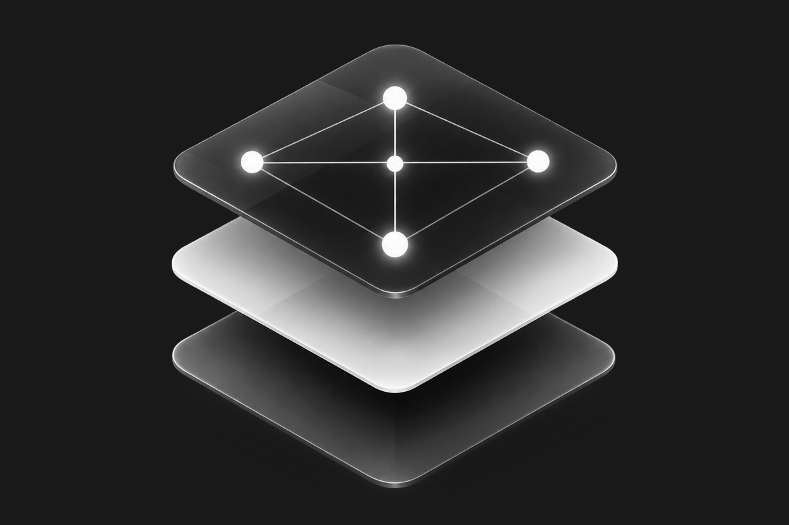
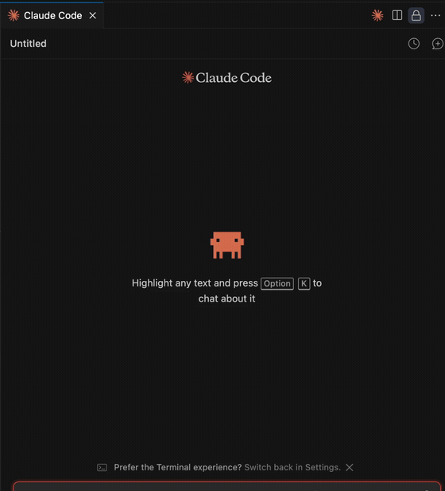
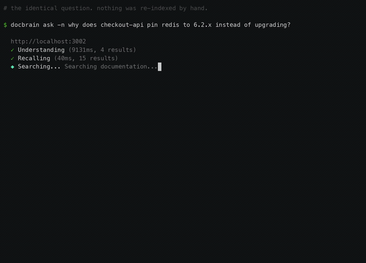
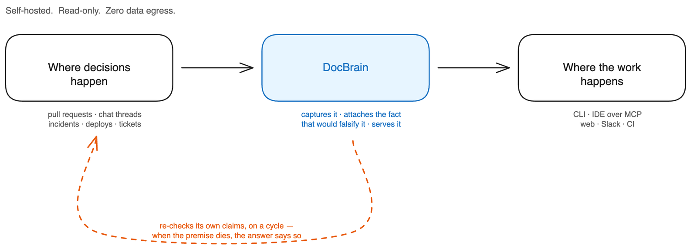

<p align="center">
  
</p>

<p align="center">
  <strong>What one engineer works out, the whole company keeps.</strong><br/>
  Someone on your team figures out why a deploy keeps breaking. Months later, someone on another team runs into the same problem. They have no way to know it was already solved, and neither does their coding agent, so it suggests the fix that was already tried and dropped. DocBrain saves those decisions where they happen (in your agent sessions, pull requests, chat threads, incidents and deploys) and shows them to the next person or agent who works on that code, before they change it. Every answer links to its source, gets flagged when the source changes, and can be exported as a file anyone can check offline. Self-hosted, and read-only against your systems.
</p>

<p align="center">
  <a href="https://docbrainapi.com"></a>
  <a href="https://github.com/docbrain-ai/docbrain/stargazers"></a>
  <a href="LICENSE"></a>
  
  <a href="https://github.com/docbrain-ai/docbrain/actions/workflows/clients.yml"></a>
  <a href="https://glama.ai/mcp/servers/docbrain-ai/docbrain"></a>
</p>

<p align="center">
  <a href="https://docbrainapi.com"><strong>Website</strong></a> &bull;
  <a href="https://docbrainapi.com/docs"><strong>Docs</strong></a> &bull;
  <a href="#quickstart">Quickstart</a> &bull;
  <a href="#the-problem">The Problem</a> &bull;
  <a href="#how-docbrain-works">How It Works</a> &bull;
  <a href="#architecture">Architecture</a> &bull;
  <a href="#security">Security</a>
</p>

---

<p align="center">
  <a href="https://youtu.be/DeiP74HuVDc">
    
  </a>
  <br/>
  <em>a one-line chart bump that takes checkout down, and the agent that refuses it — <a href="https://youtu.be/DeiP74HuVDc">54 seconds ▶</a></em>
</p>

---

## The Problem

Most of what a company knows never gets written down. Why a setting is the way it is, the fix someone found at 2am, the workaround only one person remembers. It sits in PRs, chat threads, tickets and people's heads, and it leaves with them when they change teams.

AI makes this worse. Agents write a lot of the code now, and they don't know what your team already decided, so they suggest things that were ruled out last quarter. They also write documentation faster than anyone can review it. Writing more docs is easy. Knowing which ones are still true is the hard part.

## How DocBrain Works

The best time to write something down is while you're working on it, and these days you're usually working with an agent. That's where DocBrain starts:

```
  You and your agent fix something    ──→  "capture this", you approve the draft, it's saved against the file
  A teammate's agent opens that file  ──→  it gets your decision before it edits anything
  Anyone asks a question              ──→  a cited answer, in their editor, Slack, the CLI or the web app
  The file or fact changes later      ──→  the answer says so, with the date it changed
```

It also picks up decisions from the systems you already use:

```
  Someone merges a change      ──→  decisions, caveats, procedures extracted
  A team works through chat    ──→  the answer, pulled out of the thread
  A deploy goes out            ──→  what changed and why
  On-call resolves an incident ──→  the fix and the root cause
  Any other system you run     ──→  ingested via the Connector SDK
```

**It reads your history too.** Point it at the systems you've used for years (old Slack channels, closed tickets, merged PRs, the wiki nobody has opened since 2022) and it reads them where they are, read-only. Nothing gets migrated and nobody has to re-file anything. Your first answer might come from a thread nobody remembers writing.

Everything it collects is scored for confidence, linked together, and cited claim by claim. New docs go through human review before they're published. Pages get flagged for a look when there's evidence they're wrong, like a fact that changed or answers people marked as unhelpful. When DocBrain doesn't know something, it says so instead of guessing.

## Quickstart

**1. Start the server.**

```bash
git clone https://github.com/docbrain-ai/docbrain.git && cd docbrain
./scripts/setup.sh    # interactive: picks a provider, sets keys, starts services
```

Or manually:

```bash
cp .env.example .env   # set LLM_PROVIDER and API keys
docker compose up -d
docker compose exec server cat /app/admin-bootstrap-key.txt   # your admin API key
```

Docker Compose serves the web app and the API together at http://localhost:3001, and that is the URL your agent and CLI use too. The API server itself listens on port 3000, but Compose keeps that port inside its own network. On Kubernetes or a standalone server, use whatever address your server is reachable at.

**2. Connect your coding agent.** In Claude Code, from the repo you work in:

```bash
claude plugin marketplace add docbrain-ai/docbrain --scope project
claude plugin install docbrain@docbrain --scope project
```

It asks for the server URL (`http://localhost:3001` with Docker Compose) and an API key that can write (`docbrain token create --name "Claude Code" --role editor`). Using Cursor or VS Code? See [Using DocBrain with your coding agent](#using-docbrain-with-your-coding-agent).

**3. Capture something, then ask for it.** Next time you and your agent work something out, say "capture this". You'll see a draft, and it's saved once you say yes. Then open a new session, or have a teammate open one, and ask about that file or topic. The answer comes back with your capture cited.

Full setup guide: [docs/quickstart.md](docs/quickstart.md). Prefer to call it directly? [API reference](docs/api-reference.md).

## Using DocBrain with your coding agent

Your agent is there when a problem gets solved, and it's there again when someone is about to change the same code. DocBrain gives it a way to save what was learned the first time and look it up the second time.

**While you work: capture.** When a conversation has worked something out (a decision and the reason for it, a fix that took some digging, a caveat, a procedure, how two systems actually connect), say "capture this" or run `/docbrain:docbrain-capture`. The skill will also offer when it notices something worth keeping. It checks what DocBrain already has, writes a draft in your team's words, links it to the file it's about and the facts it depends on, and shows it to you. Nothing is saved until you say yes. You get one line back: indexed, or queued for review.

**Before someone else changes it: read.** `docbrain_context` takes the files the agent is about to edit and returns what's already been decided about them: the decision, the constraint, the thing someone learned the hard way. If any of it is out of date, that warning comes first, with a date. Add this line to your `CLAUDE.md` so the agent checks every time:

```markdown
Before editing files you have not worked in before, call docbrain_context
with their repo-relative paths and read what comes back first.
```

**Any time: ask.** `docbrain_ask` answers questions from everything DocBrain knows, with sources, right in the editor.

**You stay in control.** Every capture needs your yes. Because it's tied to a file, a line range and the facts it depends on, DocBrain can tell later when the code no longer matches it. A capture that isn't tied to anything checkable goes to a person for review before anyone else sees it. Nothing is published or uploaded on its own, and your session stays on your machine.

### Setup

**Claude Code.** The plugin install in the [Quickstart](#quickstart) adds the capture skill and connects the MCP server. Both commands write to `.claude/settings.json`, so commit that file and your whole team gets it. To skip the prompts, add `--config server_url=… --config api_key=…`. If you'd rather not use a plugin, copy [`plugins/docbrain/skills/docbrain-capture`](plugins/docbrain/skills/docbrain-capture) into your repo's `.claude/skills/` and run it as `/docbrain-capture`.

**Cursor, VS Code and other editors.** Point your editor at the [`docbrain-mcp`](crates/docbrain-mcp) server (MIT, in `crates/`) with one file at your project root:

```jsonc
// .mcp.json — Claude Code. Cursor: .cursor/mcp.json (same shape).
// VS Code uses "servers" and needs "type": "stdio" — see examples/mcp-configs/vscode.json
// DOCBRAIN_SERVER_URL: http://localhost:3001 with Docker Compose; your server's address otherwise
{
  "mcpServers": {
    "docbrain": {
      "command": "npx",
      "args": ["-y", "docbrain-mcp@latest"],
      "env": {
        "DOCBRAIN_API_KEY": "YOUR_API_KEY_HERE",
        "DOCBRAIN_SERVER_URL": "http://localhost:3001"
      }
    }
  }
}
```

A `viewer` key (`docbrain token create --name "MCP" --role viewer`) can read and ask. Captures need an `editor` key. Ready-made configs for each editor, plus the one setup mistake that fails without an error, are in [`examples/mcp-configs/`](examples/mcp-configs/).

The server has [eleven tools](crates/docbrain-mcp#tools) in total. Full guide, including the privacy model: [docs/agents.md](docs/agents.md)

## Living Claims

A capture can list the facts it depends on. DocBrain calls these premises: short statements you can check, like `cert-manager is pinned to chart version 1.21.1` or `the session store is Postgres-backed`.

DocBrain re-checks each premise against its source on a schedule and keeps it in one of four states:

| state | meaning |
|---|---|
| `holds` | the source still supports it |
| `broken` | the source now says something else; shows the new value and the date it changed |
| `uncheckable` | the source couldn't be read this time |
| `dormant` | not being checked |

A source that can't be read is marked `uncheckable`, not `broken`, because a failed check says nothing about whether the claim is true. Treating it as broken would just teach people to ignore the warnings. When an answer relies on a broken premise, the warning shows above the answer wherever you read it: API, CLI, editor or web.

<p align="center">
  <a href="https://youtube.com/shorts/sq0zkHxWIaA">
    
  </a>
  <br/>
  <em>the same question, six weeks apart &mdash; <a href="https://youtube.com/shorts/sq0zkHxWIaA">watch the answer change &#9654;</a></em>
</p>

[Knowledge intelligence →](docs/knowledge-intelligence.md)

## What You Get

- **13 built-in sources:** Confluence, Slack, Teams, GitHub, GitLab, Jira, PagerDuty, Linear, OpsGenie, Rootly, Zendesk, Intercom and local files, plus a [Connector SDK](docs/connectors.md) in any language for the rest. [Ingestion guide →](docs/ingestion.md)
- **Context before a change:** `docbrain_context` returns the decisions, caveats and constraints recorded against the exact files your agent is about to edit, with a warning first if any of it is out of date. [Coding agents →](docs/agents.md)
- **Answers with sources:** vector and keyword search together, with a confidence score on each answer. When confidence is low, it asks a clarifying question instead of guessing. [API →](docs/api-reference.md)
- **`docbrain generate`:** writes docs on request from your own runbooks, incidents, threads and PRs, cites each claim, and marks what it couldn't answer as `needs_input`. [Generate guide →](docs/generate.md)
- **Quality checks on every doc:** structure, your style guide and content are all scored before a doc goes in. [Style policy →](docs/style-policy.md)
- **Reviews and ownership:** multi-step approvals, space owners, SLAs and dashboards, so every doc has someone responsible for it. [Governance →](docs/governance.md) · [Reviews →](docs/reviews.md)
- **Offline proof:** export answers, decisions, approvals and premise checks as a signed `.dbev` file. Anyone can verify it without DocBrain or a network connection, using an open-source verifier (a Rust binary and a plain Python script that give the same result). It returns `VALID`, `TAMPERED` or `CANNOT_VERIFY`. [Evidence bundles →](docs/evidence.md)
- **Autopilot:** groups questions nobody could answer into gaps, drafts fixes from what DocBrain knows, and sends them for human review. Nothing is published without a person approving it. [Autopilot →](docs/autopilot.md)
- **Live lookups:** checks your connected systems at the moment you ask and combines that with what's already indexed in one cited answer. Tools that could change anything are removed at setup, so it can only read. [MCP tools →](docs/mcp-tools.md)
- **Conflicts and stale pages:** finds docs that contradict each other, follows a stale fact through every doc that depends on it, and flags a page only when there's evidence: a fact that changed, answers marked wrong, questions it couldn't answer, or another page people preferred. [Knowledge intelligence →](docs/knowledge-intelligence.md)
- **Search that learns (optional, off by default):** feedback on answers can fine-tune the embedding model on your own content. New versions only go live if they score better, and roll back on their own if they get worse. Runs on your infrastructure. [Learning →](docs/learning.md)
- **Spotting gaps early:** what new joiners ask in their first 30 days, questions that come up at the same time each year, and docs to review when the code they describe changes. [Knowledge intelligence →](docs/knowledge-intelligence.md)
- **Same permissions as the source:** Confluence restrictions, Slack channel membership and repo visibility are applied when someone asks. [Access control →](docs/access-control.md)
- **RBAC, SSO, audit logs:** four roles, GitHub/GitLab/OIDC sign-in, separate spaces. [RBAC →](docs/rbac.md)
- **Wherever your team works:** your editor (Claude Code, Cursor or any MCP editor), Slack, the web app, the CLI and CI hooks. [Slack →](docs/slack.md)

## Architecture

<p align="center">
  
</p>

Knowledge comes in from where decisions are made and goes out to where people
work. DocBrain also re-checks what it knows against the original sources on a
regular cycle, so when a fact changes, the answers that depend on it say so.

Rust server, PostgreSQL, OpenSearch, Redis. Components, data flow and
deployment layout: [docs/architecture.md](docs/architecture.md).
Diagram source: [assets/architecture.excalidraw](assets/architecture.excalidraw).

## Security

DocBrain runs entirely in your infrastructure and only reads from your sources. You choose where the model runs: fully local with Ollama (nothing leaves your network), in your own cloud account (Bedrock, Azure, Vertex, with your KMS and audit trail), or through a provider API. Documents, embeddings and indexes stay in your network. Only the question and the relevant snippets go to the model you picked.

API keys are hashed with Argon2, every endpoint checks permissions, rate limits are per key, and admin actions are logged. The client code you install is open source in [`crates/`](crates/). The full threat model, covering 11 attack paths with an operator checklist, is in [THREAT_MODEL.md](THREAT_MODEL.md).

**LLM providers (14):** Anthropic, OpenAI, AWS Bedrock, Ollama, Google Gemini, Vertex AI, Azure OpenAI, DeepSeek, Groq, Mistral, xAI, OpenRouter, Together AI, Cohere. [Provider setup →](docs/providers.md)

## Deployment

```bash
# Docker Compose — everything behind a single origin at localhost:3001
docker compose up -d

# Kubernetes
helm install docbrain ./helm/docbrain \
  --set llm.provider=anthropic \
  --set llm.anthropicApiKey=sk-ant-...
```

[Kubernetes guide →](docs/kubernetes.md) · [Configuration →](docs/configuration.md)

## Documentation

| | |
|---|---|
| [Quickstart](docs/quickstart.md) | Running locally in 5 minutes |
| [Configuration](docs/configuration.md) | All environment variables and options |
| [Provider Setup](docs/providers.md) | LLM and embedding provider configuration |
| [Architecture](docs/architecture.md) | System design, data flow, memory, freshness |
| [Ingestion Guide](docs/ingestion.md) | Connecting the 13 built-in knowledge sources |
| [External Connectors](docs/connectors.md) | Build custom connectors for any knowledge source |
| [Governance](docs/governance.md) | Ownership, SLAs, breach detection, dashboards |
| [Review Workflows](docs/reviews.md) | Multi-stage approval pipelines |
| [Knowledge Intelligence](docs/knowledge-intelligence.md) | Graph, analytics, predictive intelligence |
| [Autopilot](docs/autopilot.md) | Gap detection, draft generation, feedback loop |
| [Generate](docs/generate.md) | Grounded on-demand doc generation |
| [Coding Agents](docs/agents.md) | Teaching Claude Code / Cursor to file docs via MCP |
| [Evidence Bundles](docs/evidence.md) | Offline-verifiable `.dbev` proof of your knowledge, and the open verifier |
| [API Reference](docs/api-reference.md) | Full REST API documentation |
| [RBAC](docs/rbac.md) | Role-based access control and SSO |
| [Slack Integration](docs/slack.md) | Slash commands, message shortcuts, thread capture |
| [Kubernetes](docs/kubernetes.md) | Helm chart deployment |

## See It In Action

| | |
|---|---|
| [What is DocBrain?](https://youtu.be/S4aSTmevvOQ), 5-min overview | [Deep Dive Podcast](https://youtu.be/GN4SC6L8YmI), 20-min deep dive |
| [MCP Preview](https://youtu.be/9mZLoQnGLl8), 30-sec IDE demo | [Full Proof Demo](https://youtu.be/yqj5BCVOLHw), Downvote → Gap → Draft |

## What We Haven't Proven Yet

- **The server is closed source.** The client that runs inside your network is MIT and you can read it in [`crates/`](crates/). The server isn't published. We aimed for the first half of 2026, missed it, and won't give a new date until we're sure we can hit it.
- **We don't publish an accuracy number.** We measure answer quality internally and every model change has to pass it, but we won't put a number here until we've measured it on real customer data and can publish how we did it.
- **Most of our evidence comes from software teams.** It should work the same way for support, operations and other teams, but we haven't measured that yet.

## Community

- **GitHub Issues:** [Bug reports and feature requests](https://github.com/docbrain-ai/docbrain/issues)
- **GitHub Discussions:** [Questions and community conversation](https://github.com/docbrain-ai/docbrain/discussions)
- **Email:** [hello@docbrainapi.com](mailto:hello@docbrainapi.com)

## Contributing

We welcome contributions. The client code in [`crates/`](crates/) accepts code PRs. For the server, documentation, configuration and bug reports are the most useful. See the [Contributing Guide](CONTRIBUTING.md).

## Security Reports

To report a security vulnerability, see [SECURITY.md](SECURITY.md). Do **not** file a public issue.

## License

This repository is [MIT licensed](LICENSE): the `docbrain` CLI, the MCP server, the Helm
charts, configuration, examples and documentation.

The **DocBrain server binaries and container images** are distributed under the
[Business Source License 1.1](LICENSE-SERVER). Production use is permitted, except offering
DocBrain as a hosted service. For alternative licensing:
[licensing@docbrainapi.com](mailto:licensing@docbrainapi.com).

## Code of Conduct

[Contributor Covenant Code of Conduct](CODE_OF_CONDUCT.md).
Report concerns to [hello@docbrainapi.com](mailto:hello@docbrainapi.com).
