<p align="center">
  
</p>

<p align="center">
  <strong>The real cost isn't wrong documentation.<br/>
  It's that you don't know it's wrong until it hurts you.<br/></strong>
</p>

<p align="center">
  DocBrain makes documentation improve itself.
</p>

<p align="center">
  <a href="https://github.com/docbrain-ai/docbrain/stargazers"></a>
  <a href="LICENSE"></a>
  <a href="https://github.com/docbrain-ai/docbrain/releases/latest"></a>
  <a href="https://github.com/docbrain-ai/docbrain/releases/latest"></a>
</p>

<p align="center">
  <a href="#quickstart">Quickstart</a> &bull;
  <a href="#who-is-this-for">Who Is This For</a> &bull;
  <a href="#why-docbrain-is-different">Why Different</a> &bull;
  <a href="#documentation-autopilot">Autopilot</a> &bull;
  <a href="#how-it-works">How It Works</a> &bull;
  <a href="docs/architecture.md">Architecture</a> &bull;
  <a href="docs/api-reference.md">API Reference</a> &bull;
  <a href="docs/kubernetes.md">Deploy</a>
</p>

---

## The Problem Every Engineering Team Shares

Documentation has a lifecycle problem that no one talks about honestly.

It starts strong. Someone writes a deployment guide. An SRE documents the incident runbook. A platform team publishes onboarding materials. Everything looks good.

Then time passes. Systems change. The guide becomes subtly wrong. The runbook references a service that was renamed. The onboarding doc points to a repo that was archived. Nobody updates them because nobody knows they're broken — until a new engineer follows outdated steps and spends four hours in the wrong direction, or an incident drags on because the runbook is lying about how the system actually works.

**The real cost isn't the wrong documentation. It's that you don't know it's wrong until it hurts you.**

DocBrain solves this differently. Instead of asking humans to maintain documentation manually, it makes documentation maintain itself — monitoring its own health, surfacing its own gaps, and proposing its own improvements based on how your team actually works.


---

## Who Is This For

You'll know immediately if DocBrain belongs in your stack.

| If you are... | DocBrain helps you... |
|---|---|
| **Platform Engineer** | Reduce runbook chaos — one source of truth your whole org trusts |
| **SRE / On-Call Engineer** | Surface operational knowledge gaps *before* the next incident exposes them |
| **Dev Team Lead** | Answer internal questions safely, without pulling senior engineers into Slack |
| **Technical Writer** | Find what's missing before anyone complains it's missing |
| **Engineering Leader** | Measure your team's knowledge health the same way you measure system health |
| **Support / Ops Team** | Stop giving users stale answers from documentation you didn't know was outdated |

If your organization has more than two teams sharing documentation, more than one deployment environment, or more than one engineer who has ever typed "how do I..." in Slack — DocBrain was built for you.

---

## Why DocBrain Is Different

This needs to be said plainly, because the category is noisy.

**DocBrain is not semantic search over your Confluence.**
Most AI documentation tools are retrieval layers: embed your docs, do a vector lookup, pass the result to an LLM. That's useful. It's also the same tool you could build in a weekend. The problem of *documentation decay* remains entirely unsolved.

**DocBrain is not a chatbot on top of your docs.**
A chatbot answers questions. DocBrain answers questions *and* watches which questions go unanswered, clusters them by theme, detects when the gaps are becoming critical, and proposes drafts to fill them — automatically, on a daily schedule, without anyone asking it to.

**DocBrain is knowledge lifecycle infrastructure.**

| Generic AI Doc Tool | DocBrain |
|---|---|
| Answers questions | Answers questions + learns from every answer |
| Static retrieval | Freshness-aware retrieval with staleness signals |
| No memory between sessions | 4-tier memory system that compounds over time |
| You discover gaps when people complain | Autopilot detects gaps before anyone complains |
| Docs decay silently | Every document has a live health score |
| Search returns results | Search returns results ranked by freshness + confidence |

The difference is orientation. Other tools treat documentation as a static artifact. DocBrain treats it as a living system — one that can monitor its own health and signal when it needs attention.

---

## 🎬 Demo

### ⚡ MCP Preview (30-Second Overview)

[](https://youtu.be/9mZLoQnGLl8)

A fast visual walkthrough of DocBrain MCP plugin in action.

### ⚡ Quick Preview (30-Second Overview)

[](https://youtu.be/IXGaJioq6Og)

A fast visual walkthrough of DocBrain in action.

---

### 🔎 Full Proof Demo (Downvote → Gap → Draft)

[](https://youtu.be/yqj5BCVOLHw)

In this complete proof flow, we:

1. Ask related questions  
2. Downvote weak responses  
3. Run Autopilot analysis  
4. Confirm a detected documentation gap  
5. Generate a structured draft automatically  

This demonstrates how DocBrain moves beyond Q&A and becomes a documentation intelligence engine.

---

## Quickstart

You can run DocBrain locally in under 5 minutes.

```bash
git clone https://github.com/docbrain-ai/docbrain.git && cd docbrain
cp .env.example .env
# Edit .env — pick your LLM provider (see options below)
docker compose up -d
```

```bash
# Get your admin API key
docker compose exec server cat /app/admin-bootstrap-key.txt

# Ingest the included sample docs
docker compose exec server docbrain-ingest

# Ask a question (replace <key> with the key from above)
docker compose exec -e DOCBRAIN_API_KEY=<key> server docbrain-cli ask "How do I deploy to production?"
```

Open the Web UI at **http://localhost:3001**.

### Choose Your LLM Provider

<details open>
<summary><strong>AWS Bedrock (recommended for teams already on AWS)</strong></summary>

Uses your existing AWS credentials. No separate API keys needed.

```env
LLM_PROVIDER=bedrock
LLM_MODEL_ID=us.anthropic.claude-sonnet-4-5-20250929-v1:0
EMBED_PROVIDER=bedrock
EMBED_MODEL_ID=cohere.embed-v4:0
AWS_REGION=us-east-1
```

Ensure the models are enabled in your [Bedrock Model Access](https://console.aws.amazon.com/bedrock/home#/modelaccess) console. Credentials are picked up from environment variables, `~/.aws/credentials`, or instance profiles.

</details>

<details>
<summary><strong>Anthropic + OpenAI (best quality)</strong></summary>

```env
LLM_PROVIDER=anthropic
ANTHROPIC_API_KEY=sk-ant-...
LLM_MODEL_ID=claude-sonnet-4-5-20250929
EMBED_PROVIDER=openai
OPENAI_API_KEY=sk-...
EMBED_MODEL_ID=text-embedding-3-small
```

</details>

<details>
<summary><strong>OpenAI only (single API key)</strong></summary>

```env
LLM_PROVIDER=openai
OPENAI_API_KEY=sk-...
LLM_MODEL_ID=gpt-4o
EMBED_PROVIDER=openai
EMBED_MODEL_ID=text-embedding-3-small
```

</details>

<details>
<summary><strong>Ollama (100% local, no data leaves your machine)</strong></summary>

```bash
ollama pull llama3.1 && ollama pull nomic-embed-text
```

```env
LLM_PROVIDER=ollama
OLLAMA_BASE_URL=http://host.docker.internal:11434
LLM_MODEL_ID=llama3.1
EMBED_PROVIDER=ollama
EMBED_MODEL_ID=nomic-embed-text
```

</details>

<details>
<summary><strong>Interactive setup wizard</strong></summary>

```bash
git clone https://github.com/docbrain-ai/docbrain.git && cd docbrain
./scripts/setup.sh
```

Walks you through provider selection, API key configuration, and document source setup.

</details>

See [Provider Setup](docs/providers.md) for full configuration details.

---


## Documentation Autopilot

This is the feature that makes DocBrain different from everything else in this space.

Most AI tools help you consume documentation faster. Autopilot helps your documentation improve itself.

**Autopilot is not AI writing assistance. It is documentation maintenance intelligence.**

Here is what it watches, every day, without being asked:

- Which questions your team asked that received no confident answer
- Which questions surfaced negative feedback from users
- Which knowledge gaps are appearing repeatedly across different people and teams
- Which gaps are growing in severity as query volume climbs

It then clusters these patterns semantically, classifies them by documentation type (runbook, FAQ, troubleshooting guide, reference doc), uses your existing documentation as context to match your team's language and domain knowledge, and drafts the missing content.

Not because someone filed a ticket. Not because a tech writer noticed. Because the system was watching.


The draft is not the end product — it is a starting point for a human reviewer who already knows what's needed, already has the domain expertise, but previously had no signal that anything was missing. Autopilot provides that signal, and removes the blank-page problem.

Enable it with one line:

```env
AUTOPILOT_ENABLED=true
```

---

## How It Works

DocBrain is a RAG pipeline with three layers that most implementations skip: **memory**, **freshness awareness**, and **autonomous gap detection**.


### Memory System

Most Q&A tools are stateless — every question starts from zero. DocBrain maintains four tiers of memory:

| Tier | Purpose | Example |
|------|---------|---------|
| **Working** | Conversation context within a session | "by 'the service' I mean auth-service" |
| **Episodic** | Past Q&A across all users, with feedback | "this was asked before — validated answer exists" |
| **Semantic** | Entity graph — services, teams, dependencies | "auth-service depends on Redis, owned by Platform" |
| **Procedural** | Rules learned from feedback patterns | "for deploy questions, always include the canary step" |

Working memory is session-scoped (Redis). The other three are permanent (PostgreSQL + OpenSearch) and compound over time.

### Document Health Scores

Every document in DocBrain has a health score — a single number from 0 to 100 that measures how alive, accurate, and reliable it is.

This score is recalculated on a configurable schedule using five signals:

| Signal | Weight | What It Measures |
|--------|--------|-----------------|
| Time Decay | 30% | Time since last edit |
| Engagement | 20% | Query frequency, view count, feedback ratio |
| Content Currency | 20% | LLM analysis of temporal references ("as of Q1 2024") |
| Link Health | 15% | Broken or redirected links within the document |
| Contradiction | 15% | Cross-document consistency — does this conflict with other docs? |

Documents scoring below 40 are flagged as outdated. When combined with Autopilot data, this surfaces docs that are both stale *and* frequently asked about — the highest-impact content to fix, ranked automatically.

### Intent-Adaptive Responses

DocBrain classifies each query and adapts the response format:

| Intent | Response Format |
|--------|----------------|
| Factual | Direct answer with source citation |
| Procedural | Numbered step-by-step instructions |
| Troubleshooting | Diagnostic tree with ranked causes |
| Comparative | Structured comparison table |
| Incident | Runbooks and playbooks surfaced first |

### Multi-Team / Space-Aware Search

When connected to Confluence with multiple spaces (or multiple doc sources), DocBrain tracks which space each chunk belongs to. Pass `"space": "PLATFORM"` in your `/api/v1/ask` request to boost results from that team's docs — results from other spaces still appear, they just rank lower (soft boost, not hard filter).

```json
{
  "title": "Production Deployment Guide",
  "source_url": "https://confluence.example.com/...",
  "space": "PLATFORM",
  "freshness_score": 82.0,
  "freshness_status": "fresh",
  "score": 14.2
}
```

Sources flagged as `stale` or `outdated` are visually marked so users know when to treat information with caution.

### Team-Scoped API Keys

For organizations with multiple teams sharing one DocBrain instance, API keys can be scoped to specific spaces — hard data isolation without deploying separate instances.

```bash
curl -X POST http://localhost:3000/api/v1/admin/keys \
  -H "Authorization: Bearer $ADMIN_KEY" \
  -H "Content-Type: application/json" \
  -d '{"name": "Platform Team Key", "role": "editor", "allowed_spaces": ["PLATFORM", "SRE"]}'
```

`allowed_spaces` on an API key is a hard filter. The `"space"` parameter in `/api/v1/ask` is a soft boost. Both can be combined.

### Knowledge Base Health Dashboard

A single endpoint that gives you the health of your entire documentation corpus:

```bash
curl http://localhost:3000/api/v1/health/report \
  -H "Authorization: Bearer $API_KEY"
```

```json
{
  "total_documents": 342,
  "overall_health_score": 67.3,
  "freshness_distribution": { "fresh": 120, "review": 89, "stale": 72, "outdated": 41, "archive": 20 },
  "top_stale_cited_docs": [
    { "title": "Deploy Guide", "freshness_score": 23, "citations_last_7d": 47, "contradiction_score": 45 }
  ],
  "coverage_gaps": 15
}
```

The `top_stale_cited_docs` list is the most actionable output in this response — docs that are simultaneously stale and frequently served to users. Fix these first.

### AI-Curated Onboarding

New team member joining? Get an AI-curated reading list tailored to their first week — not a sorted list of most-viewed pages, but a semantically assembled set of docs chosen for a week-1 persona:

```json
{
  "reading_list": [
    {
      "title": "SaaS UI Engineer Onboarding Guide",
      "freshness_score": 85,
      "reason": "Direct onboarding guide covering role-specific processes and expectations."
    },
    {
      "title": "Team Overview & What We Own",
      "freshness_score": 92,
      "reason": "Gives new hires context on team mission and responsibilities in week 1."
    }
  ]
}
```

The LLM explicitly filters out meeting notes, sprint pages, deep technical specs, and infrastructure runbooks — anything that belongs in month 2, not week 1.

### Contradiction Detection

DocBrain's freshness scorer detects conflicting instructions, inconsistent config values, and contradictory ownership claims across documents in the same space.

```json
{
  "title": "Deploy Guide v2",
  "freshness_score": 45,
  "freshness_status": "stale",
  "contradiction_score": 32
}
```

A `contradiction_score` of 32 means this doc significantly contradicts other docs in the same space. Combined with the health dashboard, you can prioritize which docs need reconciliation.

### Owner-Aware Stale Notifications

DocBrain sends targeted Slack DMs to document owners when their docs go stale — not a bulk notification that gets ignored, but a personal alert with citation counts that make the urgency real:

> ⚠️ **Stale Documentation Alert**
>
> 1. [Deploy Guide](https://...) — freshness 23/100 · **cited 47 times this week**
> 2. [API Rate Limits](https://...) — freshness 31/100 · **cited 12 times this week**
>
> 🚨 High Impact — your team is actively relying on outdated information.

```env
NOTIFICATION_INTERVAL_HOURS=24
NOTIFICATION_SPACE_FILTER=PLATFORM,SRE
```

---

## Connect Your Documents

DocBrain ingests from three source types. Documents are chunked with heading-aware splitting, embedded, and indexed in OpenSearch. Ingestion runs on a configurable cron schedule for continuous sync.

<details>
<summary><strong>Confluence (Cloud)</strong></summary>

```env
SOURCE_TYPE=confluence
CONFLUENCE_BASE_URL=https://yourcompany.atlassian.net/wiki
CONFLUENCE_USER_EMAIL=you@yourcompany.com
CONFLUENCE_API_TOKEN=your-token
CONFLUENCE_SPACE_KEYS=ENG,DOCS,OPS
```

</details>

<details>
<summary><strong>Confluence (Self-Hosted / Data Center)</strong></summary>

```env
SOURCE_TYPE=confluence
CONFLUENCE_API_VERSION=v1
CONFLUENCE_BASE_URL=https://confluence.yourcompany.com
CONFLUENCE_API_TOKEN=your-personal-access-token
CONFLUENCE_SPACE_KEYS=ENG,DOCS,OPS
```

Set `CONFLUENCE_API_VERSION=v1` for self-hosted Confluence Data Center 7.x+. Uses Bearer auth with a Personal Access Token. `CONFLUENCE_USER_EMAIL` is not required for v1.

</details>

<details>
<summary><strong>GitHub Repository</strong></summary>

```env
SOURCE_TYPE=github
GITHUB_REPO_URL=https://github.com/your-org/your-docs
GITHUB_TOKEN=ghp_...
GITHUB_BRANCH=main
```

</details>

<details>
<summary><strong>Local Markdown Files</strong></summary>

```env
SOURCE_TYPE=local
LOCAL_DOCS_PATH=/data/docs
```

</details>

Full ingestion guide: [docs/ingestion.md](docs/ingestion.md)

---

## Image Intelligence

Most documentation tools throw away images during ingestion. DocBrain reads them.

Architecture diagrams, config screenshots, flowcharts, decision tables, UI walkthroughs — during ingestion, DocBrain downloads each image from Confluence, sends it to a vision-capable LLM for description, and injects the description into the document content. The descriptions get chunked, embedded, and indexed like normal text — zero changes to the search pipeline.

**This means you can ask questions about content that only exists in images.**

```
Q: "What are the three steps to onboard a service to EKS?"
A: Based on the onboarding infographic:
   1. Update/Create your Terraform module...
   2. Create your base Helm chart...
   3. Configure ArgoCD application...
   Source: [Helm Chart Deployment Guide] — extracted from diagram
```

Image extraction is **enabled by default**. To disable:

```env
IMAGE_EXTRACTION_ENABLED=false
```

| Provider | Vision Support |
|----------|---------------|
| **AWS Bedrock** | Yes — uses Claude's native vision |
| **Anthropic** | Yes — uses Claude's native vision |
| **OpenAI** | Yes — uses GPT-4o vision |
| **Ollama** | Yes, with vision models (`llava`, `llama3.2-vision`, `moondream`). Text-only models auto-detect and skip gracefully. |

**Guardrails**: max 20 images/page, skips icons under 5KB and files over 10MB, 30s timeout per image, only processes `png`/`jpeg`/`gif`/`webp`.

See [Ingestion Guide](docs/ingestion.md) for details.

---

## Integrations

### MCP (Model Context Protocol)

Query your documentation — and discover gaps — from Claude Code, Cursor, or any MCP-compatible editor.

**Claude Code:**

```bash
claude mcp add docbrain \
  -e DOCBRAIN_API_KEY=db_sk_... \
  -e DOCBRAIN_SERVER_URL=http://localhost:3000 \
  -- npx -y docbrain-mcp@latest
```

**Cursor** (`.cursor/mcp.json`):

```json
{
  "mcpServers": {
    "docbrain": {
      "command": "npx",
      "args": ["-y", "docbrain-mcp@latest"],
      "env": {
        "DOCBRAIN_API_KEY": "db_sk_...",
        "DOCBRAIN_SERVER_URL": "http://localhost:3000"
      }
    }
  }
}
```

<details>
<summary>Alternative: binary / Homebrew</summary>

```json
{
  "mcpServers": {
    "docbrain": {
      "command": "docbrain-mcp",
      "env": {
        "DOCBRAIN_API_KEY": "db_sk_...",
        "DOCBRAIN_SERVER_URL": "http://localhost:3000"
      }
    }
  }
}
```

</details>

<details>
<summary>Alternative: Docker</summary>

```json
{
  "mcpServers": {
    "docbrain": {
      "command": "docker",
      "args": ["run", "--rm", "-i", "--network", "host",
        "-e", "DOCBRAIN_SERVER_URL=http://localhost:3000",
        "-e", "DOCBRAIN_API_KEY=db_sk_...",
        "ghcr.io/docbrain-ai/docbrain:latest", "docbrain-mcp"]
    }
  }
}
```

</details>

**Available MCP tools:** `docbrain_ask`, `docbrain_incident`, `docbrain_freshness`, `docbrain_autopilot_gaps`, `docbrain_autopilot_generate`, `docbrain_autopilot_summary`

### Slack

DocBrain can serve as a Slack bot for team-wide Q&A and receive weekly Autopilot digests. Set `SLACK_BOT_TOKEN` and `SLACK_SIGNING_SECRET` — see [Configuration](docs/configuration.md).

### CLI

```bash
brew install docbrain-ai/tap/docbrain
# or: npm install -g docbrain
# or: curl -sSL https://raw.githubusercontent.com/docbrain-ai/docbrain/main/scripts/install.sh | sh
```

```bash
export DOCBRAIN_API_KEY="db_sk_..."
export DOCBRAIN_SERVER_URL="http://localhost:3000"

docbrain ask "How do I configure mTLS between services?"
docbrain freshness --space PLATFORM
docbrain incident "Redis connection timeouts in auth-service"
```

---

## Deploy

### Docker Compose (default)

```bash
docker compose up -d
```

Starts the API server, web UI, PostgreSQL, OpenSearch, and Redis. Schema migrations run automatically on boot.

### Kubernetes (Helm)

```bash
helm install docbrain ./helm/docbrain \
  --set llm.provider=anthropic \
  --set llm.anthropicApiKey=$ANTHROPIC_API_KEY \
  --set autopilot.enabled=true
```

Supports external PostgreSQL, OpenSearch, and Redis. Includes HPA, ingress, and TLS configuration. See [Kubernetes docs](docs/kubernetes.md).

---

## Architecture

```mermaid
graph TB
    subgraph "Clients"
        WEB["Web UI<br/>(Next.js)"]
        CLI["CLI"]
        MCP["MCP Server"]
        SLACK["Slack Bot"]
    end

    subgraph "DocBrain Server (Rust / Axum)"
        API["REST API + SSE"]
        AUTH["Auth + RBAC"]
        RAG["RAG Pipeline"]
        AUTO["Autopilot Engine"]
        FRESH["Freshness Scorer"]
    end

    subgraph "Storage"
        PG["PostgreSQL<br/><i>memory · episodes · entities<br/>rules · gap clusters · drafts</i>"]
        OS["OpenSearch<br/><i>vector index (k-NN)<br/>keyword index (BM25)</i>"]
        RD["Redis<br/><i>sessions · cache · rate limits</i>"]
    end

    subgraph "LLM Providers"
        OL["Ollama"]
        AN["Anthropic"]
        OA["OpenAI"]
        BR["AWS Bedrock"]
    end

    WEB & CLI & MCP & SLACK --> API
    API --> AUTH --> RAG
    API --> AUTO
    API --> FRESH
    RAG --> PG & OS & RD
    RAG --> OL & AN & OA & BR
    AUTO --> PG & OS
    AUTO --> AN & OA & BR
    FRESH --> PG
```



| Component | Technology | Role |
|-----------|-----------|------|
| API Server | Rust, Axum, Tower | HTTP/SSE, auth, rate limiting, routing |
| RAG Pipeline | Custom | Intent classification, hybrid search, memory enrichment, generation |
| Autopilot | Custom | Gap analysis, semantic clustering, draft generation, digests |
| Freshness | Custom | 5-signal scoring, contradiction detection, staleness alerts |
| Storage | PostgreSQL 17, OpenSearch 2.19, Redis 7 | Metadata, vectors, cache |
| Ingestion | Custom | Confluence, GitHub, local file connectors with heading-aware chunking |

Full architecture documentation: [docs/architecture.md](docs/architecture.md)

---

## Documentation

| | |
|---|---|
| [Quickstart](docs/quickstart.md) | Running locally or in the cloud in 5 minutes |
| [Ingestion Guide](docs/ingestion.md) | Connecting Confluence, GitHub, or local files |
| [Configuration](docs/configuration.md) | All environment variables and options |
| [Provider Setup](docs/providers.md) | LLM and embedding provider configuration |
| [Architecture](docs/architecture.md) | System design, data flow, memory, freshness, and Autopilot |
| [API Reference](docs/api-reference.md) | REST API with Autopilot endpoints |
| [Kubernetes](docs/kubernetes.md) | Helm chart deployment and scaling |

---

## A Note on Why This Exists

Every team we have talked to has the same documentation story. It started with good intentions. It fell apart under the weight of moving fast. And the failure was invisible until it wasn't.

We built DocBrain because we believe there's a better model — one where documentation is treated as a living system with health signals, feedback loops, and the ability to identify its own weaknesses. Not a static artifact that engineers are guilted into maintaining, but infrastructure that participates in its own upkeep.

If DocBrain helps your team, please consider starring the project — it genuinely helps us reach the engineers who need it. If it fails you, open an issue and tell us exactly why. That feedback is the most valuable thing you can give us.

---

## Contributing

We welcome bug reports, feature requests, and documentation improvements via [GitHub Issues](https://github.com/docbrain-ai/docbrain/issues).


Source code releases at **5,000 GitHub stars** or **January 1, 2028**, whichever comes first.

⭐ Help us open-source this faster — source code releases at 5,000 GitHub stars. Every star moves the date forward.
